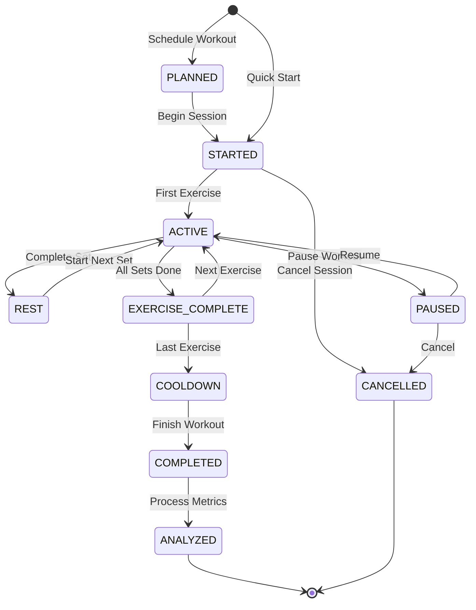
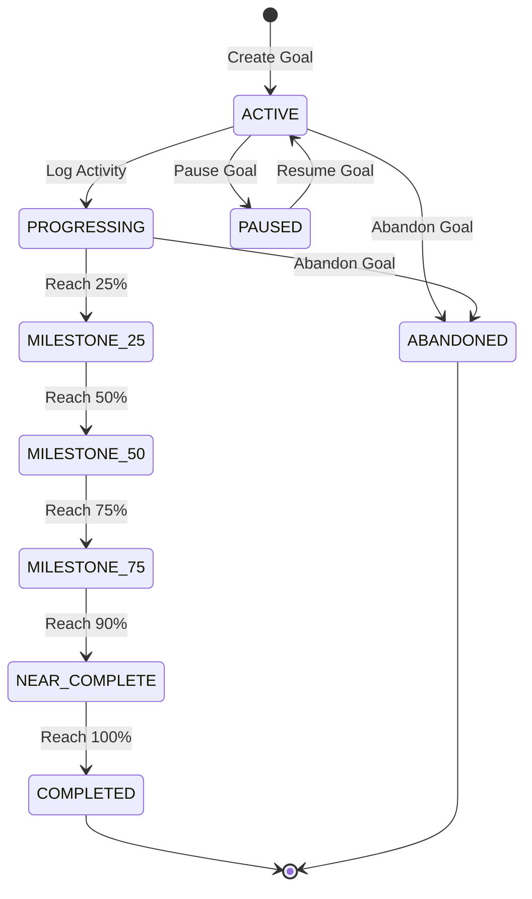
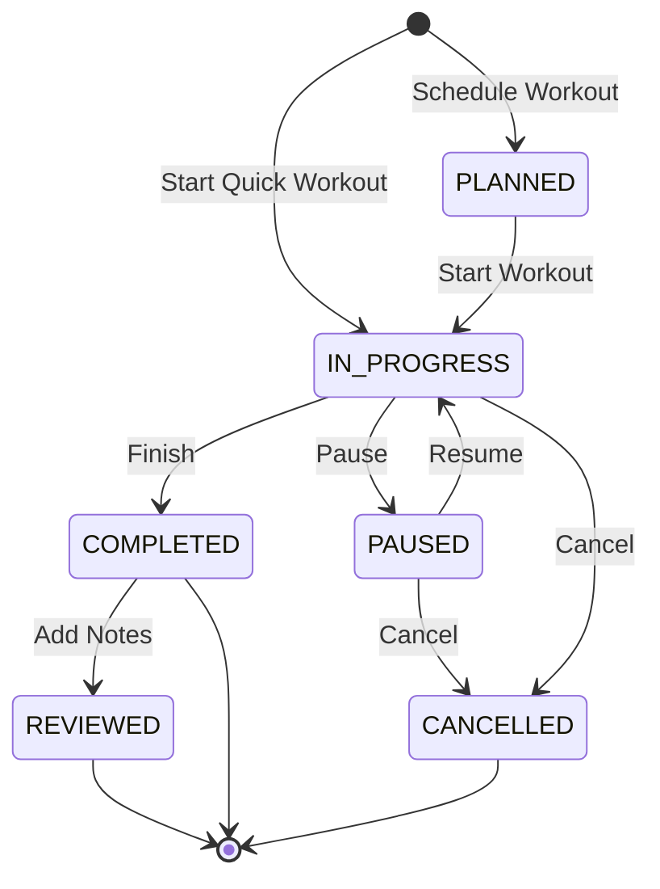
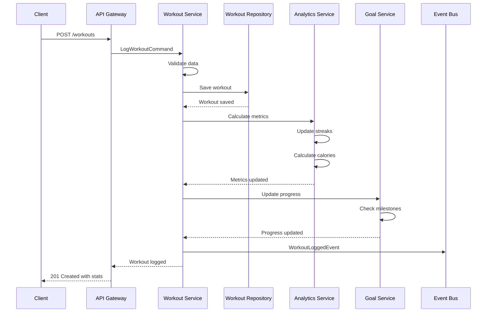
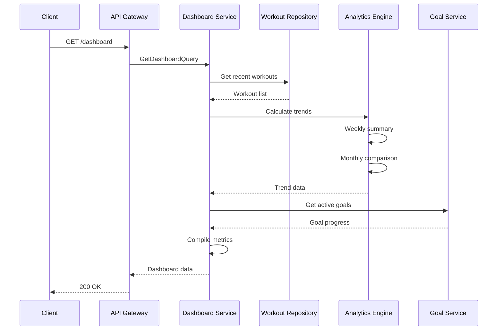
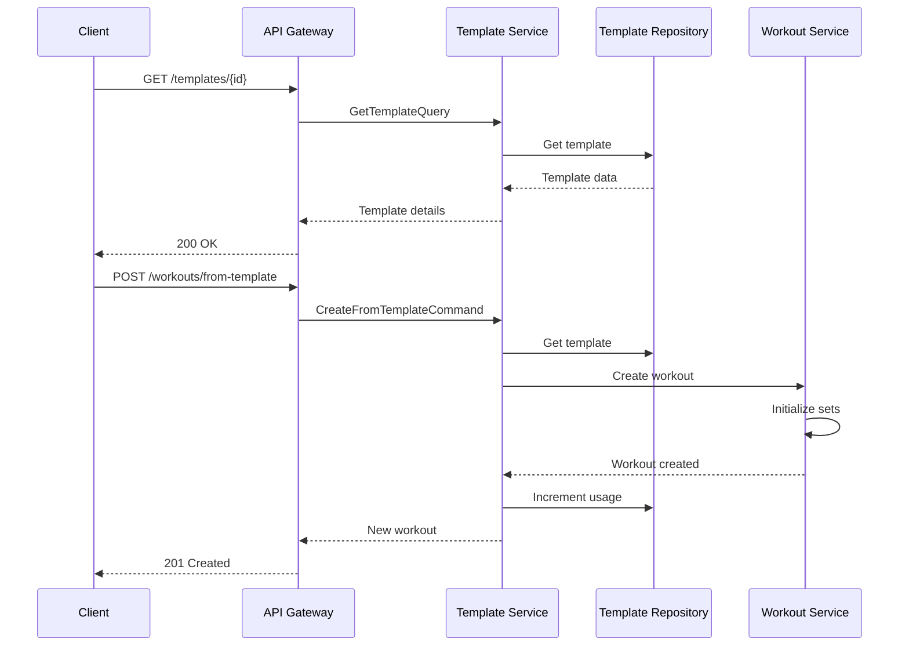

# Fitness Tracker Service Backend Technical Specification

## Review Table

| Version | Date | Name | Role | Description |
| --- | --- | --- | --- | --- |
| 1.2 | 2025-11-13 | Engineering Lead | Reviewer | Added wearable integration API and performance benchmarks |
| 1.1 | 2025-11-10 | Senior Developer | Reviewer | Enhanced goal tracking with milestone notifications |
| 1.0 | 2025-11-07 | System Architect | Author | Initial Draft |

## Approval Table

| Approved By | Approved At | Note |
| --- | --- | --- |
| Technical Lead | Pending | Review integration points |
| Product Owner | Pending | - |
| QA Manager | Pending | - |

---

## Background

Fitness enthusiasts and beginners alike struggle to maintain consistent workout routines due to lack of structured tracking, goal visibility, and progress insights. Current solutions either oversimplify tracking or require expensive hardware investments, creating barriers to entry for casual users seeking health improvements.

## Context

The fitness tracking landscape is divided between complex professional apps requiring wearables and oversimplified note-taking approaches. Users need a middle ground that provides structured workout logging with intelligent insights, progressive overload tracking, and motivational feedback without mandatory device dependencies. The system must support various workout types, from strength training to cardio, while maintaining simplicity for daily use.

## Objective

Implement a comprehensive fitness tracking service that:

1. **Enables quick workout logging** - Manual entry with smart defaults and templates
2. **Tracks measurable progress** - Visual trends, personal records, and streaks
3. **Provides intelligent guidance** - Rest day recommendations and overtraining alerts
4. **Supports diverse activities** - Strength, cardio, flexibility, and custom workouts

## Paradigm

We adopt a **Service-Oriented Architecture with Analytics Pipeline**:

- **Service Layer**: RESTful APIs for workout operations and data retrieval
- **Data Pipeline**: Apache Spark for batch analytics and trend analysis
- **Cache Layer**: Redis for leaderboards and frequently accessed metrics
- **Storage Strategy**: PostgreSQL for structured data, S3 for workout images/videos
- **Integration Layer**: Webhook system for third-party fitness device APIs

---

## Database Design

### dbdiagram.io Schema

```dbml
Table workouts {
  id uuid [pk]
  user_id uuid [ref: > users.id]
  activity_type_id uuid [ref: > activity_types.id]
  name varchar(255)
  duration_minutes int [not null]
  distance_km decimal(6,2)
  calories_burned int
  heart_rate_avg int
  notes text
  intensity WorkoutIntensity
  workout_date timestamp [not null]
  location varchar(255)
  weather varchar(100)
  created_at timestamp [default: `now()`]
  updated_at timestamp [default: `now()`]
  
  indexes {
    user_id
    (user_id, workout_date)
    (user_id, activity_type_id)
    workout_date
  }
}

Table activity_types {
  id uuid [pk]
  name varchar(100) [not null]
  category ActivityCategory
  met_value decimal(4,2) [note: 'Metabolic Equivalent of Task']
  icon varchar(50)
  color varchar(7)
  is_custom bool [default: false]
  user_id uuid [ref: > users.id]
  created_at timestamp [default: `now()`]
  
  indexes {
    category
    (user_id, name)
  }
}

Table workout_sets {
  id uuid [pk]
  workout_id uuid [ref: > workouts.id]
  exercise_id uuid [ref: > exercises.id]
  set_number int [not null]
  reps int
  weight_kg decimal(6,2)
  distance_meters int
  duration_seconds int
  rest_seconds int
  created_at timestamp [default: `now()`]
  
  indexes {
    workout_id
    (workout_id, set_number)
  }
}

Table exercises {
  id uuid [pk]
  name varchar(100) [not null]
  muscle_group MuscleGroup
  equipment_needed varchar(100)
  is_compound bool [default: false]
  user_id uuid [ref: > users.id]
  created_at timestamp [default: `now()`]
  
  indexes {
    muscle_group
    (user_id, name)
  }
}

Table fitness_goals {
  id uuid [pk]
  user_id uuid [ref: > users.id]
  goal_type GoalType
  target_value decimal(10,2) [not null]
  target_unit varchar(20)
  current_value decimal(10,2) [default: 0]
  deadline date
  status GoalStatus [default: 'ACTIVE']
  activity_type_id uuid [ref: > activity_types.id]
  created_at timestamp [default: `now()`]
  completed_at timestamp
  
  indexes {
    user_id
    (user_id, status)
    (user_id, deadline)
  }
}

Table workout_streaks {
  id uuid [pk]
  user_id uuid [ref: > users.id]
  current_streak int [default: 0]
  longest_streak int [default: 0]
  last_workout_date date
  streak_start_date date
  total_workouts int [default: 0]
  updated_at timestamp [default: `now()`]
  
  indexes {
    user_id [unique]
  }
}

Table body_measurements {
  id uuid [pk]
  user_id uuid [ref: > users.id]
  weight_kg decimal(5,2)
  body_fat_percentage decimal(4,2)
  muscle_mass_kg decimal(5,2)
  chest_cm decimal(5,2)
  waist_cm decimal(5,2)
  hips_cm decimal(5,2)
  bicep_cm decimal(4,2)
  thigh_cm decimal(5,2)
  measurement_date date [not null]
  notes text
  created_at timestamp [default: `now()`]
  
  indexes {
    user_id
    (user_id, measurement_date)
  }
}

Table workout_templates {
  id uuid [pk]
  user_id uuid [ref: > users.id]
  name varchar(255) [not null]
  description text
  activity_type_id uuid [ref: > activity_types.id]
  estimated_duration int
  exercises jsonb [note: 'Array of exercise configurations']
  is_public bool [default: false]
  usage_count int [default: 0]
  created_at timestamp [default: `now()`]
  
  indexes {
    user_id
    (user_id, name)
    is_public
  }
}

Table users {
  id uuid [pk]
  email varchar(255) [unique]
  name varchar(255)
  birth_date date
  height_cm int
  fitness_level FitnessLevel
  timezone varchar(50)
  preferences jsonb
  created_at timestamp
}

Enum WorkoutIntensity {
  LOW
  MODERATE
  HIGH
  MAXIMUM
}

Enum ActivityCategory {
  CARDIO
  STRENGTH
  FLEXIBILITY
  SPORTS
  RECREATION
}

Enum MuscleGroup {
  CHEST
  BACK
  SHOULDERS
  ARMS
  CORE
  LEGS
  FULL_BODY
}

Enum GoalType {
  WEIGHT_LOSS
  WEIGHT_GAIN
  DISTANCE
  DURATION
  FREQUENCY
  STRENGTH
}

Enum GoalStatus {
  ACTIVE
  COMPLETED
  PAUSED
  ABANDONED
}

Enum FitnessLevel {
  BEGINNER
  INTERMEDIATE
  ADVANCED
  ATHLETE
}
```

### SQL Implementation

```sql
CREATE TYPE workout_intensity AS ENUM ('LOW', 'MODERATE', 'HIGH', 'MAXIMUM');
CREATE TYPE activity_category AS ENUM ('CARDIO', 'STRENGTH', 'FLEXIBILITY', 'SPORTS', 'RECREATION');
CREATE TYPE muscle_group AS ENUM ('CHEST', 'BACK', 'SHOULDERS', 'ARMS', 'CORE', 'LEGS', 'FULL_BODY');
CREATE TYPE goal_type AS ENUM ('WEIGHT_LOSS', 'WEIGHT_GAIN', 'DISTANCE', 'DURATION', 'FREQUENCY', 'STRENGTH');
CREATE TYPE goal_status AS ENUM ('ACTIVE', 'COMPLETED', 'PAUSED', 'ABANDONED');

CREATE TABLE workouts (
    id UUID PRIMARY KEY DEFAULT gen_random_uuid(),
    user_id UUID NOT NULL REFERENCES users(id),
    activity_type_id UUID REFERENCES activity_types(id),
    name VARCHAR(255),
    duration_minutes INT NOT NULL,
    distance_km DECIMAL(6,2),
    calories_burned INT,
    heart_rate_avg INT,
    notes TEXT,
    intensity workout_intensity,
    workout_date TIMESTAMP NOT NULL,
    location VARCHAR(255),
    weather VARCHAR(100),
    created_at TIMESTAMP DEFAULT CURRENT_TIMESTAMP,
    updated_at TIMESTAMP DEFAULT CURRENT_TIMESTAMP
);

CREATE INDEX idx_workouts_user ON workouts(user_id);
CREATE INDEX idx_workouts_user_date ON workouts(user_id, workout_date DESC);
CREATE INDEX idx_workouts_activity ON workouts(user_id, activity_type_id);

-- Trigger for automatic calorie calculation
CREATE OR REPLACE FUNCTION calculate_calories()
RETURNS TRIGGER AS $$
BEGIN
    IF NEW.calories_burned IS NULL THEN
        NEW.calories_burned = (
            SELECT ROUND(NEW.duration_minutes * at.met_value * 
                   (SELECT weight_kg FROM body_measurements 
                    WHERE user_id = NEW.user_id 
                    ORDER BY measurement_date DESC LIMIT 1) / 60)
            FROM activity_types at 
            WHERE at.id = NEW.activity_type_id
        );
    END IF;
    RETURN NEW;
END;
$$ LANGUAGE plpgsql;

CREATE TRIGGER workout_calorie_calc
BEFORE INSERT OR UPDATE ON workouts
FOR EACH ROW EXECUTE FUNCTION calculate_calories();
```

---

## Activity Lifecycle

### Workout Session Lifecycle



---

## State Machines

### Goal Progress State Machine



### Workout Session State Machine



---

## Sequence Diagrams

### Log Workout Flow



### Progress Dashboard Flow



### Template Workout Flow



---

## API Endpoints

### Workout Management APIs

`POST /api/v1/workouts`

Log a new workout session.

Request:
```json
{
  "activity_type_id": "act_running",
  "name": "Morning Run",
  "duration_minutes": 45,
  "distance_km": 7.5,
  "intensity": "MODERATE",
  "workout_date": "2025-11-13T07:00:00Z",
  "notes": "Felt great, good pace",
  "sets": [
    {
      "exercise_id": "ex_warmup",
      "duration_seconds": 300
    }
  ]
}
```

Response (201 Created):
```json
{
  "id": "workout_abc123",
  "activity_type": "Running",
  "duration_minutes": 45,
  "calories_burned": 450,
  "progress": {
    "streak": 5,
    "weekly_total": 3,
    "goal_impact": [
      {
        "goal": "Weekly cardio",
        "progress": 75,
        "remaining": "1 workout"
      }
    ]
  },
  "created_at": "2025-11-13T07:00:00Z"
}
```

#### GET /api/v1/workouts
**List workouts with filtering**

Query Parameters:
| Parameter | Type | Required | Description |
| --- | --- | --- | --- |
| start_date | date | No | Filter from date |
| end_date | date | No | Filter to date |
| activity_type | uuid | No | Filter by activity |
| intensity | string | No | Filter by intensity |
| page | int | No | Page number (default: 1) |
| limit | int | No | Items per page (default: 20) |

Response (200 OK):
```json
{
  "workouts": [
    {
      "id": "workout_abc123",
      "name": "Morning Run",
      "activity_type": "Running",
      "duration_minutes": 45,
      "distance_km": 7.5,
      "calories_burned": 450,
      "workout_date": "2025-11-13T07:00:00Z"
    }
  ],
  "summary": {
    "total_workouts": 12,
    "total_duration": 540,
    "total_calories": 5400,
    "favorite_activity": "Running"
  },
  "pagination": {
    "page": 1,
    "limit": 20,
    "total": 156
  }
}
```

#### POST /api/v1/goals
**Create a fitness goal**

Request:
```json
{
  "goal_type": "DISTANCE",
  "target_value": 100,
  "target_unit": "km",
  "deadline": "2025-12-31",
  "activity_type_id": "act_running"
}
```

Response (201 Created):
```json
{
  "id": "goal_xyz456",
  "goal_type": "DISTANCE",
  "target_value": 100,
  "current_value": 15.5,
  "progress_percentage": 15.5,
  "days_remaining": 48,
  "on_track": true,
  "created_at": "2025-11-13T10:00:00Z"
}
```

#### GET /api/v1/dashboard
**Get fitness dashboard metrics**

Response (200 OK):
```json
{
  "streak": {
    "current": 5,
    "longest": 21,
    "last_workout": "2025-11-13"
  },
  "this_week": {
    "workouts": 3,
    "duration_minutes": 145,
    "calories_burned": 1450,
    "vs_last_week": "+25%"
  },
  "this_month": {
    "workouts": 12,
    "duration_minutes": 580,
    "calories_burned": 5800,
    "favorite_activity": "Running"
  },
  "active_goals": [
    {
      "id": "goal_xyz456",
      "description": "Run 100km",
      "progress": 15.5,
      "deadline": "2025-12-31",
      "on_track": true
    }
  ],
  "recent_workouts": [
    {
      "id": "workout_abc123",
      "name": "Morning Run",
      "date": "2025-11-13",
      "duration": 45,
      "calories": 450
    }
  ],
  "recommendations": [
    "You're on a 5-day streak! Keep it up!",
    "Try adding strength training for balanced fitness"
  ]
}
```

#### POST /api/v1/measurements
**Log body measurements**

Request:
```json
{
  "weight_kg": 75.5,
  "body_fat_percentage": 18.5,
  "waist_cm": 82,
  "measurement_date": "2025-11-13",
  "notes": "Morning measurement, before breakfast"
}
```

Response (201 Created):
```json
{
  "id": "measure_def789",
  "weight_kg": 75.5,
  "change_from_last": -0.5,
  "trend": "DECREASING",
  "bmi": 23.4,
  "created_at": "2025-11-13T07:00:00Z"
}
```

## Architecture Components

### Service Layer

**Core Services**:
- Workout Service - Manages workout logging and history
- Goal Service - Tracks fitness goals and milestones
- Analytics Service - Calculates trends and insights
- Streak Service - Maintains workout streaks
- Notification Service - Sends reminders and achievements

**Data Layer**:
- PostgreSQL - Primary storage for workouts and user data
- TimescaleDB - Time-series metrics and aggregations
- Redis - Cache for dashboard metrics
- S3 - Storage for progress photos

**Integration Layer**:
- REST API - Web and mobile clients
- GraphQL - Complex dashboard queries
- WebSocket - Live workout tracking
- Event Bus - Service communication
- Wearable APIs - Optional device integration

---

## Security Considerations

### Authorization
- User-scoped data access with JWT authentication
- API rate limiting: 100 requests/minute per user
- Session timeout after 30 minutes of inactivity
- Workout data isolation between users

### Privacy Protection
- Optional anonymous mode for sensitive health data
- HIPAA-ready infrastructure for health provider integrations
- Data retention policies with automatic purging
- Export and deletion rights under GDPR

### Data Validation
- Input sanitization for all user-provided content
- Range validation for physiological metrics
- Prevent future-dated workout entries
- Cross-site scripting (XSS) protection

---

## Testing Strategy

### Unit Tests
```typescript
describe('WorkoutService', () => {
  it('should calculate calories based on MET values', () => {
    const workout = new Workout({
      activity: 'Running',
      duration: 30,
      weight: 70
    });
    expect(workout.calculateCalories()).toBe(245);
  });

  it('should detect overtraining patterns', () => {
    const workouts = generateHighIntensityWeek();
    const analysis = analyzer.checkOvertraining(workouts);
    expect(analysis.risk).toBe('HIGH');
    expect(analysis.recommendation).toContain('rest day');
  });
});
```

### Integration Tests
- Workout logging with streak updates
- Goal progress calculation accuracy
- Template application with customization
- Body measurement trend analysis

### E2E Tests
- Complete workout session from start to finish
- Goal creation and milestone notifications
- Dashboard metrics accuracy
- Export functionality validation

### Performance Tests
- Dashboard load time < 1 second
- Workout save response < 500ms
- Handle 1000 concurrent active sessions
- Analytics calculation < 2 seconds

---

## Acceptance Criteria

1. ✅ Users can log workouts in under 30 seconds
2. ✅ Calorie calculation accuracy within 10% of actual
3. ✅ Streak tracking with timezone support
4. ✅ Goal progress updates in real-time
5. ✅ Support for 50+ exercise types
6. ✅ Rest day recommendations based on intensity
7. ✅ Personal record detection and celebration
8. ✅ Mobile app offline mode with sync
9. ✅ Export data in CSV and JSON formats
10. ✅ 99.5% uptime for core workout logging

---

## Implementation Notes

### Calorie Calculation
- Use MET values for activity-based calculation
- Factor in user weight and intensity
- Provide manual override option
- Learn from user corrections

### Streak Calculation
- Define active day threshold (e.g., any workout)
- Allow rest days without breaking streaks
- Weekend vs weekday streak options
- Recovery day support

### Goal Tracking
- Smart goal suggestions based on history
- Adaptive targets based on progress
- Milestone notifications
- Goal achievement badges

### Performance Optimizations
- Cache dashboard metrics in Redis
- Batch calculate weekly/monthly stats
- Use materialized views for trends
- Async processing for heavy analytics

### Data Privacy
- Anonymous benchmark comparisons
- Opt-in data sharing
- Local data export options
- GDPR compliance

### Monitoring & Insights
- Track popular workout times
- Analyze completion patterns
- Monitor goal success rates
- Detect overtraining signals

### Future Enhancements
- Wearable device integration
- Social workout challenges
- AI-powered form checking
- Nutrition tracking integration
- Virtual coaching