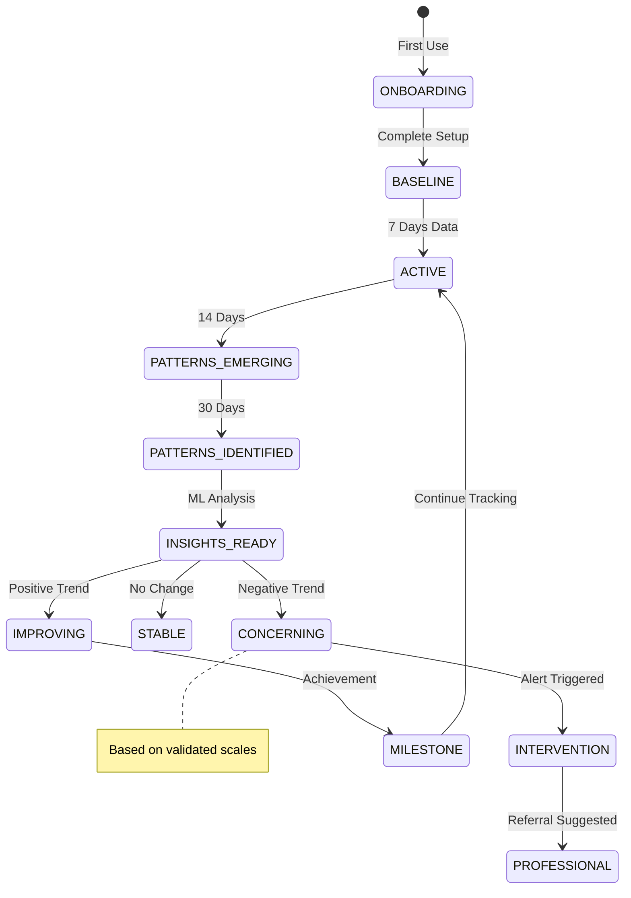
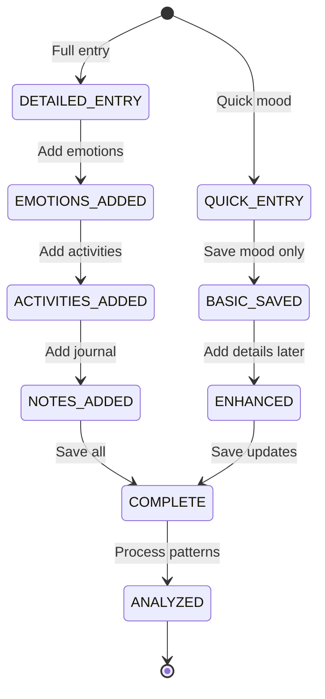
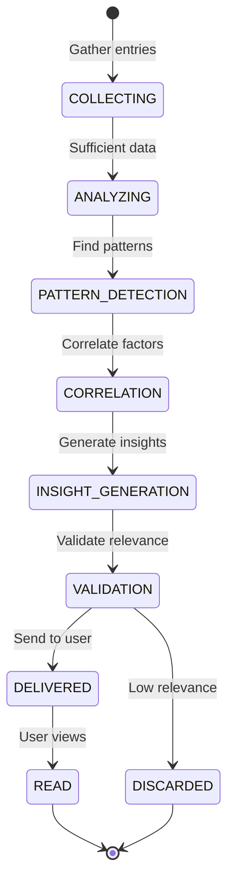
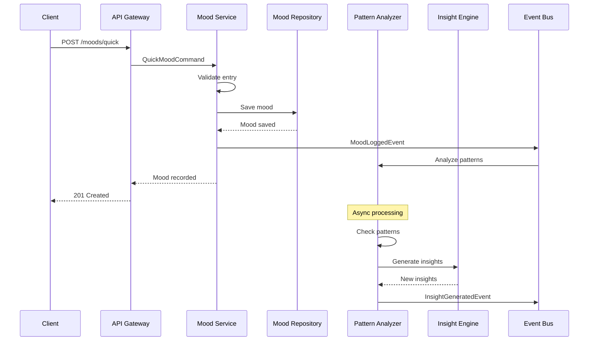
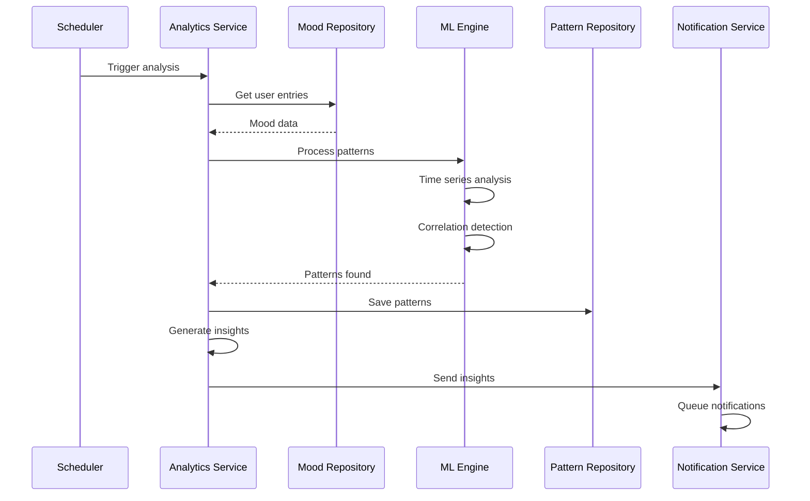
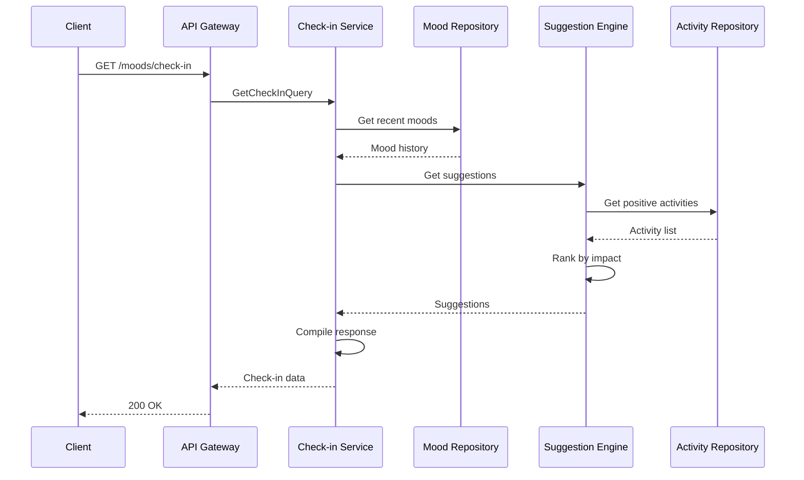

# Mood Journal Service Backend Technical Specification

## Review Table

| Version | Date | Name | Role | Description |
| --- | --- | --- | --- | --- |
| 1.2 | 2025-11-13 | Privacy Officer | Reviewer | Enhanced encryption and HIPAA compliance measures |
| 1.1 | 2025-11-10 | ML Engineer | Reviewer | Added pattern detection algorithms and insight generation |
| 1.0 | 2025-11-07 | System Architect | Author | Initial Draft |

## Approval Table

| Approved By | Approved At | Note |
| --- | --- | --- |
| Technical Lead | Pending | Review ML pipeline |
| Product Owner | Pending | - |
| Clinical Advisor | Pending | Validate psychological frameworks |

---

## Background

Mental health awareness is growing, but individuals lack tools to systematically track and understand their emotional patterns. Users need a private, secure platform to log moods, identify triggers, and receive evidence-based insights without fear of data misuse or stigma.

## Context

Current mood tracking solutions either lack depth (simple rating scales) or require extensive manual journaling without automated insights. Users need quick mood logging with optional detailed journaling, pattern detection across multiple factors (sleep, activities, weather), and actionable recommendations based on psychological research. Privacy and data security are paramount given the sensitive nature of mental health data.

## Objective

Implement a comprehensive mood journaling service that:

1. **Enables quick mood logging** - One-tap mood entry with optional details
2. **Identifies emotional patterns** - ML-driven analysis of triggers and cycles
3. **Provides personalized insights** - Evidence-based recommendations for well-being
4. **Ensures complete privacy** - End-to-end encryption with zero-knowledge architecture

## Paradigm

We adopt a **Privacy-First Layered Architecture with Time-Series Focus**:

- **Time-Series Database**: InfluxDB for efficient mood data storage and queries
- **Privacy Layer**: Client-side encryption with user-controlled keys
- **Service Layer**: Business logic for mood analysis and insights
- **ML Pipeline**: Separate batch processing for pattern detection
- **API Layer**: REST with strict rate limiting and authentication

---

## Database Design

### dbdiagram.io Schema

```dbml
Table mood_entries {
  id uuid [pk]
  user_id uuid [ref: > users.id]
  mood_value int [not null, note: 'Scale 1-10']
  primary_emotion_id uuid [ref: > emotions.id]
  energy_level int [note: 'Scale 1-10']
  stress_level int [note: 'Scale 1-10']
  sleep_hours decimal(3,1)
  sleep_quality int [note: 'Scale 1-5']
  entry_date date [not null]
  entry_time time [not null]
  weather varchar(50)
  location varchar(255)
  is_encrypted bool [default: false]
  created_at timestamp [default: `now()`]
  updated_at timestamp [default: `now()`]
  
  indexes {
    user_id
    (user_id, entry_date)
    (user_id, created_at)
    entry_date
  }
}

Table mood_emotions {
  id uuid [pk]
  mood_entry_id uuid [ref: > mood_entries.id]
  emotion_id uuid [ref: > emotions.id]
  intensity int [note: 'Scale 1-5']
  created_at timestamp [default: `now()`]
  
  indexes {
    mood_entry_id
    (mood_entry_id, emotion_id) [unique]
  }
}

Table emotions {
  id uuid [pk]
  name varchar(50) [not null]
  category EmotionCategory
  valence int [note: '-5 to +5, negative to positive']
  arousal int [note: '1-10, calm to excited']
  color varchar(7)
  icon varchar(50)
  is_primary bool [default: false]
  created_at timestamp [default: `now()`]
  
  indexes {
    category
    is_primary
  }
}

Table mood_notes {
  id uuid [pk]
  mood_entry_id uuid [ref: > mood_entries.id, unique]
  note_text text
  is_encrypted bool [default: false]
  gratitude_list jsonb
  accomplishments jsonb
  challenges jsonb
  created_at timestamp [default: `now()`]
  
  indexes {
    mood_entry_id [unique]
  }
}

Table mood_activities {
  id uuid [pk]
  mood_entry_id uuid [ref: > mood_entries.id]
  activity_id uuid [ref: > activities.id]
  impact MoodImpact
  created_at timestamp [default: `now()`]
  
  indexes {
    mood_entry_id
    (mood_entry_id, activity_id) [unique]
  }
}

Table activities {
  id uuid [pk]
  user_id uuid [ref: > users.id]
  name varchar(100) [not null]
  category ActivityCategory
  icon varchar(50)
  color varchar(7)
  is_custom bool [default: false]
  usage_count int [default: 0]
  average_impact decimal(3,2)
  created_at timestamp [default: `now()`]
  
  indexes {
    user_id
    category
    (user_id, name) [unique]
  }
}

Table mood_triggers {
  id uuid [pk]
  mood_entry_id uuid [ref: > mood_entries.id]
  trigger_type TriggerType
  trigger_name varchar(255)
  impact_level int [note: 'Scale -5 to +5']
  created_at timestamp [default: `now()`]
  
  indexes {
    mood_entry_id
    trigger_type
  }
}

Table mood_patterns {
  id uuid [pk]
  user_id uuid [ref: > users.id]
  pattern_type PatternType
  pattern_data jsonb
  confidence_score decimal(3,2)
  period_start date
  period_end date
  insights text
  created_at timestamp [default: `now()`]
  
  indexes {
    user_id
    (user_id, pattern_type)
    (user_id, period_start)
  }
}

Table mood_reminders {
  id uuid [pk]
  user_id uuid [ref: > users.id]
  reminder_time time [not null]
  frequency ReminderFrequency
  message text
  is_active bool [default: true]
  last_sent_at timestamp
  created_at timestamp [default: `now()`]
  
  indexes {
    user_id
    (is_active, reminder_time)
  }
}

Table mood_insights {
  id uuid [pk]
  user_id uuid [ref: > users.id]
  insight_type InsightType
  title varchar(255)
  description text
  data jsonb
  relevance_score decimal(3,2)
  is_read bool [default: false]
  created_at timestamp [default: `now()`]
  expires_at timestamp
  
  indexes {
    user_id
    (user_id, is_read)
    (user_id, relevance_score)
  }
}

Table users {
  id uuid [pk]
  email varchar(255) [unique]
  name varchar(255)
  timezone varchar(50)
  preferences jsonb
  therapy_mode bool [default: false]
  created_at timestamp
}

Enum EmotionCategory {
  JOY
  SADNESS
  ANGER
  FEAR
  SURPRISE
  DISGUST
  NEUTRAL
}

Enum MoodImpact {
  VERY_NEGATIVE
  NEGATIVE
  NEUTRAL
  POSITIVE
  VERY_POSITIVE
}

Enum ActivityCategory {
  SOCIAL
  EXERCISE
  WORK
  HOBBY
  SELF_CARE
  ROUTINE
}

Enum TriggerType {
  PERSON
  PLACE
  EVENT
  THOUGHT
  PHYSICAL
}

Enum PatternType {
  WEEKLY_CYCLE
  MONTHLY_CYCLE
  SEASONAL
  TRIGGER_CORRELATION
  ACTIVITY_IMPACT
}

Enum ReminderFrequency {
  DAILY
  WEEKDAYS
  WEEKENDS
  CUSTOM
}

Enum InsightType {
  PATTERN
  MILESTONE
  SUGGESTION
  WARNING
}
```

### SQL Implementation

```sql
CREATE TYPE emotion_category AS ENUM ('JOY', 'SADNESS', 'ANGER', 'FEAR', 'SURPRISE', 'DISGUST', 'NEUTRAL');
CREATE TYPE mood_impact AS ENUM ('VERY_NEGATIVE', 'NEGATIVE', 'NEUTRAL', 'POSITIVE', 'VERY_POSITIVE');
CREATE TYPE activity_category AS ENUM ('SOCIAL', 'EXERCISE', 'WORK', 'HOBBY', 'SELF_CARE', 'ROUTINE');
CREATE TYPE trigger_type AS ENUM ('PERSON', 'PLACE', 'EVENT', 'THOUGHT', 'PHYSICAL');
CREATE TYPE pattern_type AS ENUM ('WEEKLY_CYCLE', 'MONTHLY_CYCLE', 'SEASONAL', 'TRIGGER_CORRELATION', 'ACTIVITY_IMPACT');

CREATE TABLE mood_entries (
    id UUID PRIMARY KEY DEFAULT gen_random_uuid(),
    user_id UUID NOT NULL REFERENCES users(id),
    mood_value INT NOT NULL CHECK (mood_value >= 1 AND mood_value <= 10),
    primary_emotion_id UUID REFERENCES emotions(id),
    energy_level INT CHECK (energy_level >= 1 AND energy_level <= 10),
    stress_level INT CHECK (stress_level >= 1 AND stress_level <= 10),
    sleep_hours DECIMAL(3,1) CHECK (sleep_hours >= 0 AND sleep_hours <= 24),
    sleep_quality INT CHECK (sleep_quality >= 1 AND sleep_quality <= 5),
    entry_date DATE NOT NULL,
    entry_time TIME NOT NULL,
    weather VARCHAR(50),
    location VARCHAR(255),
    is_encrypted BOOLEAN DEFAULT false,
    created_at TIMESTAMP DEFAULT CURRENT_TIMESTAMP,
    updated_at TIMESTAMP DEFAULT CURRENT_TIMESTAMP,
    UNIQUE(user_id, entry_date, entry_time)
);

CREATE INDEX idx_mood_user ON mood_entries(user_id);
CREATE INDEX idx_mood_user_date ON mood_entries(user_id, entry_date DESC);
CREATE INDEX idx_mood_date ON mood_entries(entry_date);

-- View for mood trends
CREATE MATERIALIZED VIEW mood_trends AS
SELECT 
    user_id,
    DATE_TRUNC('week', entry_date) as week,
    AVG(mood_value) as avg_mood,
    AVG(energy_level) as avg_energy,
    AVG(stress_level) as avg_stress,
    COUNT(*) as entry_count
FROM mood_entries
GROUP BY user_id, DATE_TRUNC('week', entry_date);

CREATE INDEX idx_mood_trends_user ON mood_trends(user_id);
```

---

## Activity Lifecycle

### Mood Tracking Journey



---

## State Machines

### Mood Entry Lifecycle



### Insight Generation Pipeline



---

## Sequence Diagrams

### Quick Mood Entry Flow



### Mood Patterns Analysis



### Mood Check-in with Suggestions



---

## API Endpoints

### Mood Management Endpoints

#### POST /api/v1/moods
**Create a detailed mood entry**

Request:
```json
{
  "mood_value": 7,
  "primary_emotion": "JOY",
  "emotions": [
    {"emotion_id": "em_happy", "intensity": 4},
    {"emotion_id": "em_grateful", "intensity": 3}
  ],
  "energy_level": 8,
  "stress_level": 3,
  "sleep_hours": 7.5,
  "sleep_quality": 4,
  "activities": [
    {"activity_id": "act_exercise", "impact": "POSITIVE"},
    {"activity_id": "act_meditation", "impact": "VERY_POSITIVE"}
  ],
  "notes": {
    "note_text": "Great day, felt productive",
    "gratitude_list": ["Family", "Health", "New opportunity"],
    "accomplishments": ["Finished project", "Went for run"]
  },
  "triggers": [
    {"type": "EVENT", "name": "Team meeting", "impact": 3}
  ]
}
```

Response (201 Created):
```json
{
  "id": "mood_abc123",
  "mood_value": 7,
  "primary_emotion": "JOY",
  "streak": 14,
  "insights": [
    "Your mood improves 23% on days with exercise",
    "You're on a 14-day logging streak!"
  ],
  "created_at": "2025-11-13T20:00:00Z"
}
```

#### POST /api/v1/moods/quick
**Quick mood entry**

Request:
```json
{
  "mood_value": 6,
  "primary_emotion": "NEUTRAL"
}
```

Response (201 Created):
```json
{
  "id": "mood_xyz456",
  "mood_value": 6,
  "quick_insights": "Your mood is stable today",
  "suggestion": "Consider adding more details later",
  "created_at": "2025-11-13T14:00:00Z"
}
```

#### GET /api/v1/moods
**List mood entries with filtering**

Query Parameters:
| Parameter | Type | Required | Description |
| --- | --- | --- | --- |
| start_date | date | No | Filter from date |
| end_date | date | No | Filter to date |
| emotion | string | No | Filter by emotion |
| min_mood | int | No | Minimum mood value |
| page | int | No | Page number (default: 1) |
| limit | int | No | Items per page (default: 20) |

Response (200 OK):
```json
{
  "moods": [
    {
      "id": "mood_abc123",
      "mood_value": 7,
      "primary_emotion": "JOY",
      "entry_date": "2025-11-13",
      "entry_time": "20:00",
      "has_notes": true
    }
  ],
  "summary": {
    "average_mood": 6.8,
    "mood_trend": "IMPROVING",
    "dominant_emotion": "JOY"
  },
  "pagination": {
    "page": 1,
    "limit": 20,
    "total": 89
  }
}
```

#### GET /api/v1/moods/insights
**Get personalized insights**

Response (200 OK):
```json
{
  "insights": [
    {
      "id": "insight_123",
      "type": "PATTERN",
      "title": "Weekend Mood Boost",
      "description": "Your mood averages 2 points higher on weekends",
      "relevance_score": 0.95,
      "data": {
        "weekday_avg": 5.8,
        "weekend_avg": 7.8
      }
    },
    {
      "id": "insight_456",
      "type": "SUGGESTION",
      "title": "Morning meditation impact",
      "description": "Days starting with meditation show 30% less stress",
      "relevance_score": 0.88,
      "action": "Try morning meditation tomorrow"
    }
  ],
  "milestones": [
    {
      "type": "STREAK",
      "value": 30,
      "message": "30 days of mood tracking!"
    }
  ]
}
```

#### GET /api/v1/moods/analytics
**Get mood analytics and trends**

Query Parameters:
| Parameter | Type | Required | Description |
| --- | --- | --- | --- |
| period | string | No | 'week', 'month', 'year' (default: 'month') |

Response (200 OK):
```json
{
  "period": "month",
  "mood_chart": [
    {"date": "2025-11-01", "mood": 6, "energy": 7, "stress": 4},
    {"date": "2025-11-02", "mood": 7, "energy": 8, "stress": 3}
  ],
  "emotion_distribution": [
    {"emotion": "JOY", "count": 12, "percentage": 40},
    {"emotion": "NEUTRAL", "count": 10, "percentage": 33}
  ],
  "activity_impacts": [
    {"activity": "Exercise", "average_impact": 2.3, "frequency": 15},
    {"activity": "Meditation", "average_impact": 1.8, "frequency": 20}
  ],
  "patterns": [
    {
      "type": "WEEKLY_CYCLE",
      "description": "Monday blues pattern detected",
      "confidence": 0.78
    }
  ],
  "correlations": [
    {
      "factor": "sleep_quality",
      "mood_correlation": 0.72,
      "interpretation": "Strong positive correlation"
    }
  ]
}
```

## Architecture Components

### Service Layer

**Core Services**:
- Mood Service - Handles mood entry and retrieval
- Pattern Service - Detects emotional patterns and cycles
- Insight Service - Generates personalized recommendations
- Encryption Service - Manages end-to-end encryption
- Notification Service - Sends reminders and alerts

**Data Layer**:
- PostgreSQL - Primary storage with encryption at rest
- TimescaleDB - Time-series mood trends
- Redis - Cache for quick check-ins
- S3 - Encrypted journal attachments

**ML Pipeline**:
- TensorFlow Lite - On-device pattern detection
- Cloud ML - Advanced pattern analysis
- NLP Service - Journal text sentiment analysis
- Anomaly Detection - Crisis intervention triggers

**Integration Layer**:
- REST API - Mobile and web clients
- GraphQL - Complex analytics queries
- WebSocket - Real-time mood updates
- HealthKit/Google Fit - Biometric correlation

---

## Security Considerations

### Privacy Protection
- **End-to-end encryption** option for all mood data
- **Zero-knowledge architecture** - server cannot decrypt data
- **Local-only mode** for maximum privacy
- **Anonymous aggregation** for research insights

### Compliance
- **HIPAA compliance** for healthcare integrations
- **GDPR compliance** with right to deletion
- **CCPA compliance** for California users
- **SOC 2 Type II** certification

### Data Security
- **AES-256 encryption** at rest
- **TLS 1.3** for all communications
- **Key rotation** every 90 days
- **Secure key storage** using HSM

### Crisis Management
- **Automated crisis detection** based on validated scales
- **Resource referral system** for immediate help
- **Optional therapist alerts** with user consent
- **Emergency contact notification** system

---

## Testing Strategy

### Unit Tests
```typescript
describe('MoodPatternDetector', () => {
  it('should identify weekly cycles', () => {
    const entries = generateWeeklyPattern();
    const pattern = detector.analyze(entries);
    expect(pattern.type).toBe('WEEKLY_CYCLE');
    expect(pattern.confidence).toBeGreaterThan(0.7);
  });

  it('should detect concerning patterns', () => {
    const entries = generateDeclinePattern();
    const alert = detector.checkConcerning(entries);
    expect(alert.triggered).toBe(true);
    expect(alert.severity).toBe('MODERATE');
  });
});
```

### Integration Tests
- Mood entry with encryption flow
- Pattern detection pipeline accuracy
- Insight generation relevance
- Crisis detection sensitivity

### E2E Tests
- Complete mood tracking journey
- Data export and portability
- Therapist sharing workflow
- Emergency contact system

### Security Tests
- Encryption key management
- Zero-knowledge verification
- Data isolation between users
- Penetration testing quarterly

---

## Acceptance Criteria

1. ✅ Mood entry completed in < 5 seconds
2. ✅ Pattern detection accuracy > 80%
3. ✅ Insight relevance score > 0.7
4. ✅ End-to-end encryption < 100ms overhead
5. ✅ Crisis detection sensitivity > 90%
6. ✅ Zero data breaches or leaks
7. ✅ Data export within 24 hours
8. ✅ 99.99% uptime for mood logging
9. ✅ HIPAA compliance certification
10. ✅ User satisfaction score > 4.5/5

---

## Implementation Notes

### Privacy & Security
- Optional end-to-end encryption for entries
- Zero-knowledge architecture option
- Local-only mode available
- Anonymous pattern aggregation
- HIPAA compliance ready

### Pattern Recognition
- Time series analysis for cycles
- Correlation analysis for triggers
- Sentiment analysis for notes
- Anomaly detection for alerts
- Seasonal affective pattern detection

### Insight Generation
- Evidence-based CBT principles
- Personalized recommendations
- Actionable suggestions
- Cultural sensitivity in messaging
- Professional resource connections

### Performance Optimizations
- Batch pattern analysis nightly
- Cache frequent queries in Redis
- Lazy load detailed entries
- Progressive data aggregation
- Client-side chart rendering

### Data Export & Portability
- Full data export in JSON/CSV
- Therapist report generation
- Integration with health apps
- Backup to cloud storage
- Account deletion with data purge

### Monitoring & Safety
- Crisis resource links
- Concerning pattern detection
- Optional therapist sharing
- Emergency contact system
- Wellness check reminders

### Future Enhancements
- Voice mood entry
- Photo mood board
- Biometric integration
- Group mood tracking
- AI therapy chatbot
- Predictive mood forecasting