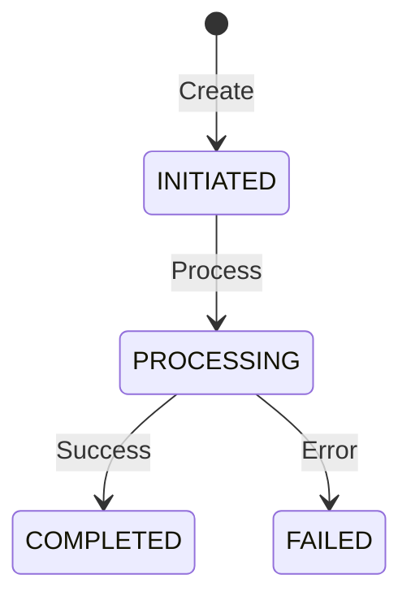
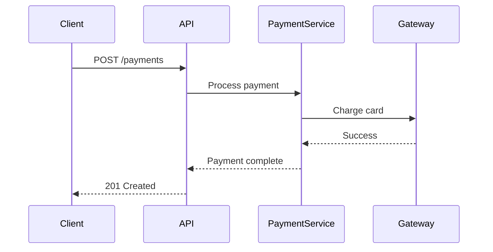

# Backend Spec Writer

This skill provides comprehensive guidance and tools for writing professional technical design specifications, with support for diverse architectural patterns suited to different problem domains.

## Overview

This skill helps create well-structured technical specifications that include:
- Clear problem definition and solution approach
- Database schemas with dbdiagram.io and SQL syntax
- State machines and sequence diagrams using Mermaid
- REST API endpoint documentation
- DDD concepts (bounded contexts, aggregates, domain events)
- Hexagonal architecture (ports and adapters)
- Implementation notes and operational considerations

## When to Use This Skill

Trigger this skill when:
- Creating a new technical specification or design document
- Documenting system architecture or API design
- Defining database schemas and data models
- Specifying state machines and business workflows
- Implementing DDD and hexagonal architecture patterns
- Writing engineering documentation for complex systems
- Creating specs for microservices or distributed systems
- Documenting integration patterns between systems

## Quick Start

### Generate a Basic Spec Scaffold

Use the scaffolding generator to quickly create a spec structure:

```bash
# Standard specification
python scripts/generate_scaffold.py "My New Feature Spec" --author "Your Name"

# DDD/Hexagonal specification
python scripts/generate_scaffold.py "Payment Service Spec" --author "Your Name" --type ddd

# Clean Architecture specification
python scripts/generate_scaffold.py "Task Manager Spec" --author "Your Name" --type clean

# Microservices specification
python scripts/generate_scaffold.py "Bookmark Service Spec" --author "Your Name" --type microservices

# Event Sourcing specification
python scripts/generate_scaffold.py "Expense Logger Spec" --author "Your Name" --type event-sourcing

# Save to file
python scripts/generate_scaffold.py "Order Management Spec" --author "Your Name" -o order_spec.md
```

## Core Components of a Spec

### 1. Header Metadata

Every spec should begin with review and approval tables:

```markdown
## Review Table
| Version | Date | Name | Role | Description |
| --- | --- | --- | --- | --- |
| 1.0 | [Date] | [Author] | Author | Initial Draft |

## Approval Table
| Approved By | Approved At | Note |
| --- | --- | --- |
```

### 2. Background / Context / Objective

Structure your opening with:
- **Background**: Historical context and current state
- **Context**: System limitations and needs
- **Objective**: Clear goals and success criteria
- **Paradigm** (optional): Design philosophy and approach

### 3. Database Design

Use dbdiagram.io syntax for visual representation:

```dbml
Table orders {
  id int [pk, increment]
  customer_id int [ref: > customers.id]
  status OrderStatus
  created_at timestamp [default: `CURRENT_TIMESTAMP`]
  
  indexes {
    customer_id
    (status, created_at)
  }
}

Enum OrderStatus {
  INITIATED
  PROCESSING
  COMPLETED
  FAILED
}
```

Follow with SQL implementation for clarity.

### 4. State Machines

Document state transitions clearly:



Include a state transition table with triggers and guards.

### 5. API Documentation

Document endpoints with clear request/response formats:

```markdown
### POST /api/orders

**Request**
| Field | Type | Required | Description |
| --- | --- | --- | --- |
| customer_id | string | Y | Customer identifier |
| items | array | Y | Order items |

**Response (201 Created)**
{
  "order_id": "ord_123",
  "status": "INITIATED"
}
```

## Choosing the Right Architecture

### Architecture Pattern Selection Guide

Choose your architecture based on the problem domain:

#### Clean Architecture with Repository Pattern
**Best for:** CRUD-heavy applications, task managers, simple business apps
- Clear separation of concerns with layers
- Repository pattern for data abstraction
- Use cases encapsulate business logic
- Easy to test and maintain

#### Document-Oriented Architecture
**Best for:** Content management, note-taking apps, knowledge bases
- Flexible schema with document stores (MongoDB)
- Search-first design with Elasticsearch
- GraphQL for flexible querying
- Optimized for rich content

#### Event Sourcing
**Best for:** Financial systems, audit-heavy applications, systems needing replay
- Immutable event log as source of truth
- Complete audit trail
- Can rebuild state from events
- Perfect for compliance requirements

#### Microservices Architecture
**Best for:** Large systems with multiple teams, scaling requirements
- Independent services with clear boundaries
- API Gateway for unified access
- Message queues for async communication
- Each service can use different tech stack

#### Service-Oriented Architecture (SOA)
**Best for:** Enterprise systems, integration-heavy applications
- RESTful services for operations
- Shared data pipeline for analytics
- Centralized caching layer
- Integration with third-party services

#### Domain-Driven Design (DDD) with Hexagonal
**Best for:** Complex business domains, payment systems, e-commerce
- Rich domain models
- Bounded contexts for clear boundaries
- Ports and adapters for flexibility
- Ubiquitous language

#### Modular Monolith
**Best for:** Medium complexity apps, future microservices candidates
- Module boundaries within single deployment
- Easier to manage than microservices
- Can evolve to microservices later
- Shared database with logical separation

#### Time-Series Architecture
**Best for:** IoT, monitoring, mood/health tracking, metrics
- Specialized time-series databases (InfluxDB)
- Efficient temporal queries
- Built-in aggregations and downsampling
- Optimized for time-based data

## DDD and Hexagonal Architecture

When implementing DDD patterns:

### Bounded Contexts
Define clear domain boundaries:
- What each context owns (aggregates, entities)
- Events it publishes
- Dependencies on other contexts

### Aggregates
Document aggregate roots and their invariants:
- Identity and boundaries
- State transitions
- Business rules

### Ports and Adapters
Separate business logic from infrastructure:
- **Inbound Ports**: Use case interfaces
- **Outbound Ports**: Repository and external service interfaces
- **Adapters**: Concrete implementations

Detailed patterns and examples are available through the comprehensive templates and guidelines in this skill.

## Best Practices

### Core Principles

1. **Be Specific**: Avoid vague terms; use measurable criteria
2. **Include Examples**: Every complex concept needs a concrete example
3. **Document Decisions**: Include rationale for architectural choices
4. **Version Everything**: Track changes systematically
5. **Define Success**: Make acceptance criteria measurable

### Diagram-First Approach ⚠️ CRITICAL

**Use diagrams to explain, not code.** Code should only appear in specs when absolutely necessary.

**Good uses of code in specs:**
- Database schema definitions (DBML/SQL) - essential for implementation
- API request/response examples - shows exact contract
- Critical business logic - only when it cannot be explained clearly otherwise
- Configuration examples - when structure is complex

**Avoid excessive code:**
- ❌ Don't include full implementation code blocks
- ❌ Don't show service classes or repository implementations
- ❌ Don't include test code (testing strategy is optional anyway)
- ❌ Don't paste large code snippets when a diagram would suffice

**Instead, use:**
- ✅ Mermaid sequence diagrams for flows
- ✅ State machines for lifecycles
- ✅ Architecture diagrams for system design
- ✅ Entity-relationship diagrams for data
- ✅ Flowcharts for decision logic

**Example - Bad:**
```typescript
// 50 lines of service implementation code
class PaymentService {
  async processPayment(req: PaymentRequest) {
    // ... lots of code ...
  }
}
```

**Example - Good:**


### Optional but Beneficial Sections

While not strictly required, these sections greatly improve spec quality:
- **Testing Strategy**: How to verify the implementation works
- **Rollback Plan**: What to do if deployment fails
- **Performance Benchmarks**: Expected throughput and latency
- **Monitoring & Alerting**: How to observe system health

### Absolutely Required Sections

Every spec MUST include:
- ✅ **Review Table**: Track who reviewed and when
- ✅ **Approval Table**: Track who approved and when
- ✅ **Background/Context/Objective**: Why this work matters
- ✅ **Database Design** (if applicable): Schema changes
- ✅ **API Documentation** (if applicable): Endpoint contracts
- ✅ **State Machines** (if applicable): Lifecycle transitions

## Common Patterns

### Idempotency
- Use unique reference IDs
- Check existing state before mutations
- Return same response for duplicate requests

### Repository Pattern
- Abstract data access logic
- Enable easy testing with mocks
- Switch data sources without changing business logic

### Saga Pattern
- Manage distributed transactions
- Implement compensation logic
- Handle partial failures gracefully

### API Gateway
- Single entry point for clients
- Handle cross-cutting concerns (auth, rate limiting)
- Route to appropriate services

### Circuit Breaker
- Prevent cascading failures
- Fail fast when service is down
- Automatic recovery detection

### Event Sourcing (When Appropriate)
- Store events for audit trails (financial systems)
- Rebuild state from event history
- Enable temporal queries and replay

### CQRS (When Appropriate)
- Use when read/write patterns differ significantly
- Not needed for simple CRUD applications
- Adds complexity - use judiciously

## Resources

### scripts/
- `generate_scaffold.py` - Generates basic spec structure with optional DDD support

### references/
- `spec-templates.md` - Standard spec structure and templates
- `spec-sections.md` - Common sections and writing patterns
- `architecture-patterns.md` - Comprehensive guide to choosing architectural patterns

## Example Usage

### Creating a Payment Service Spec

1. Generate scaffold with DDD support
2. Define bounded contexts (Payment, Order, User)
3. Model aggregates (PaymentRequest, PaymentTransaction)
4. Design state machine (INITIATED → PROCESSING → COMPLETED/FAILED)
5. Define ports for external payment gateways
6. Document API endpoints
7. Specify database schema
8. Include operational considerations

### Creating a Notification System Spec

1. Start with standard scaffold
2. Define notification types and categories
3. Design database schema for notifications and read tracking
4. Specify delivery mechanisms (push, email, in-app)
5. Document targeting and filtering logic
6. Define APIs for sending and retrieving notifications
7. Include monitoring and delivery tracking

## Output Format

Specs should be written in Markdown with:
- Clear section headers
- Tables for structured data
- Code blocks with syntax highlighting
- Mermaid diagrams for visualizations
- Consistent formatting throughout

## Important Notes

- Always include both business and technical perspectives
- Consider backward compatibility and migration paths
- Document assumptions and constraints explicitly
- Include concrete examples for complex concepts
- Keep specs versioned and track changes
- Focus on clarity and completeness over brevity
- Ensure specs are actionable and testable
