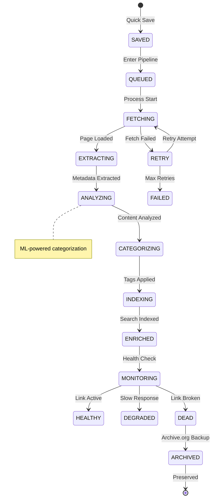
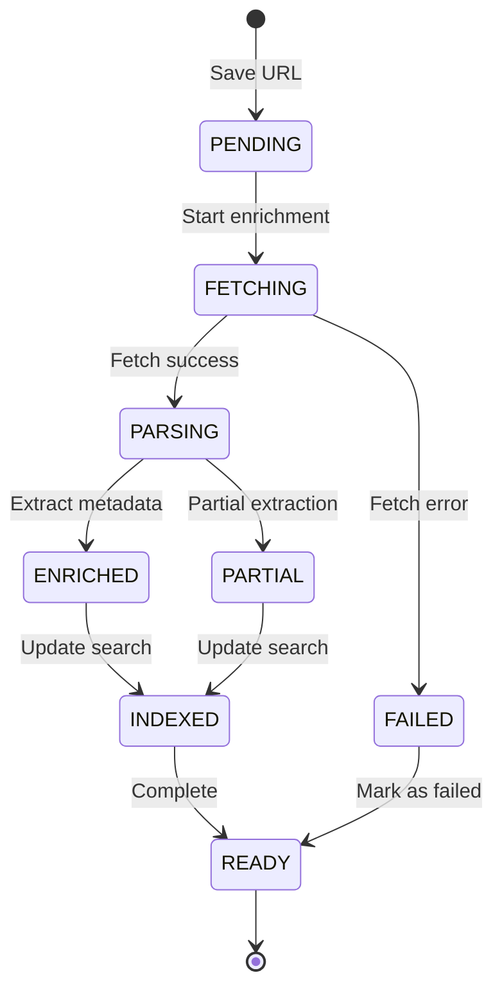
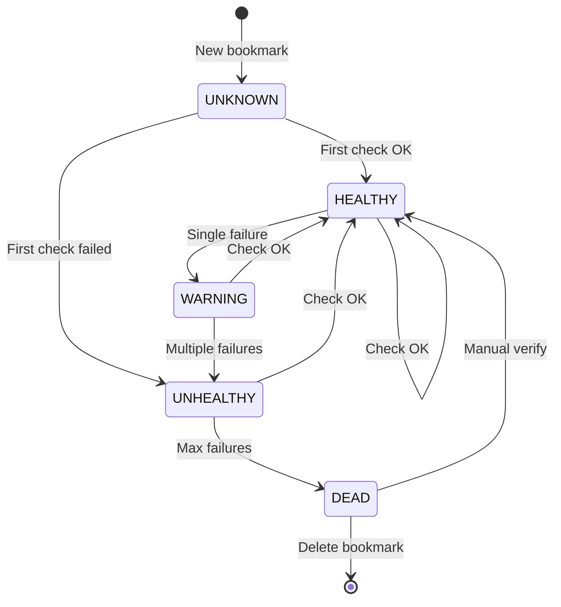
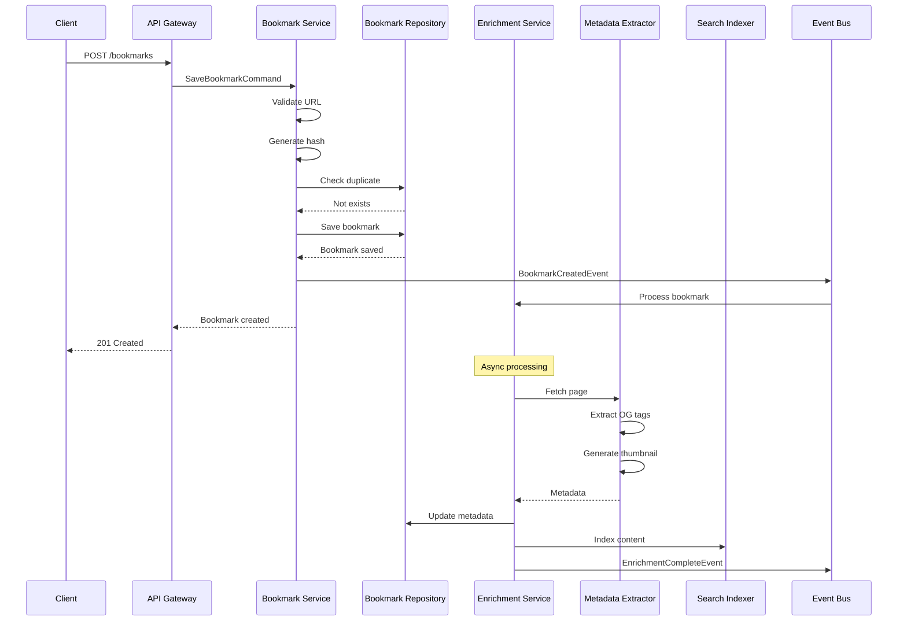
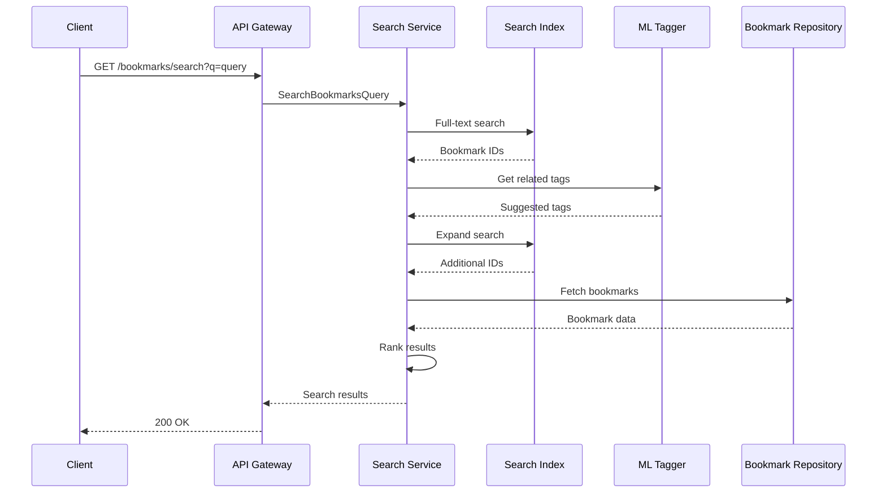
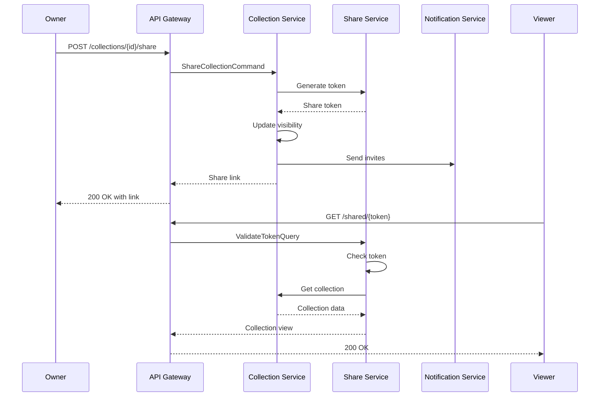

# Bookmark Manager Service Backend Technical Specification

## Review Table

| Version | Date | Name | Role | Description |
| --- | --- | --- | --- | --- |
| 1.2 | 2025-11-13 | ML Engineer | Reviewer | Added smart categorization and recommendation engine |
| 1.1 | 2025-11-10 | DevOps Lead | Reviewer | Enhanced metadata extraction pipeline and CDN strategy |
| 1.0 | 2025-11-07 | System Architect | Author | Initial Draft |

## Approval Table

| Approved By | Approved At | Note |
| --- | --- | --- |
| Technical Lead | Pending | Review ML pipeline costs |
| Product Owner | Pending | - |
| Security Officer | Pending | - |

---

## Background

Knowledge workers and researchers accumulate thousands of web resources but struggle to organize, retrieve, and maintain them effectively. Dead links, poor search capabilities, and lack of metadata make traditional bookmarking inadequate for modern information management needs.

## Context

Current bookmark solutions are limited to browser-specific storage with basic folder organization. Users need intelligent categorization, full-text search of bookmarked content, automatic metadata extraction, dead link detection, and cross-platform synchronization. The system must handle various content types, provide instant search, and enable collection sharing for team knowledge management.

## Objective

Implement a comprehensive bookmark management service that:

1. **Captures web content instantly** - One-click saving with browser extension
2. **Enriches metadata automatically** - Extract titles, descriptions, and generate previews
3. **Enables powerful search** - Full-text search across content and metadata
4. **Maintains link health** - Automated dead link detection and archiving

## Paradigm

We adopt a **Microservices Architecture with Content Pipeline**:

- **API Gateway**: Kong for rate limiting and authentication
- **Content Service**: Bookmark CRUD operations and collections
- **Enrichment Pipeline**: Async workers for metadata extraction and screenshot generation
- **Search Service**: Elasticsearch for full-text search and faceting
- **Health Monitor**: Scheduled jobs for link validation and archiving
- **Message Queue**: RabbitMQ for async task distribution

---

## Database Design

### dbdiagram.io Schema

```dbml
Table bookmarks {
  id uuid [pk]
  user_id uuid [ref: > users.id]
  url varchar(2048) [not null]
  url_hash varchar(64) [note: 'SHA-256 for deduplication']
  title varchar(500)
  description text
  favicon_url varchar(500)
  thumbnail_url varchar(500)
  domain varchar(255)
  collection_id uuid [ref: > collections.id]
  is_favorite bool [default: false]
  is_archived bool [default: false]
  read_status ReadStatus [default: 'UNREAD']
  last_accessed_at timestamp
  created_at timestamp [default: `now()`]
  updated_at timestamp [default: `now()`]
  deleted_at timestamp
  
  indexes {
    user_id
    (user_id, url_hash) [unique]
    (user_id, collection_id)
    (user_id, is_archived)
    (user_id, created_at)
    domain
  }
}

Table bookmark_metadata {
  id uuid [pk]
  bookmark_id uuid [ref: > bookmarks.id, unique]
  og_title varchar(500)
  og_description text
  og_image varchar(500)
  author varchar(255)
  published_date timestamp
  reading_time_minutes int
  word_count int
  language varchar(10)
  content_type varchar(100)
  extracted_text text [note: 'For full-text search']
  metadata_json jsonb
  last_crawled_at timestamp [default: `now()`]
  
  indexes {
    bookmark_id [unique]
  }
}

Table bookmark_tags {
  id uuid [pk]
  bookmark_id uuid [ref: > bookmarks.id]
  tag_id uuid [ref: > tags.id]
  is_auto_tagged bool [default: false]
  confidence_score decimal(3,2)
  created_at timestamp [default: `now()`]
  
  indexes {
    bookmark_id
    tag_id
    (bookmark_id, tag_id) [unique]
  }
}

Table tags {
  id uuid [pk]
  user_id uuid [ref: > users.id]
  name varchar(50) [not null]
  color varchar(7)
  usage_count int [default: 0]
  is_system bool [default: false]
  created_at timestamp [default: `now()`]
  
  indexes {
    user_id
    (user_id, name) [unique]
  }
}

Table collections {
  id uuid [pk]
  user_id uuid [ref: > users.id]
  name varchar(100) [not null]
  description text
  icon varchar(50)
  color varchar(7)
  is_public bool [default: false]
  share_token varchar(32) [unique]
  parent_collection_id uuid [ref: > collections.id]
  sort_order int
  created_at timestamp [default: `now()`]
  updated_at timestamp [default: `now()`]
  
  indexes {
    user_id
    parent_collection_id
    (user_id, sort_order)
    share_token
  }
}

Table bookmark_search_index {
  id uuid [pk]
  bookmark_id uuid [ref: > bookmarks.id, unique]
  user_id uuid [ref: > users.id]
  title_tokens tsvector
  description_tokens tsvector
  content_tokens tsvector
  url_tokens tsvector
  tag_names text[]
  last_indexed_at timestamp [default: `now()`]
  
  indexes {
    bookmark_id [unique]
    user_id
    title_tokens [type: gin]
    content_tokens [type: gin]
  }
}

Table link_health {
  id uuid [pk]
  bookmark_id uuid [ref: > bookmarks.id, unique]
  status_code int
  is_alive bool
  redirect_url varchar(2048)
  last_check_at timestamp
  consecutive_failures int [default: 0]
  error_message text
  
  indexes {
    bookmark_id [unique]
    (is_alive, last_check_at)
  }
}

Table bookmark_analytics {
  id uuid [pk]
  bookmark_id uuid [ref: > bookmarks.id]
  user_id uuid [ref: > users.id]
  action AnalyticsAction
  created_at timestamp [default: `now()`]
  
  indexes {
    bookmark_id
    (user_id, action)
    created_at
  }
}

Table users {
  id uuid [pk]
  email varchar(255) [unique]
  name varchar(255)
  preferences jsonb
  created_at timestamp
}

Enum ReadStatus {
  UNREAD
  IN_PROGRESS
  READ
}

Enum AnalyticsAction {
  VIEWED
  CLICKED
  SHARED
  EXPORTED
}
```

### SQL Implementation

```sql
CREATE TYPE read_status AS ENUM ('UNREAD', 'IN_PROGRESS', 'READ');
CREATE TYPE analytics_action AS ENUM ('VIEWED', 'CLICKED', 'SHARED', 'EXPORTED');

CREATE TABLE bookmarks (
    id UUID PRIMARY KEY DEFAULT gen_random_uuid(),
    user_id UUID NOT NULL REFERENCES users(id),
    url VARCHAR(2048) NOT NULL,
    url_hash VARCHAR(64) NOT NULL,
    title VARCHAR(500),
    description TEXT,
    favicon_url VARCHAR(500),
    thumbnail_url VARCHAR(500),
    domain VARCHAR(255),
    collection_id UUID REFERENCES collections(id),
    is_favorite BOOLEAN DEFAULT false,
    is_archived BOOLEAN DEFAULT false,
    read_status read_status DEFAULT 'UNREAD',
    last_accessed_at TIMESTAMP,
    created_at TIMESTAMP DEFAULT CURRENT_TIMESTAMP,
    updated_at TIMESTAMP DEFAULT CURRENT_TIMESTAMP,
    deleted_at TIMESTAMP,
    UNIQUE(user_id, url_hash)
);

CREATE INDEX idx_bookmarks_user ON bookmarks(user_id);
CREATE INDEX idx_bookmarks_collection ON bookmarks(user_id, collection_id);
CREATE INDEX idx_bookmarks_archived ON bookmarks(user_id, is_archived);
CREATE INDEX idx_bookmarks_domain ON bookmarks(domain);

-- Full-text search
CREATE TABLE bookmark_search_index (
    id UUID PRIMARY KEY DEFAULT gen_random_uuid(),
    bookmark_id UUID UNIQUE NOT NULL REFERENCES bookmarks(id) ON DELETE CASCADE,
    user_id UUID NOT NULL REFERENCES users(id),
    title_tokens tsvector,
    description_tokens tsvector,
    content_tokens tsvector,
    url_tokens tsvector,
    tag_names text[],
    last_indexed_at TIMESTAMP DEFAULT CURRENT_TIMESTAMP
);

CREATE INDEX idx_search_title ON bookmark_search_index USING gin(title_tokens);
CREATE INDEX idx_search_content ON bookmark_search_index USING gin(content_tokens);
```

---

## Activity Lifecycle

### Bookmark Enrichment Lifecycle



---

## State Machines

### Bookmark Processing Pipeline



### Link Health State Machine



---

## Sequence Diagrams

### Save Bookmark with Enrichment



### Smart Search Flow



### Collection Sharing Flow



---

## API Endpoints

### Bookmark Management Endpoints

#### POST /api/v1/bookmarks
**Save a new bookmark**

Request:
```json
{
  "url": "https://example.com/article",
  "title": "Custom Title (optional)",
  "collection_id": "coll_abc123",
  "tags": ["development", "tutorial"]
}
```

Response (201 Created):
```json
{
  "id": "bm_xyz789",
  "url": "https://example.com/article",
  "title": "Article Title",
  "domain": "example.com",
  "thumbnail_url": "https://cdn.example.com/thumb.jpg",
  "enrichment_status": "PROCESSING",
  "created_at": "2025-11-13T10:00:00Z"
}
```

#### POST /api/v1/bookmarks/import
**Bulk import bookmarks**

Request:
```json
{
  "format": "NETSCAPE",
  "file_content": "base64_encoded_html",
  "collection_id": "coll_abc123",
  "auto_tag": true
}
```

Response (202 Accepted):
```json
{
  "job_id": "import_job123",
  "total_items": 250,
  "status": "PROCESSING",
  "estimated_time": 120
}
```

#### GET /api/v1/bookmarks
**List bookmarks with filtering**

Query Parameters:
| Parameter | Type | Required | Description |
| --- | --- | --- | --- |
| collection_id | uuid | No | Filter by collection |
| tags | string[] | No | Filter by tags (AND) |
| domain | string | No | Filter by domain |
| read_status | string | No | Filter by read status |
| is_favorite | bool | No | Favorites only |
| sort_by | string | No | 'created', 'accessed', 'title' |
| page | int | No | Page number (default: 1) |
| limit | int | No | Items per page (default: 20) |

Response (200 OK):
```json
{
  "bookmarks": [
    {
      "id": "bm_xyz789",
      "url": "https://example.com/article",
      "title": "Article Title",
      "description": "Article summary...",
      "favicon_url": "https://example.com/favicon.ico",
      "tags": ["development", "tutorial"],
      "read_status": "UNREAD",
      "created_at": "2025-11-13T10:00:00Z"
    }
  ],
  "pagination": {
    "page": 1,
    "limit": 20,
    "total": 156
  }
}
```

#### GET /api/v1/bookmarks/search
**Full-text search bookmarks**

Query Parameters:
| Parameter | Type | Required | Description |
| --- | --- | --- | --- |
| q | string | Yes | Search query |
| scope | string | No | 'all', 'title', 'content' |
| collection_id | uuid | No | Search within collection |

Response (200 OK):
```json
{
  "results": [
    {
      "id": "bm_xyz789",
      "url": "https://example.com/article",
      "title": "Article Title",
      "snippet": "...matching <mark>content</mark> preview...",
      "score": 0.92,
      "highlights": {
        "title": ["Article <mark>Title</mark>"],
        "content": ["matching <mark>content</mark>"]
      }
    }
  ],
  "total": 23,
  "suggested_tags": ["development", "programming"]
}
```

#### POST /api/v1/collections
**Create a collection**

Request:
```json
{
  "name": "Web Development Resources",
  "description": "Tutorials and references",
  "color": "#2196F3",
  "is_public": false,
  "parent_collection_id": null
}
```

Response (201 Created):
```json
{
  "id": "coll_def456",
  "name": "Web Development Resources",
  "bookmark_count": 0,
  "share_token": null,
  "created_at": "2025-11-13T10:00:00Z"
}
```

#### GET /api/v1/bookmarks/{id}/health
**Check bookmark link health**

Response (200 OK):
```json
{
  "bookmark_id": "bm_xyz789",
  "status": "HEALTHY",
  "status_code": 200,
  "last_check": "2025-11-13T10:00:00Z",
  "redirect_chain": [],
  "warnings": []
}
```

## Architecture Components

### Service Layer

**Core Services**:
- Bookmark Service - Handles save, update, delete operations
- Enrichment Service - Metadata extraction and preview generation
- Search Service - Full-text search and filtering
- Health Monitor Service - Link validation and archiving
- Collection Service - Folder management and sharing

**Data Layer**:
- PostgreSQL - Primary bookmark storage
- ElasticSearch - Full-text search index
- Redis - URL deduplication cache
- S3 - Thumbnail and content storage

**Processing Pipeline**:
- RabbitMQ - Task queue for enrichment
- Puppeteer - JavaScript rendering
- ML Service - Auto-categorization
- Archive.org API - Dead link preservation

**Integration Layer**:
- REST API - Web and mobile clients
- GraphQL - Complex search queries
- Browser Extension API - One-click save
- Webhook API - Third-party integrations

---

## Security Considerations

### Access Control
- **Collection permissions** - Private, shared, public
- **Share tokens** with expiration
- **API authentication** via OAuth 2.0
- **Rate limiting** - 1000 saves/day per user

### Data Protection
- **URL deduplication** to prevent tracking
- **Content sanitization** for XSS prevention
- **Encrypted storage** for sensitive bookmarks
- **HTTPS-only** bookmark capture

### Privacy
- **No third-party analytics**
- **Optional content extraction**
- **Private collections** by default
- **GDPR compliance** with data export

---

## Testing Strategy

### Unit Tests
```typescript
describe('BookmarkEnrichment', () => {
  it('should extract OpenGraph metadata', () => {
    const html = createHTMLWithOGTags();
    const metadata = extractor.parse(html);
    expect(metadata.title).toBe('Expected Title');
    expect(metadata.image).toContain('og:image');
  });

  it('should detect duplicate URLs', () => {
    const url1 = 'https://example.com/page?utm_source=test';
    const url2 = 'https://example.com/page';
    const hash1 = hasher.normalize(url1);
    const hash2 = hasher.normalize(url2);
    expect(hash1).toBe(hash2);
  });
});
```

### Integration Tests
- Bookmark save with enrichment pipeline
- Search indexing accuracy
- Collection sharing workflow
- Dead link detection cycle

### E2E Tests
- Browser extension save flow
- Import from browser bookmarks
- Bulk operations performance
- Share link access control

### Performance Tests
- Handle 100k bookmarks per user
- Search response < 100ms
- Enrichment processing < 5 seconds
- Support 10k concurrent saves

---

## Acceptance Criteria

1. ✅ One-click save from browser extension
2. ✅ Automatic title and description extraction
3. ✅ Full-text search across all content
4. ✅ Thumbnail generation for visual browsing
5. ✅ Dead link detection with 24-hour checks
6. ✅ Tag suggestions based on content
7. ✅ Collection sharing with permissions
8. ✅ Import from Chrome/Firefox/Safari
9. ✅ Export to HTML/JSON/CSV
10. ✅ 99.9% uptime for save operations

---

## Implementation Notes

### Metadata Extraction
- Use Puppeteer for JavaScript-rendered pages
- Extract Open Graph and Twitter Card tags
- Generate readable content with Readability.js
- Calculate reading time based on word count

### Duplicate Detection
- SHA-256 hash of normalized URLs
- Handle URL parameters intelligently
- Detect redirects and canonical URLs
- Merge duplicates with user confirmation

### Auto-Tagging
- NLP-based content analysis
- Domain-based categorization rules
- User behavior learning
- Confidence scoring for suggestions

### Performance Optimizations
- Async metadata enrichment queue
- CDN for thumbnails and favicons
- Aggressive caching of domain metadata
- Batch operations for bulk imports

### Privacy & Security
- Optional end-to-end encryption
- Private collections by default
- Secure sharing with expiring tokens
- GDPR-compliant data export

### Monitoring & Analytics
- Track popular domains
- Monitor enrichment success rates
- Analyze tag usage patterns
- Dead link detection alerts

### Future Enhancements
- Browser sync extensions
- AI-powered content summarization
- Collaborative annotations
- RSS feed integration
- Archive.org integration for dead links