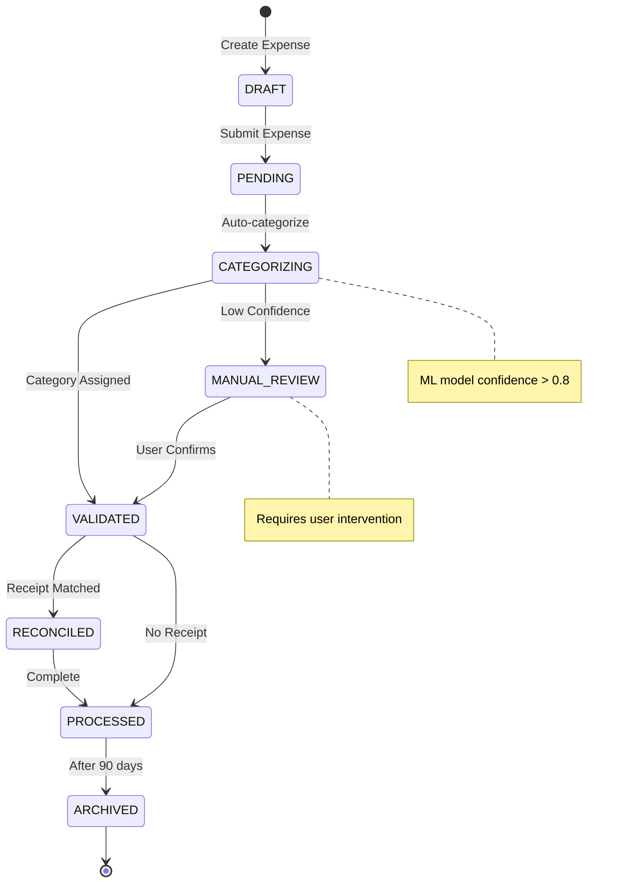
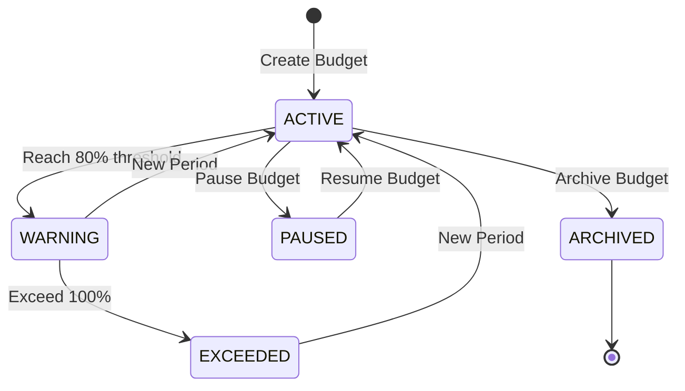
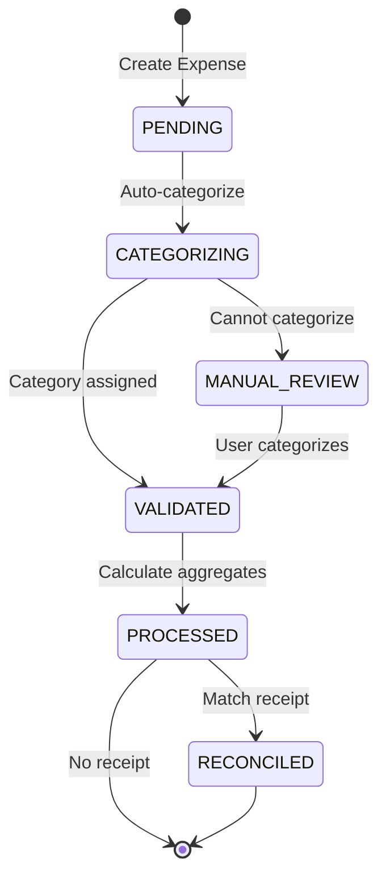
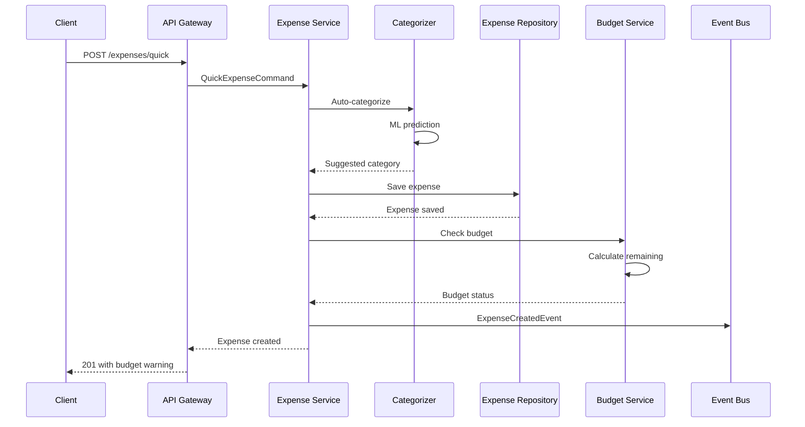
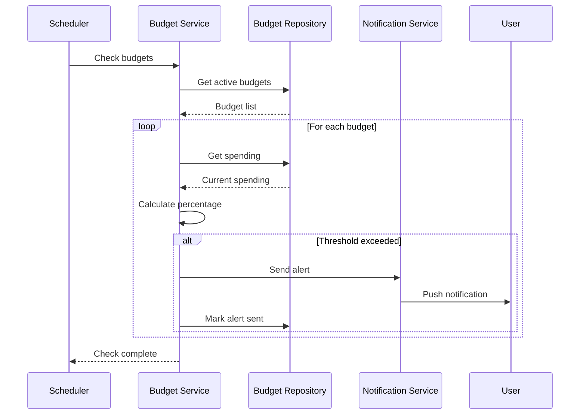
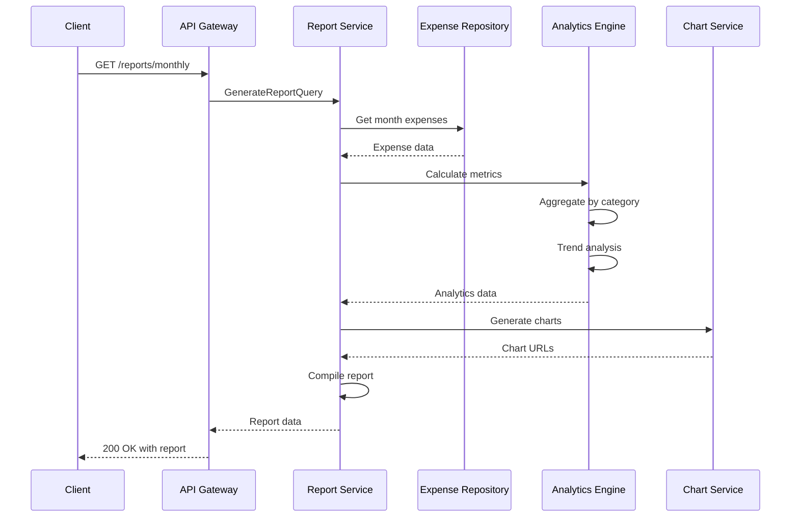
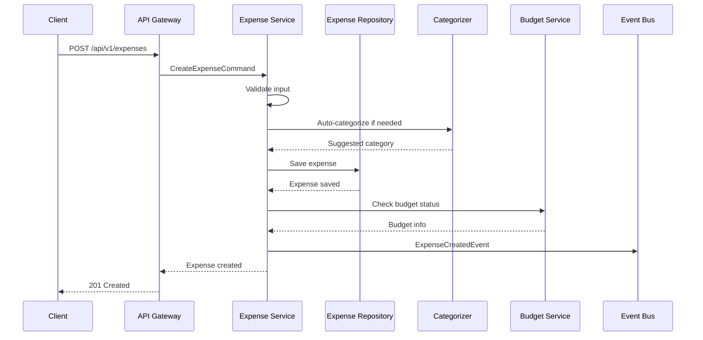

# Expense Logger Service Backend Technical Specification

## Review Table

| Version | Date | Name | Role | Description |
| --- | --- | --- | --- | --- |
| 1.2 | 2025-11-13 | Technical Lead | Reviewer | Added security considerations and expanded API documentation |
| 1.1 | 2025-11-10 | Senior Engineer | Reviewer | Added receipt processing flow and budget alert mechanisms |
| 1.0 | 2025-11-07 | System Architect | Author | Initial Draft |

## Approval Table

| Approved By | Approved At | Note |
| --- | --- | --- |
| Technical Lead | Pending | Pending security review |
| Product Owner | Pending | - |
| Engineering Manager | Pending | - |

---

## Background

Users struggle with manual expense tracking across multiple payment methods and categories. Current solutions lack real-time budget monitoring, intelligent categorization, and actionable spending insights. Small business owners and individuals need a unified platform to manage financial awareness without complex accounting knowledge.

## Context

The existing expense management landscape suffers from fragmented user experiences, delayed transaction processing, and limited analytical capabilities. Users require immediate expense capture with minimal friction, automatic categorization with high accuracy, and proactive budget alerts to prevent overspending. The system must support multi-currency transactions, receipt digitization, and comprehensive reporting while maintaining data security and privacy compliance.

## Objective

Implement a comprehensive expense logging service that:

1. **Captures expenses instantly** - Quick entry with auto-categorization and receipt scanning
2. **Monitors budgets proactively** - Real-time alerts and spending pattern analysis
3. **Provides actionable insights** - ML-powered recommendations and trend visualization
4. **Ensures data integrity** - Event-sourced ledger with audit trail and reconciliation

## Paradigm

We adopt an **Event Sourcing with Double-Entry Bookkeeping**:

- **Event Store**: Immutable ledger of all financial transactions
- **Double-Entry System**: Every expense creates balanced debit/credit entries
- **Projection Engine**: Materialized views for reports and dashboards
- **Command Validation**: Business rules enforced before event persistence
- **Saga Pattern**: Complex multi-step transactions with compensation

---

## Database Design

### dbdiagram.io Schema

```dbml
Table expenses {
  id uuid [pk]
  user_id uuid [ref: > users.id]
  amount decimal(12,2) [not null]
  currency varchar(3) [default: 'USD']
  category_id uuid [ref: > categories.id]
  merchant varchar(255)
  description text
  payment_method_id uuid [ref: > payment_methods.id]
  expense_date timestamp [not null]
  location varchar(255)
  is_recurring bool [default: false]
  receipt_url varchar(500)
  tags text[]
  created_at timestamp [default: `now()`]
  updated_at timestamp [default: `now()`]
  deleted_at timestamp
  
  indexes {
    user_id
    (user_id, expense_date)
    (user_id, category_id)
    (user_id, created_at)
    expense_date
  }
}

Table categories {
  id uuid [pk]
  user_id uuid [ref: > users.id]
  name varchar(100) [not null]
  icon varchar(50)
  color varchar(7)
  parent_category_id uuid [ref: > categories.id]
  budget_limit decimal(12,2)
  budget_period BudgetPeriod
  is_system bool [default: false]
  created_at timestamp [default: `now()`]
  
  indexes {
    user_id
    (user_id, name) [unique]
    parent_category_id
  }
}

Table payment_methods {
  id uuid [pk]
  user_id uuid [ref: > users.id]
  name varchar(100) [not null]
  type PaymentType
  last_four varchar(4)
  color varchar(7)
  is_default bool [default: false]
  is_active bool [default: true]
  created_at timestamp [default: `now()`]
  
  indexes {
    user_id
    (user_id, is_default)
  }
}

Table budgets {
  id uuid [pk]
  user_id uuid [ref: > users.id]
  category_id uuid [ref: > categories.id]
  amount decimal(12,2) [not null]
  period BudgetPeriod [default: 'MONTHLY']
  start_date date [not null]
  end_date date
  alert_threshold decimal(3,2) [default: 0.8, note: 'Alert at 80% of budget']
  is_active bool [default: true]
  created_at timestamp [default: `now()`]
  
  indexes {
    user_id
    (user_id, category_id, period)
    (user_id, is_active)
  }
}

Table budget_tracking {
  id uuid [pk]
  budget_id uuid [ref: > budgets.id]
  period_start date [not null]
  period_end date [not null]
  spent_amount decimal(12,2) [default: 0]
  remaining_amount decimal(12,2)
  alert_sent bool [default: false]
  last_updated timestamp [default: `now()`]
  
  indexes {
    budget_id
    (budget_id, period_start) [unique]
  }
}

Table expense_aggregates {
  id uuid [pk]
  user_id uuid [ref: > users.id]
  period_type PeriodType
  period_value varchar(20) [note: 'YYYY-MM for monthly, YYYY-WW for weekly']
  category_id uuid [ref: > categories.id]
  total_amount decimal(12,2)
  transaction_count int
  average_amount decimal(12,2)
  created_at timestamp [default: `now()`]
  
  indexes {
    user_id
    (user_id, period_type, period_value)
    (user_id, category_id, period_type)
  }
}

Table recurring_expenses {
  id uuid [pk]
  user_id uuid [ref: > users.id]
  template_expense_id uuid [ref: > expenses.id]
  frequency RecurrenceFrequency
  day_of_month int
  next_occurrence date
  is_active bool [default: true]
  created_at timestamp [default: `now()`]
  
  indexes {
    user_id
    (user_id, next_occurrence)
    (is_active, next_occurrence)
  }
}

Table users {
  id uuid [pk]
  email varchar(255) [unique]
  name varchar(255)
  default_currency varchar(3) [default: 'USD']
  timezone varchar(50)
  created_at timestamp
}

Enum PaymentType {
  CASH
  CREDIT_CARD
  DEBIT_CARD
  BANK_TRANSFER
  DIGITAL_WALLET
  CRYPTOCURRENCY
}

Enum BudgetPeriod {
  DAILY
  WEEKLY
  MONTHLY
  QUARTERLY
  YEARLY
}

Enum PeriodType {
  DAILY
  WEEKLY
  MONTHLY
  YEARLY
}

Enum RecurrenceFrequency {
  DAILY
  WEEKLY
  MONTHLY
  QUARTERLY
  YEARLY
}
```

### SQL Implementation

```sql
CREATE TYPE payment_type AS ENUM ('CASH', 'CREDIT_CARD', 'DEBIT_CARD', 'BANK_TRANSFER', 'DIGITAL_WALLET', 'CRYPTOCURRENCY');
CREATE TYPE budget_period AS ENUM ('DAILY', 'WEEKLY', 'MONTHLY', 'QUARTERLY', 'YEARLY');
CREATE TYPE period_type AS ENUM ('DAILY', 'WEEKLY', 'MONTHLY', 'YEARLY');

CREATE TABLE expenses (
    id UUID PRIMARY KEY DEFAULT gen_random_uuid(),
    user_id UUID NOT NULL REFERENCES users(id),
    amount DECIMAL(12,2) NOT NULL,
    currency VARCHAR(3) DEFAULT 'USD',
    category_id UUID REFERENCES categories(id),
    merchant VARCHAR(255),
    description TEXT,
    payment_method_id UUID REFERENCES payment_methods(id),
    expense_date TIMESTAMP NOT NULL,
    location VARCHAR(255),
    is_recurring BOOLEAN DEFAULT false,
    receipt_url VARCHAR(500),
    tags TEXT[],
    created_at TIMESTAMP DEFAULT CURRENT_TIMESTAMP,
    updated_at TIMESTAMP DEFAULT CURRENT_TIMESTAMP,
    deleted_at TIMESTAMP
);

CREATE INDEX idx_expenses_user ON expenses(user_id);
CREATE INDEX idx_expenses_user_date ON expenses(user_id, expense_date DESC);
CREATE INDEX idx_expenses_user_category ON expenses(user_id, category_id);

-- Trigger for automatic budget tracking updates
CREATE OR REPLACE FUNCTION update_budget_tracking()
RETURNS TRIGGER AS $$
BEGIN
    UPDATE budget_tracking
    SET spent_amount = spent_amount + NEW.amount,
        remaining_amount = (SELECT amount FROM budgets WHERE id = budget_tracking.budget_id) - (spent_amount + NEW.amount),
        last_updated = CURRENT_TIMESTAMP
    WHERE budget_id IN (
        SELECT id FROM budgets 
        WHERE category_id = NEW.category_id 
        AND user_id = NEW.user_id
        AND is_active = true
    );
    RETURN NEW;
END;
$$ LANGUAGE plpgsql;

CREATE TRIGGER expense_budget_update
AFTER INSERT ON expenses
FOR EACH ROW EXECUTE FUNCTION update_budget_tracking();
```

---

## Activity Lifecycle

### Expense Recording Lifecycle



---

## State Machines

### Budget Alert State Machine



### Expense Processing State Machine



---

## Sequence Diagrams

### Quick Expense Entry



### Budget Alert Flow



### Monthly Report Generation



---

## API Endpoints

### Expense Management APIs

`POST /api/v1/expenses`

Log a new expense entry.

**Request**

| Field | Type | Required | Description |
| --- | --- | --- | --- |
| amount | decimal | Y | Expense amount in specified currency |
| currency | string | N | ISO 4217 currency code (default: user's default) |
| merchant | string | Y | Merchant or vendor name |
| category_id | uuid | N | Category UUID (auto-categorized if not provided) |
| payment_method_id | uuid | N | Payment method UUID |
| expense_date | timestamp | Y | When the expense occurred |
| description | string | N | Additional notes or description |
| tags | string[] | N | User-defined tags for filtering |
| receipt_url | string | N | URL to uploaded receipt image |

**Request Example**
```json
{
  "amount": 45.50,
  "currency": "USD",
  "merchant": "Coffee Shop",
  "category_id": "cat_food123",
  "payment_method_id": "pm_card456",
  "expense_date": "2025-11-13T09:30:00Z",
  "description": "Morning coffee and pastry",
  "tags": ["breakfast", "work"]
}
```

**Response (201 Created)**
```json
{
  "id": "exp_abc789",
  "amount": 45.50,
  "category": {
    "id": "cat_food123",
    "name": "Food & Dining"
  },
  "budget_status": {
    "spent": 450.00,
    "limit": 500.00,
    "percentage": 90,
    "alert": "WARNING"
  },
  "created_at": "2025-11-13T09:30:00Z"
}
```

**Response (400 Bad Request)**
```json
{
  "error": "INVALID_AMOUNT",
  "message": "Amount must be positive"
}
```

**Sequence Diagram**



---

#### POST /api/v1/expenses/quick
**Quick expense entry with auto-categorization**

Request:
```json
{
  "amount": 25.00,
  "merchant": "Uber"
}
```

Response (201 Created):
```json
{
  "id": "exp_xyz456",
  "amount": 25.00,
  "suggested_category": "Transportation",
  "confidence": 0.92,
  "created_at": "2025-11-13T10:00:00Z"
}
```

#### GET /api/v1/expenses
**List expenses with filtering**

Query Parameters:
| Parameter | Type | Required | Description |
| --- | --- | --- | --- |
| start_date | date | No | Filter from date |
| end_date | date | No | Filter to date |
| category_id | uuid | No | Filter by category |
| payment_method_id | uuid | No | Filter by payment method |
| min_amount | decimal | No | Minimum amount |
| max_amount | decimal | No | Maximum amount |
| page | int | No | Page number (default: 1) |
| limit | int | No | Items per page (default: 20) |

Response (200 OK):
```json
{
  "expenses": [
    {
      "id": "exp_abc789",
      "amount": 45.50,
      "merchant": "Coffee Shop",
      "category": "Food & Dining",
      "expense_date": "2025-11-13T09:30:00Z"
    }
  ],
  "summary": {
    "total_amount": 1250.00,
    "average_amount": 62.50,
    "expense_count": 20
  },
  "pagination": {
    "page": 1,
    "limit": 20,
    "total": 145
  }
}
```

#### GET /api/v1/reports/monthly
**Get monthly expense report**

Query Parameters:
| Parameter | Type | Required | Description |
| --- | --- | --- | --- |
| year | int | Yes | Year (e.g., 2025) |
| month | int | Yes | Month (1-12) |

Response (200 OK):
```json
{
  "period": {
    "year": 2025,
    "month": 11
  },
  "summary": {
    "total_expenses": 3450.00,
    "expense_count": 89,
    "daily_average": 115.00,
    "top_category": "Food & Dining",
    "top_merchant": "Amazon"
  },
  "by_category": [
    {
      "category": "Food & Dining",
      "amount": 850.00,
      "percentage": 24.6,
      "count": 35
    }
  ],
  "by_payment_method": [
    {
      "method": "Credit Card",
      "amount": 2100.00,
      "percentage": 60.9
    }
  ],
  "trend": {
    "vs_last_month": "+12.5%",
    "vs_avg_3_months": "+5.2%"
  },
  "budget_performance": [
    {
      "category": "Food & Dining",
      "spent": 850.00,
      "budget": 900.00,
      "percentage": 94.4,
      "status": "ON_TRACK"
    }
  ]
}
```

#### POST /api/v1/budgets
**Create or update a budget**

Request:
```json
{
  "category_id": "cat_food123",
  "amount": 500.00,
  "period": "MONTHLY",
  "alert_threshold": 0.8
}
```

Response (201 Created):
```json
{
  "id": "budget_xyz789",
  "category": "Food & Dining",
  "amount": 500.00,
  "period": "MONTHLY",
  "current_spent": 0.00,
  "created_at": "2025-11-13T10:00:00Z"
}
```

## Architecture Components

### Service Layer

**Core Services**:
- Expense Management Service - Handles expense CRUD operations
- Budget Monitoring Service - Tracks budget limits and sends alerts
- Categorization Service - ML-powered auto-categorization
- Analytics Service - Generates reports and insights
- Notification Service - Sends budget alerts and reminders

**Data Layer**:
- PostgreSQL - Primary data store for expenses and budgets
- TimescaleDB - Time-series data for aggregations
- Redis - Caching layer for frequent queries
- S3 - Object storage for receipt images

**Integration Layer**:
- REST API - External client communication
- GraphQL - Mobile app queries
- WebSocket - Real-time budget updates
- Event Bus (Kafka) - Inter-service communication
- Plaid API - Bank account synchronization

---

## Security Considerations

### Authorization
- Row-level security ensuring users can only access their own expenses
- API key authentication for third-party integrations
- OAuth 2.0 for bank account connections
- Multi-factor authentication for sensitive operations

### Data Protection
- Encrypt sensitive financial data at rest using AES-256
- TLS 1.3 for all API communications
- PCI DSS compliance for payment method storage
- GDPR compliance with right to deletion

### Audit Trail
- Immutable event log for all financial transactions
- Track all data modifications with user attribution
- Compliance reporting for financial regulations
- Suspicious activity detection and alerting

---

## Testing Strategy

### Unit Tests
```typescript
describe('ExpenseService', () => {
  it('should reject negative amounts', () => {
    const expense = new Expense({ amount: -50 });
    expect(() => expense.validate()).toThrow('Amount must be positive');
  });

  it('should auto-categorize with high confidence', () => {
    const expense = new Expense({ merchant: 'Starbucks' });
    const category = categorizer.predict(expense);
    expect(category.name).toBe('Food & Dining');
    expect(category.confidence).toBeGreaterThan(0.8);
  });
});
```

### Integration Tests
- Test expense creation flow with budget updates
- Verify receipt processing pipeline
- Test multi-currency conversion accuracy
- Validate report generation with complex filters

### E2E Tests
- Complete expense tracking user journey
- Budget alert delivery verification
- Report export functionality
- Bank sync integration flow

### Performance Tests
- Load test with 10,000 concurrent users
- Stress test budget calculation under heavy load
- Report generation response time < 2 seconds
- API response time p99 < 200ms

---

## Acceptance Criteria

1. ✅ Users can log expenses within 3 clicks/taps
2. ✅ Auto-categorization accuracy > 85%
3. ✅ Budget alerts delivered within 1 minute of threshold breach
4. ✅ Support for 50+ currencies with real-time conversion
5. ✅ Receipt OCR extraction accuracy > 90%
6. ✅ Monthly reports generated in < 2 seconds
7. ✅ 99.9% uptime SLA for core expense tracking
8. ✅ Data export in CSV, PDF, and JSON formats
9. ✅ Mobile app sync within 5 seconds
10. ✅ Compliance with GDPR, PCI DSS, and SOC 2

---

## Implementation Notes

### Auto-Categorization
- ML model based on merchant name patterns
- Learn from user corrections
- Confidence threshold for manual review
- Category rules engine fallback

### Multi-Currency Support
- Store amounts in user's default currency
- Real-time exchange rate fetching
- Historical rate storage for reports
- Currency conversion audit trail

### Receipt Processing
- OCR for receipt scanning
- Automatic amount extraction
- Merchant name matching
- Store receipts in object storage

### Performance Optimizations
- Materialized views for reports
- Time-series database for aggregations
- Redis cache for budget calculations
- Batch processing for recurring expenses

### Monitoring & Alerts
- Track categorization accuracy
- Monitor budget alert delivery
- Analyze spending patterns
- Detect unusual transactions

### Future Enhancements
- Bank account integration
- Bill splitting with friends
- Investment tracking
- Tax report generation
- Predictive budget recommendations