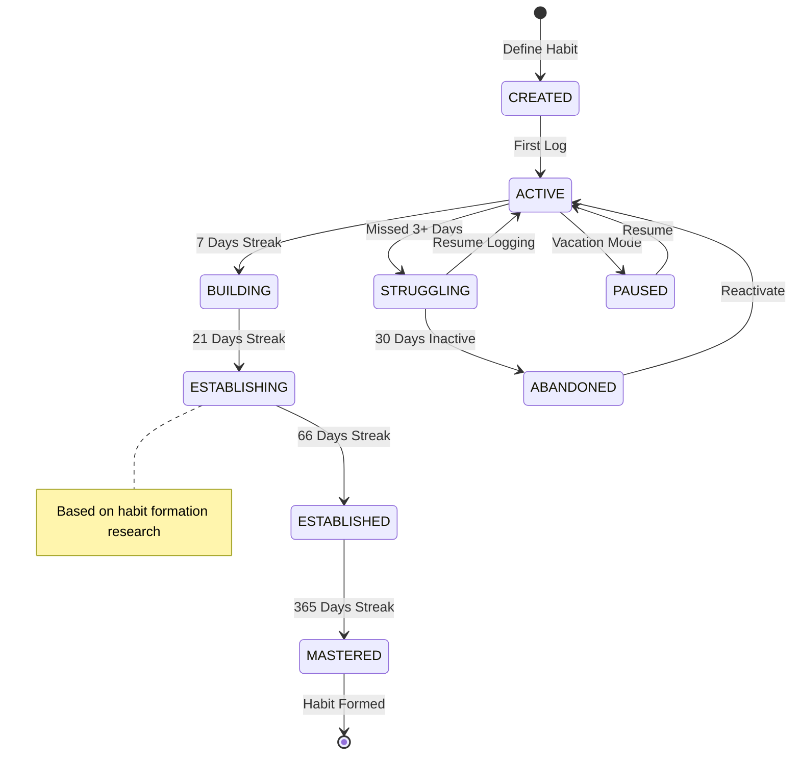
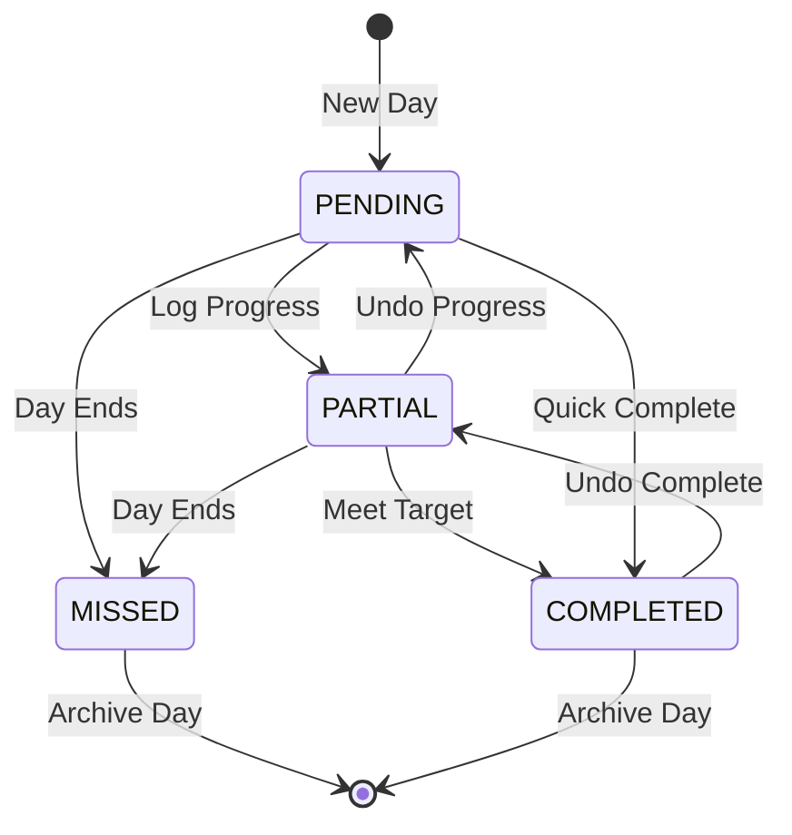
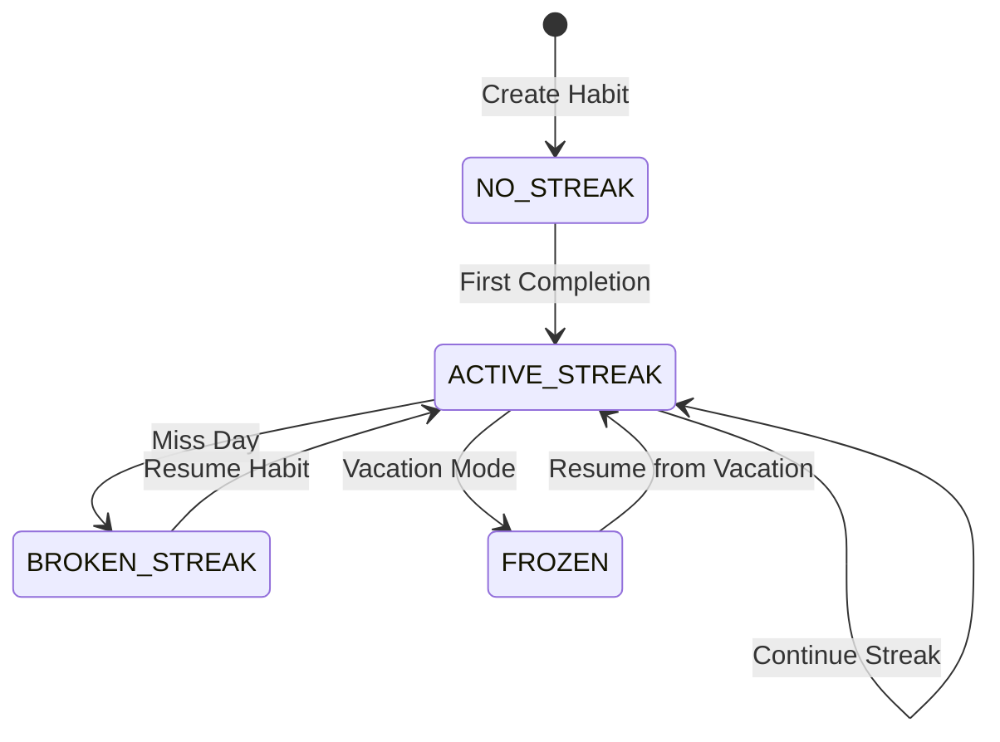
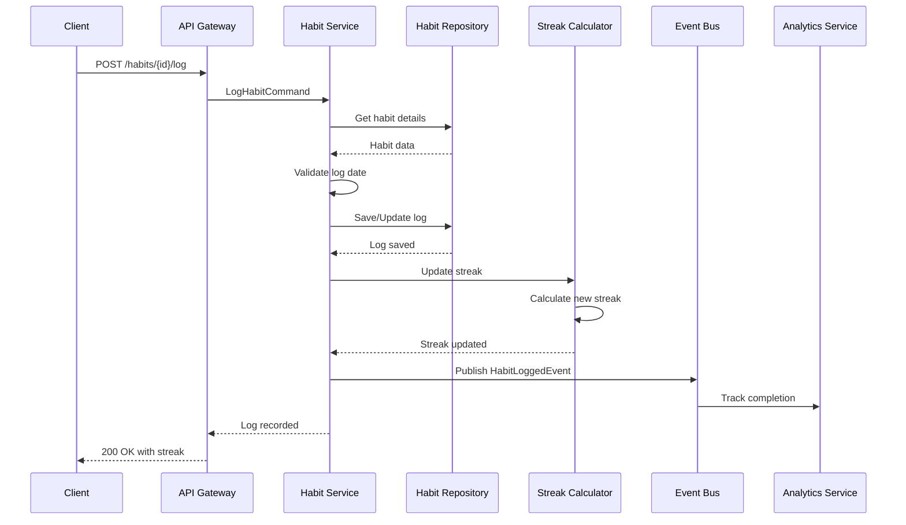
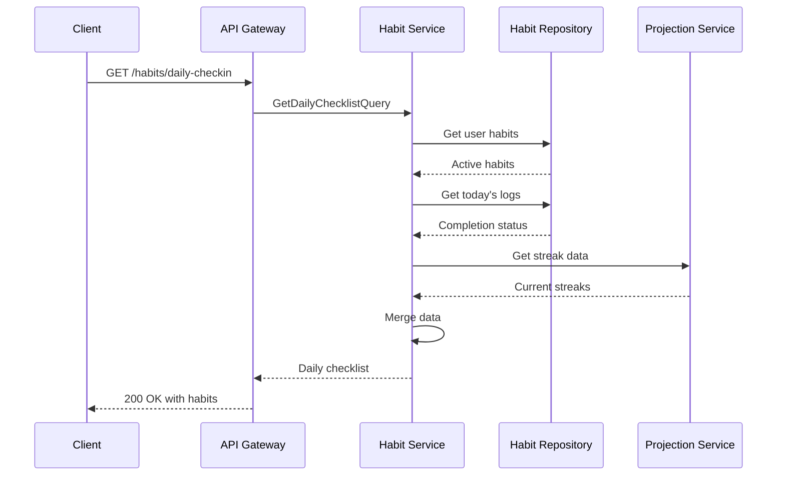
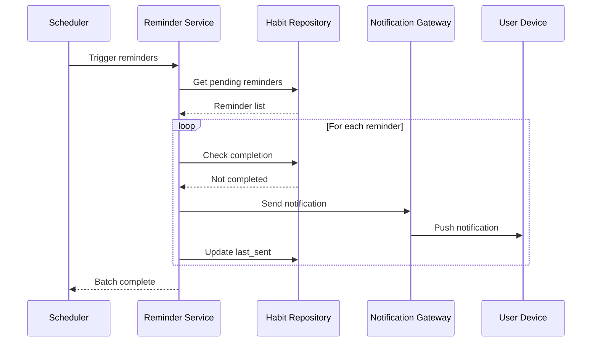

# Habit Tracker Service Backend Technical Specification

## Review Table

| Version | Date | Name | Role | Description |
| --- | --- | --- | --- | --- |
| 1.2 | 2025-11-13 | Senior Engineer | Reviewer | Added gamification elements and social features API |
| 1.1 | 2025-11-10 | Tech Lead | Reviewer | Enhanced streak calculation logic and reminder system |
| 1.0 | 2025-11-07 | System Architect | Author | Initial Draft |

## Approval Table

| Approved By | Approved At | Note |
| --- | --- | --- |
| Technical Lead | Pending | Review gamification approach |
| Product Owner | Pending | - |
| UX Designer | Pending | - |

---

## Background

Building lasting habits requires consistent tracking, timely reminders, and motivational feedback. Users struggle with habit formation due to lack of visibility into their progress, missing accountability mechanisms, and absence of data-driven insights about their behavioral patterns.

## Context

Current habit tracking solutions either oversimplify by using basic checklists or overcomplicate with excessive features. Users need a balanced approach that provides streak tracking, flexible scheduling, smart reminders, and meaningful analytics without overwhelming complexity. The system must handle various habit frequencies, timezone changes, and provide motivational elements to sustain long-term engagement.

## Objective

Implement a comprehensive habit tracking service that:

1. **Tracks habits flexibly** - Daily, weekly, or custom schedules with easy check-ins
2. **Maintains accurate streaks** - Timezone-aware calculations with vacation mode
3. **Sends smart reminders** - Context-aware notifications based on completion patterns
4. **Provides behavioral insights** - Analytics on success rates and optimal timing

## Paradigm

We adopt a **Domain-Driven Design with Modular Monolith**:

- **Domain Layer**: Habit entities, streak calculations, and reward rules
- **Application Services**: Use cases for habit tracking and analytics
- **Infrastructure**: PostgreSQL with JSONB for flexible habit metadata
- **Scheduled Jobs**: Cron-based reminder service and streak calculations
- **Module Boundaries**: Clear separation between habits, reminders, and gamification

---

## Database Design

### dbdiagram.io Schema

```dbml
Table habits {
  id uuid [pk]
  user_id uuid [ref: > users.id]
  name varchar(255) [not null]
  description text
  frequency HabitFrequency [default: 'DAILY']
  target_count int [default: 1]
  unit varchar(50)
  color varchar(7) [note: 'Hex color for UI']
  icon varchar(50)
  reminder_time time
  is_active bool [default: true]
  created_at timestamp [default: `now()`]
  updated_at timestamp [default: `now()`]
  archived_at timestamp
  
  indexes {
    user_id
    (user_id, is_active)
    (user_id, created_at)
  }
}

Table habit_logs {
  id uuid [pk]
  habit_id uuid [ref: > habits.id]
  user_id uuid [ref: > users.id]
  log_date date [not null]
  completed bool [default: false]
  completion_count int [default: 0]
  notes text
  logged_at timestamp [default: `now()`]
  
  indexes {
    habit_id
    (habit_id, log_date) [unique]
    (user_id, log_date)
    log_date
  }
}

Table habit_streaks {
  id uuid [pk]
  habit_id uuid [ref: > habits.id]
  user_id uuid [ref: > users.id]
  current_streak int [default: 0]
  longest_streak int [default: 0]
  last_completed_date date
  streak_start_date date
  total_completions int [default: 0]
  updated_at timestamp [default: `now()`]
  
  indexes {
    habit_id [unique]
    (user_id, current_streak)
  }
}

Table habit_weekly_schedules {
  id uuid [pk]
  habit_id uuid [ref: > habits.id]
  monday bool [default: true]
  tuesday bool [default: true]
  wednesday bool [default: true]
  thursday bool [default: true]
  friday bool [default: true]
  saturday bool [default: true]
  sunday bool [default: true]
  
  indexes {
    habit_id [unique]
  }
}

Table habit_reminders {
  id uuid [pk]
  habit_id uuid [ref: > habits.id]
  reminder_type ReminderType
  time_of_day time
  is_enabled bool [default: true]
  last_sent_at timestamp
  
  indexes {
    habit_id
    (is_enabled, time_of_day)
  }
}

Table users {
  id uuid [pk]
  email varchar(255) [unique]
  name varchar(255)
  timezone varchar(50) [default: 'UTC']
  created_at timestamp
}

Enum HabitFrequency {
  DAILY
  WEEKLY
  CUSTOM_DAYS
}

Enum ReminderType {
  PUSH
  EMAIL
  SMS
}
```

### SQL Implementation

```sql
CREATE TYPE habit_frequency AS ENUM ('DAILY', 'WEEKLY', 'CUSTOM_DAYS');
CREATE TYPE reminder_type AS ENUM ('PUSH', 'EMAIL', 'SMS');

CREATE TABLE habits (
    id UUID PRIMARY KEY DEFAULT gen_random_uuid(),
    user_id UUID NOT NULL REFERENCES users(id),
    name VARCHAR(255) NOT NULL,
    description TEXT,
    frequency habit_frequency DEFAULT 'DAILY',
    target_count INT DEFAULT 1,
    unit VARCHAR(50),
    color VARCHAR(7),
    icon VARCHAR(50),
    reminder_time TIME,
    is_active BOOLEAN DEFAULT true,
    created_at TIMESTAMP DEFAULT CURRENT_TIMESTAMP,
    updated_at TIMESTAMP DEFAULT CURRENT_TIMESTAMP,
    archived_at TIMESTAMP
);

CREATE INDEX idx_habits_user ON habits(user_id);
CREATE INDEX idx_habits_user_active ON habits(user_id, is_active);

CREATE TABLE habit_logs (
    id UUID PRIMARY KEY DEFAULT gen_random_uuid(),
    habit_id UUID NOT NULL REFERENCES habits(id),
    user_id UUID NOT NULL REFERENCES users(id),
    log_date DATE NOT NULL,
    completed BOOLEAN DEFAULT false,
    completion_count INT DEFAULT 0,
    notes TEXT,
    logged_at TIMESTAMP DEFAULT CURRENT_TIMESTAMP,
    UNIQUE(habit_id, log_date)
);

CREATE INDEX idx_habit_logs_date ON habit_logs(log_date);
CREATE INDEX idx_habit_logs_user_date ON habit_logs(user_id, log_date);
```

---

## Activity Lifecycle

### Habit Formation Lifecycle



---

## State Machines

### Habit Completion State Machine



### Streak State Machine



---

## Sequence Diagrams

### Log Habit Completion



### Daily Check-in Flow



### Reminder Notification Flow



---

## API Endpoints

### Habit Management Endpoints

#### POST /api/v1/habits
**Create a new habit**

Request:
```json
{
  "name": "Morning Exercise",
  "description": "30 minutes workout",
  "frequency": "DAILY",
  "target_count": 30,
  "unit": "minutes",
  "color": "#4CAF50",
  "reminder_time": "07:00:00",
  "weekly_schedule": {
    "monday": true,
    "tuesday": true,
    "wednesday": true,
    "thursday": true,
    "friday": true,
    "saturday": false,
    "sunday": false
  }
}
```

Response (201 Created):
```json
{
  "id": "habit_xyz789",
  "name": "Morning Exercise",
  "frequency": "DAILY",
  "current_streak": 0,
  "created_at": "2025-11-13T08:00:00Z"
}
```

#### POST /api/v1/habits/{id}/log
**Log habit completion for a date**

Request:
```json
{
  "log_date": "2025-11-13",
  "completed": true,
  "completion_count": 30,
  "notes": "Great workout session"
}
```

Response (200 OK):
```json
{
  "habit_id": "habit_xyz789",
  "log_date": "2025-11-13",
  "completed": true,
  "current_streak": 5,
  "longest_streak": 12,
  "streak_status": "ACTIVE"
}
```

#### GET /api/v1/habits/daily-checkin
**Get daily habit checklist**

Query Parameters:
| Parameter | Type | Required | Description |
| --- | --- | --- | --- |
| date | date | No | Check-in date (default: today) |

Response (200 OK):
```json
{
  "date": "2025-11-13",
  "habits": [
    {
      "id": "habit_xyz789",
      "name": "Morning Exercise",
      "target_count": 30,
      "unit": "minutes",
      "completed": false,
      "current_count": 0,
      "current_streak": 4,
      "color": "#4CAF50"
    }
  ],
  "summary": {
    "total_habits": 5,
    "completed": 2,
    "completion_rate": 0.4
  }
}
```

#### GET /api/v1/habits/{id}/analytics
**Get habit analytics and insights**

Query Parameters:
| Parameter | Type | Required | Description |
| --- | --- | --- | --- |
| period | string | No | 'week', 'month', 'year' (default: 'month') |

Response (200 OK):
```json
{
  "habit_id": "habit_xyz789",
  "period": "month",
  "completion_rate": 0.87,
  "total_completions": 26,
  "current_streak": 5,
  "longest_streak": 12,
  "average_per_week": 6.2,
  "best_day": "Monday",
  "trend": "IMPROVING",
  "heatmap": [
    {"date": "2025-11-01", "completed": true},
    {"date": "2025-11-02", "completed": true}
  ]
}
```

## Architecture Components

### Service Layer

**Core Services**:
- Habit Service - Manages habit definitions and logging
- Streak Service - Calculates and maintains streak data
- Reminder Service - Sends scheduled notifications
- Analytics Service - Generates insights and patterns
- Gamification Service - Manages badges and achievements

**Data Layer**:
- PostgreSQL - Primary storage for habits and logs
- Redis - Cache for streaks and daily checklists
- TimescaleDB - Time-series data for analytics
- S3 - Storage for habit icons and badges

**Integration Layer**:
- REST API - Mobile and web clients
- GraphQL - Complex dashboard queries
- WebSocket - Real-time streak updates
- Push Notifications - iOS/Android reminders
- Event Bus - Service communication

---

## Security Considerations

### Authorization
- User-scoped habit access with JWT tokens
- API rate limiting: 200 requests/minute
- Session management with refresh tokens
- Habit sharing with granular permissions

### Privacy Protection
- Optional end-to-end encryption for sensitive habits
- Anonymous habit templates in community library
- GDPR compliance with data export/deletion
- Habit data isolation between users

### Input Validation
- Sanitize habit names and descriptions
- Validate frequency and schedule constraints
- Prevent backdated logs beyond 7 days
- XSS protection for user-generated content

---

## Testing Strategy

### Unit Tests
```typescript
describe('StreakCalculator', () => {
  it('should handle timezone changes correctly', () => {
    const logs = createLogsAcrossTimezones();
    const streak = calculator.calculate(logs);
    expect(streak.current).toBe(5);
  });

  it('should preserve streak during vacation mode', () => {
    const habit = createHabitWithVacation();
    const streak = calculator.calculate(habit);
    expect(streak.broken).toBe(false);
  });
});
```

### Integration Tests
- Habit creation with reminder setup
- Daily check-in flow with streak updates
- Vacation mode activation and recovery
- Analytics generation accuracy

### E2E Tests
- Complete habit lifecycle from creation to mastery
- Reminder delivery across timezones
- Streak recovery after app reinstall
- Data export and import functionality

### Performance Tests
- Handle 10,000 habits per user
- Daily check-in < 500ms response time
- Analytics dashboard < 1 second load
- Reminder batch processing for 100k users

---

## Acceptance Criteria

1. ✅ Habits can be logged with single tap/click
2. ✅ Streaks calculated accurately across timezones
3. ✅ Reminders delivered within 1 minute of scheduled time
4. ✅ Support for daily, weekly, and custom frequencies
5. ✅ Vacation mode preserves streaks up to 14 days
6. ✅ Analytics show completion rates and best times
7. ✅ Badges awarded for milestones (7, 30, 100 days)
8. ✅ Data export in JSON and CSV formats
9. ✅ Offline mode with background sync
10. ✅ 99.9% uptime for core habit logging

---

## Implementation Notes

### Streak Calculation Algorithm
- Check consecutive days based on habit frequency
- Account for timezone differences
- Handle vacation mode without breaking streaks
- Implement grace period for late logging (configurable)

### Performance Optimizations
- Cache current streaks in Redis
- Batch process analytics calculations
- Use materialized views for heatmap data
- Implement read replicas for analytics queries

### Data Integrity
- Enforce single log per day per habit constraint
- Use event sourcing for audit trail
- Implement soft deletes for habit archival
- Version control for habit modifications

### Monitoring & Alerts
- Track daily active users (DAU)
- Monitor streak calculation performance
- Alert on reminder delivery failures
- Track habit completion rates by category

### Future Enhancements
- Social features (habit buddies)
- Gamification (badges, achievements)
- AI-powered habit recommendations
- Integration with fitness trackers
- Export data to health apps