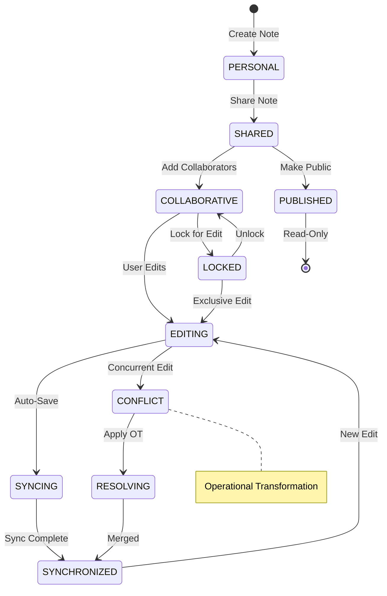
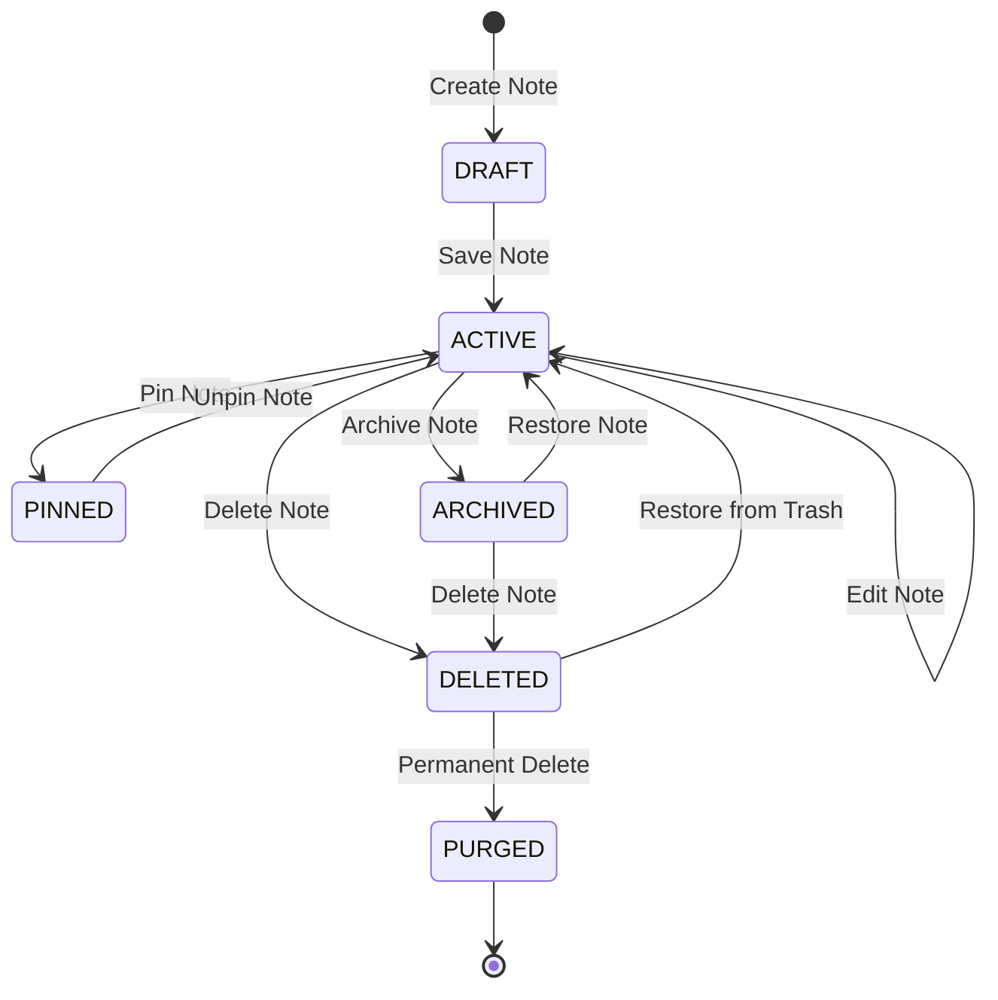
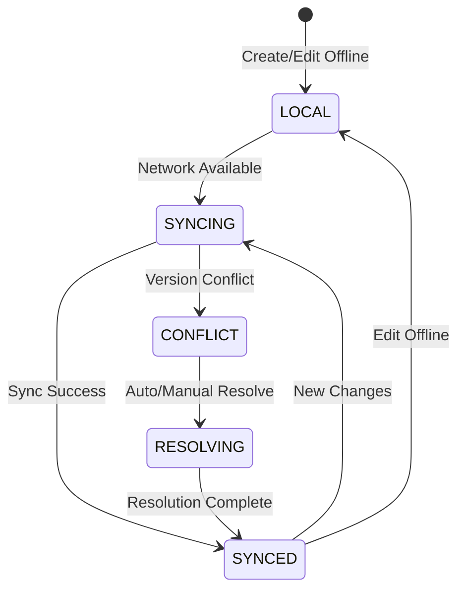

# Notes App Service Backend Technical Specification

## Review Table

| Version | Date | Name | Role | Description |
| --- | --- | --- | --- | --- |
| 1.2 | 2025-11-13 | Infrastructure Lead | Reviewer | Added real-time sync architecture and CDN strategy |
| 1.1 | 2025-11-10 | Security Engineer | Reviewer | Enhanced encryption and sharing mechanisms |
| 1.0 | 2025-11-07 | System Architect | Author | Initial Draft |

## Approval Table

| Approved By | Approved At | Note |
| --- | --- | --- |
| Technical Lead | Pending | Review sync conflict resolution |
| Product Owner | Pending | - |
| DevOps Manager | Pending | - |

---

## Background

Knowledge workers and students generate vast amounts of digital notes across devices, requiring seamless organization, instant search, and reliable synchronization. Current solutions struggle with large document handling, offline functionality, and maintaining version history while ensuring data privacy.

## Context

The note-taking landscape is fragmented between simple text editors lacking organization features and complex knowledge management systems with steep learning curves. Users need a balanced solution offering rich formatting options, powerful search capabilities, hierarchical organization, and real-time synchronization without sacrificing performance or privacy. The system must support various content types including text, markdown, images, and file attachments.

## Objective

Implement a comprehensive notes management service that:

1. **Enables rich content creation** - Support for markdown, rich text, and multimedia
2. **Provides instant search** - Full-text search with sub-second response times
3. **Ensures seamless sync** - Real-time synchronization with conflict resolution
4. **Maintains complete history** - Version control with diff tracking

## Paradigm

We adopt a **Document-Oriented Architecture with Search-First Design**:

- **Document Store**: MongoDB for flexible note structure and rich content
- **Search Engine**: Elasticsearch for full-text search and faceted filtering
- **Sync Engine**: Operational Transformation (OT) for real-time collaboration
- **Version Control**: Git-like branching model for note history
- **API Gateway**: GraphQL for flexible client queries and subscriptions

---

## Database Design

### dbdiagram.io Schema

```dbml
Table notes {
  id uuid [pk]
  user_id uuid [ref: > users.id]
  title varchar(255)
  content text [note: 'Markdown or plain text']
  content_type ContentType [default: 'PLAIN_TEXT']
  excerpt varchar(500) [note: 'Auto-generated preview']
  word_count int [default: 0]
  is_pinned bool [default: false]
  is_archived bool [default: false]
  is_encrypted bool [default: false]
  folder_id uuid [ref: > folders.id]
  created_at timestamp [default: `now()`]
  updated_at timestamp [default: `now()`]
  deleted_at timestamp
  version int [default: 1]
  
  indexes {
    user_id
    (user_id, is_archived)
    (user_id, folder_id)
    (user_id, created_at)
    (user_id, updated_at)
    deleted_at
  }
}

Table note_versions {
  id uuid [pk]
  note_id uuid [ref: > notes.id]
  version_number int [not null]
  title varchar(255)
  content text
  content_diff jsonb [note: 'Diff from previous version']
  created_by uuid [ref: > users.id]
  created_at timestamp [default: `now()`]
  
  indexes {
    note_id
    (note_id, version_number) [unique]
    (note_id, created_at)
  }
}

Table note_tags {
  id uuid [pk]
  note_id uuid [ref: > notes.id]
  tag_id uuid [ref: > tags.id]
  created_at timestamp [default: `now()`]
  
  indexes {
    note_id
    tag_id
    (note_id, tag_id) [unique]
  }
}

Table tags {
  id uuid [pk]
  user_id uuid [ref: > users.id]
  name varchar(50) [not null]
  color varchar(7)
  usage_count int [default: 0]
  created_at timestamp [default: `now()`]
  
  indexes {
    user_id
    (user_id, name) [unique]
  }
}

Table folders {
  id uuid [pk]
  user_id uuid [ref: > users.id]
  name varchar(100) [not null]
  parent_folder_id uuid [ref: > folders.id]
  color varchar(7)
  icon varchar(50)
  path_materialized varchar(500) [note: 'Materialized path for hierarchy']
  created_at timestamp [default: `now()`]
  
  indexes {
    user_id
    parent_folder_id
    (user_id, parent_folder_id)
    path_materialized
  }
}

Table note_attachments {
  id uuid [pk]
  note_id uuid [ref: > notes.id]
  file_name varchar(255)
  file_url varchar(500)
  file_type varchar(50)
  file_size int
  thumbnail_url varchar(500)
  uploaded_at timestamp [default: `now()`]
  
  indexes {
    note_id
  }
}

Table note_search_index {
  id uuid [pk]
  note_id uuid [ref: > notes.id]
  user_id uuid [ref: > users.id]
  title_tokens tsvector
  content_tokens tsvector
  tag_names text[]
  last_indexed_at timestamp [default: `now()`]
  
  indexes {
    note_id [unique]
    user_id
    title_tokens [type: gin]
    content_tokens [type: gin]
    tag_names [type: gin]
  }
}

Table users {
  id uuid [pk]
  email varchar(255) [unique]
  name varchar(255)
  preferences jsonb
  created_at timestamp
}

Enum ContentType {
  PLAIN_TEXT
  MARKDOWN
  RICH_TEXT
  CODE
}
```

### SQL Implementation

```sql
CREATE TYPE content_type AS ENUM ('PLAIN_TEXT', 'MARKDOWN', 'RICH_TEXT', 'CODE');

CREATE TABLE notes (
    id UUID PRIMARY KEY DEFAULT gen_random_uuid(),
    user_id UUID NOT NULL REFERENCES users(id),
    title VARCHAR(255),
    content TEXT,
    content_type content_type DEFAULT 'PLAIN_TEXT',
    excerpt VARCHAR(500),
    word_count INT DEFAULT 0,
    is_pinned BOOLEAN DEFAULT false,
    is_archived BOOLEAN DEFAULT false,
    is_encrypted BOOLEAN DEFAULT false,
    folder_id UUID REFERENCES folders(id),
    created_at TIMESTAMP DEFAULT CURRENT_TIMESTAMP,
    updated_at TIMESTAMP DEFAULT CURRENT_TIMESTAMP,
    deleted_at TIMESTAMP,
    version INT DEFAULT 1
);

CREATE INDEX idx_notes_user ON notes(user_id);
CREATE INDEX idx_notes_user_archived ON notes(user_id, is_archived);
CREATE INDEX idx_notes_user_folder ON notes(user_id, folder_id);
CREATE INDEX idx_notes_updated ON notes(user_id, updated_at DESC);

-- Full-text search index
CREATE TABLE note_search_index (
    id UUID PRIMARY KEY DEFAULT gen_random_uuid(),
    note_id UUID UNIQUE NOT NULL REFERENCES notes(id) ON DELETE CASCADE,
    user_id UUID NOT NULL REFERENCES users(id),
    title_tokens tsvector,
    content_tokens tsvector,
    tag_names text[],
    last_indexed_at TIMESTAMP DEFAULT CURRENT_TIMESTAMP
);

CREATE INDEX idx_search_title ON note_search_index USING gin(title_tokens);
CREATE INDEX idx_search_content ON note_search_index USING gin(content_tokens);
CREATE INDEX idx_search_tags ON note_search_index USING gin(tag_names);
```

---

## Activity Lifecycle

### Note Collaboration Lifecycle



---

## State Machines

### Note Lifecycle State Machine



### Sync State Machine



---

## Sequence Diagrams

### Create Note with Auto-Save

```mermaid
sequenceDiagram
    participant Client
    participant API Gateway
    participant Note Service
    participant Note Repository
    participant Search Indexer
    participant Event Bus

    Client->>API Gateway: POST /notes
    API Gateway->>Note Service: CreateNoteCommand
    Note Service->>Note Service: Generate ID & metadata
    Note Service->>Note Repository: Save draft
    Note Repository-->>Note Service: Draft saved
    Note Service->>Event Bus: Publish NoteCreatedEvent
    Note Service-->>API Gateway: Note created
    API Gateway-->>Client: 201 Created
    
    loop Auto-save every 30s
        Client->>API Gateway: PATCH /notes/{id}
        API Gateway->>Note Service: UpdateNoteCommand
        Note Service->>Note Repository: Update content
        Note Service->>Search Indexer: Update index
        Note Service-->>Client: 200 OK
    end
```

### Full-Text Search Flow

```mermaid
sequenceDiagram
    participant Client
    participant API Gateway
    participant Search Service
    participant Search Index
    participant Note Repository
    participant Cache

    Client->>API Gateway: GET /notes/search?q=keyword
    API Gateway->>Search Service: SearchNotesQuery
    Search Service->>Cache: Check cache
    Cache-->>Search Service: Cache miss
    Search Service->>Search Index: Full-text search
    Search Index-->>Search Service: Note IDs ranked
    Search Service->>Note Repository: Batch fetch notes
    Note Repository-->>Search Service: Note details
    Search Service->>Cache: Store results
    Search Service->>Search Service: Highlight matches
    Search Service-->>API Gateway: Search results
    API Gateway-->>Client: 200 OK with results
```

### Version History Flow

```mermaid
sequenceDiagram
    participant Client
    participant API Gateway
    participant Note Service
    participant Version Repository
    participant Diff Service

    Client->>API Gateway: GET /notes/{id}/versions
    API Gateway->>Note Service: GetVersionHistoryQuery
    Note Service->>Version Repository: Get all versions
    Version Repository-->>Note Service: Version list
    Note Service-->>API Gateway: Version history
    API Gateway-->>Client: 200 OK
    
    Client->>API Gateway: POST /notes/{id}/restore/{version}
    API Gateway->>Note Service: RestoreVersionCommand
    Note Service->>Version Repository: Get version content
    Note Service->>Diff Service: Calculate changes
    Note Service->>Note Service: Apply version
    Note Service->>Version Repository: Save as new version
    Note Service-->>API Gateway: Version restored
    API Gateway-->>Client: 200 OK
```

---

## API Endpoints

### Note Management Endpoints

#### POST /api/v1/notes
**Create a new note**

Request:
```json
{
  "title": "Meeting Notes",
  "content": "# Q4 Planning\n\n- Budget review\n- Timeline",
  "content_type": "MARKDOWN",
  "folder_id": "folder_abc123",
  "tags": ["work", "planning"]
}
```

Response (201 Created):
```json
{
  "id": "note_xyz123",
  "title": "Meeting Notes",
  "excerpt": "Q4 Planning - Budget review...",
  "created_at": "2025-11-13T10:00:00Z",
  "version": 1
}
```

#### GET /api/v1/notes
**List user notes with filtering**

Query Parameters:
| Parameter | Type | Required | Description |
| --- | --- | --- | --- |
| folder_id | uuid | No | Filter by folder |
| tag | string | No | Filter by tag name |
| is_archived | bool | No | Include/exclude archived |
| sort_by | string | No | 'created', 'updated', 'title' |
| page | int | No | Page number (default: 1) |
| limit | int | No | Items per page (default: 20) |

Response (200 OK):
```json
{
  "notes": [
    {
      "id": "note_xyz123",
      "title": "Meeting Notes",
      "excerpt": "Q4 Planning - Budget review...",
      "tags": ["work", "planning"],
      "is_pinned": false,
      "updated_at": "2025-11-13T10:00:00Z"
    }
  ],
  "pagination": {
    "page": 1,
    "limit": 20,
    "total": 145
  }
}
```

#### GET /api/v1/notes/search
**Full-text search across notes**

Query Parameters:
| Parameter | Type | Required | Description |
| --- | --- | --- | --- |
| q | string | Yes | Search query |
| tags | string[] | No | Filter by tags |
| folder_id | uuid | No | Search within folder |

Response (200 OK):
```json
{
  "results": [
    {
      "id": "note_xyz123",
      "title": "Meeting Notes",
      "excerpt": "Q4 Planning - <mark>Budget</mark> review...",
      "highlights": {
        "title": ["Meeting <mark>Notes</mark>"],
        "content": ["Q4 Planning - <mark>Budget</mark> review"]
      },
      "score": 0.95
    }
  ],
  "total": 12,
  "query": "budget"
}
```

#### GET /api/v1/notes/{id}/versions
**Get version history for a note**

Response (200 OK):
```json
{
  "versions": [
    {
      "version_number": 3,
      "created_at": "2025-11-13T11:00:00Z",
      "created_by": "user_123",
      "changes": {
        "additions": 45,
        "deletions": 12
      }
    },
    {
      "version_number": 2,
      "created_at": "2025-11-13T10:30:00Z",
      "created_by": "user_123",
      "changes": {
        "additions": 23,
        "deletions": 5
      }
    }
  ]
}
```

## Architecture Components

### Service Layer

**Core Services**:
- Note Service - Handles CRUD operations and versioning
- Search Service - Full-text search and indexing
- Sync Service - Real-time synchronization engine
- Storage Service - File attachments and media
- Share Service - Collaboration and permissions

**Data Layer**:
- PostgreSQL - Primary storage with JSONB for rich content
- ElasticSearch - Full-text search index
- Redis - Cache and sync state
- S3 - Attachment storage with CDN

**Sync Infrastructure**:
- WebSocket Server - Real-time connections
- Operational Transform - Conflict resolution
- Event Log - Sync history
- Offline Queue - Pending changes

**Integration Layer**:
- REST API - Standard CRUD operations
- GraphQL - Complex queries
- WebSocket - Real-time updates
- Export API - PDF, Markdown, HTML

---

## Security Considerations

### Access Control
- **Role-based permissions** - Owner, Editor, Viewer
- **Folder-level inheritance** - Cascading permissions
- **Share links** with expiration dates
- **API key authentication** for integrations

### Data Protection
- **Encryption at rest** using AES-256
- **End-to-end encryption** for sensitive notes
- **TLS 1.3** for all communications
- **Secure deletion** with data overwriting

### Privacy Features
- **Private folders** with encryption
- **Anonymous sharing** options
- **No tracking mode** for privacy
- **GDPR compliance** with data portability

---

## Testing Strategy

### Unit Tests
```typescript
describe('NoteVersioning', () => {
  it('should create diff between versions', () => {
    const v1 = createNote('Original content');
    const v2 = updateNote(v1, 'Modified content');
    const diff = versionService.createDiff(v1, v2);
    expect(diff.additions).toBe(1);
    expect(diff.deletions).toBe(1);
  });

  it('should resolve sync conflicts', () => {
    const base = createNote('Base');
    const local = updateNote(base, 'Local change');
    const remote = updateNote(base, 'Remote change');
    const merged = syncService.merge(base, local, remote);
    expect(merged).toContain('Local change');
    expect(merged).toContain('Remote change');
  });
});
```

### Integration Tests
- Note creation with attachment upload
- Full-text search accuracy
- Real-time sync between devices
- Version restore functionality

### E2E Tests
- Complete note lifecycle
- Collaborative editing session
- Offline-to-online sync
- Data export and import

### Performance Tests
- 10,000 notes per user
- Search response < 200ms
- Sync latency < 100ms
- 1000 concurrent WebSocket connections

---

## Acceptance Criteria

1. ✅ Notes save automatically every 2 seconds
2. ✅ Full-text search returns results in < 200ms
3. ✅ Version history maintained for 90 days
4. ✅ Real-time sync latency < 100ms
5. ✅ Support for 10MB attachments
6. ✅ Offline mode with background sync
7. ✅ Markdown and rich text support
8. ✅ Folder hierarchy with drag-drop
9. ✅ Export to PDF, MD, HTML, DOCX
10. ✅ 99.9% uptime for core features

---

## Implementation Notes

### Search Optimization
- Use PostgreSQL full-text search with tsvector
- Implement fuzzy matching for typo tolerance
- Index content asynchronously via message queue
- Cache frequent search queries in Redis

### Version Control Strategy
- Store full content every 10 versions
- Use diffs for intermediate versions
- Implement automatic cleanup for old versions
- Support branching for collaborative editing prep

### Encryption
- Client-side encryption for sensitive notes
- Zero-knowledge architecture
- Key derivation from user password
- Secure key storage in dedicated vault

### Performance Considerations
- Lazy load note content
- Implement virtual scrolling for large lists
- Use CDN for attachment delivery
- Batch API calls for bulk operations

### Monitoring & Analytics
- Track search query patterns
- Monitor note creation/edit frequency
- Alert on sync failures
- Analyze tag usage trends

### Future Enhancements
- Collaborative editing
- AI-powered note suggestions
- OCR for image attachments
- Voice note transcription
- Smart folders with dynamic filters