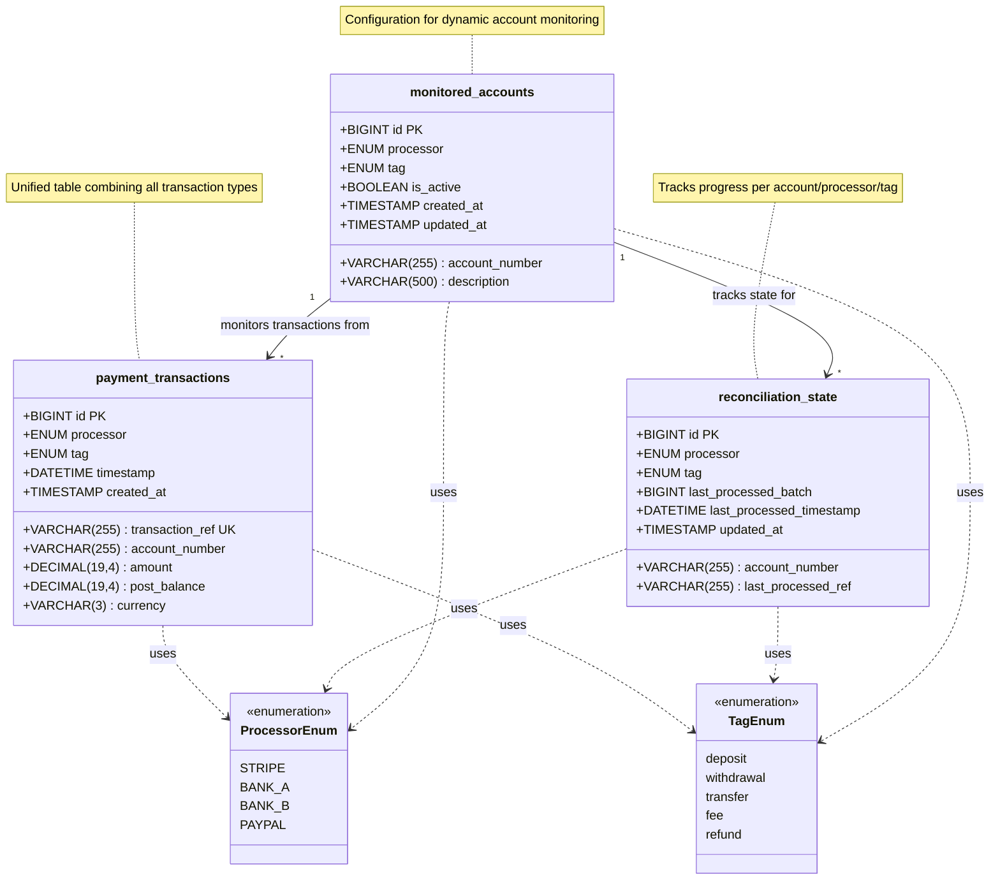
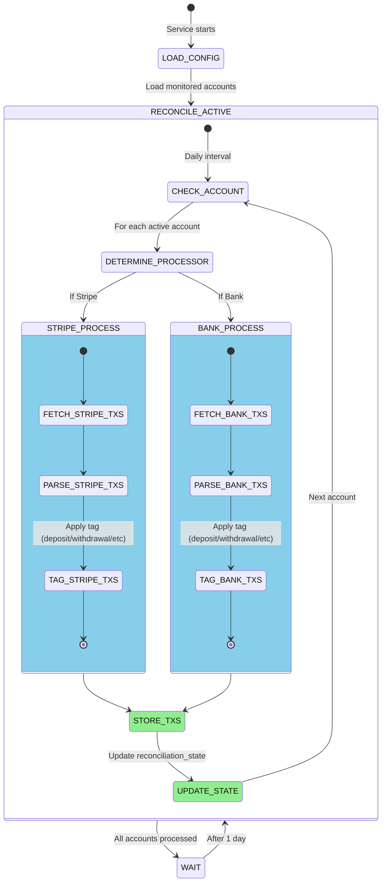
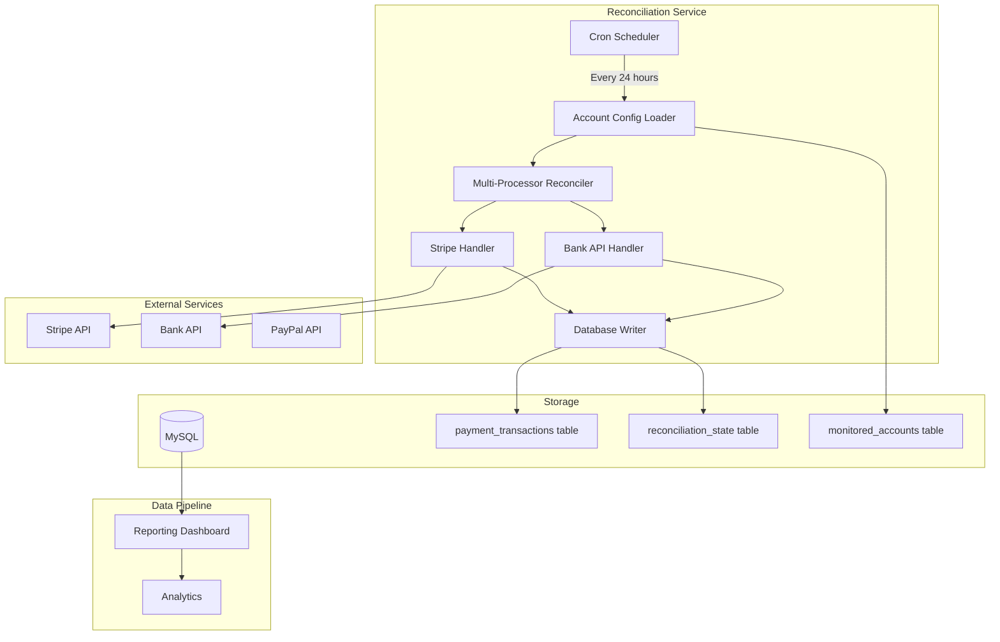
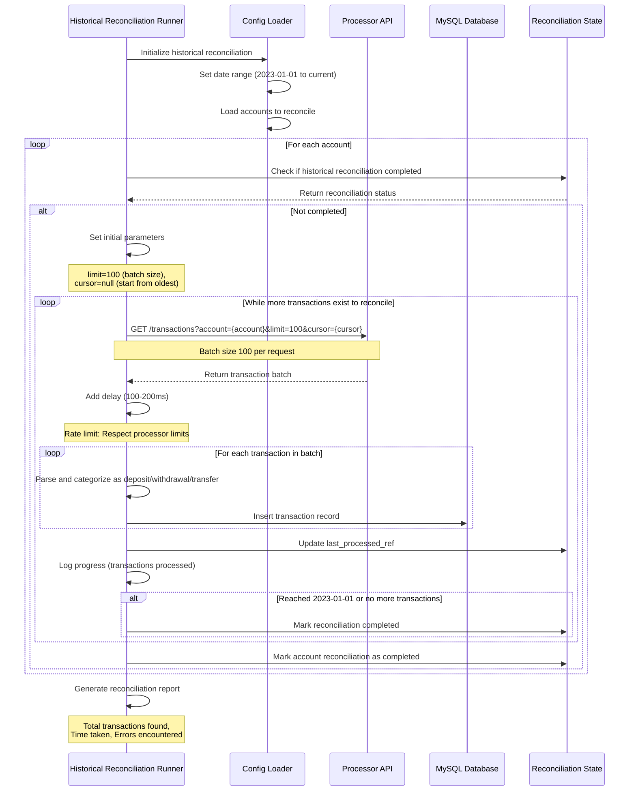
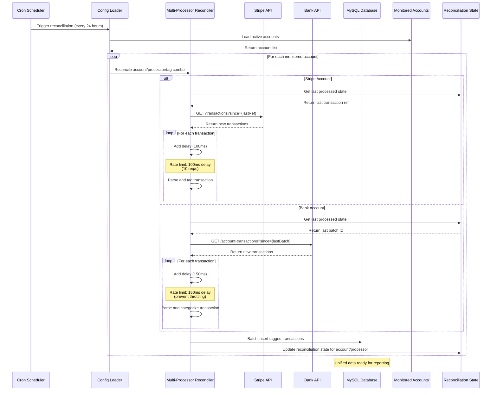

# Payment Transaction Reconciliation System - Backend Engineering Specification

## Review Table

| Version | Date | Name | Role | Description |
| --- | --- | --- | --- | --- |
| 1.0 | 2025-11-12 | Engineer | Author | Initial Draft |

## Approval Table

| Approved By | Approved At | Note |
| --- | --- | --- |
|  |  |  |

---

## Background

The payment platform requires a comprehensive reconciliation system to track and monitor payment transactions across multiple payment processors and banks. Currently, transaction data is fragmented across different systems, making it difficult to maintain accurate financial records and detect discrepancies.

## Context

The existing system lacks a unified approach to transaction tracking, with separate tables and logic for different transaction types (deposits, withdrawals, transfers). This creates maintenance overhead and makes it challenging to add new payment processors or account types without significant code changes.

## Objective

Implement a unified transaction reconciliation system that:

1. **Consolidates transaction data** - Single table for all transaction types across all processors
2. **Enables scalable monitoring** - Dynamic account configuration without schema changes
3. **Provides automated reconciliation** - Daily sync with configurable intervals
4. **Supports historical data loading** - Batch processing with rate limiting protection
5. **Maintains data integrity** - Consistent structure for reporting and analytics

## Paradigm

We adopt a **unified table approach with processor abstraction**:

- **Domain Layer**: Payment transactions as universal entities
- **Application Layer**: Multi-processor reconciliation use cases
- **Infrastructure Layer**: Processor-specific API adapters
- **Separation of Concerns**: Processor logic isolated from core reconciliation

---

## Database Design

The schema uses a single unified table that combines the functionality of separate transaction type tables:

### Database Class Diagram



## Database Schema

```sql
-- Unified table for all payment transactions
CREATE TABLE payment_transactions (
  id BIGINT AUTO_INCREMENT PRIMARY KEY,
  transaction_ref VARCHAR(255) UNIQUE NOT NULL,
  account_number VARCHAR(255) NOT NULL,
  processor ENUM('STRIPE', 'BANK_A', 'BANK_B', 'PAYPAL') NOT NULL,
  tag ENUM('deposit', 'withdrawal', 'transfer', 'fee', 'refund') NOT NULL,
  timestamp DATETIME NOT NULL,
  amount DECIMAL(19,4) NOT NULL,
  post_balance DECIMAL(19,4) NOT NULL,
  currency VARCHAR(3) NOT NULL DEFAULT 'USD',
  created_at TIMESTAMP DEFAULT CURRENT_TIMESTAMP,

  INDEX idx_account_processor (account_number, processor),
  INDEX idx_tag (tag),
  INDEX idx_timestamp (timestamp),
  INDEX idx_processor (processor),
  INDEX idx_account_tag (account_number, tag)
);

-- Table to track reconciliation state for each account/processor combination
CREATE TABLE reconciliation_state (
  id BIGINT AUTO_INCREMENT PRIMARY KEY,
  account_number VARCHAR(255) NOT NULL,
  processor ENUM('STRIPE', 'BANK_A', 'BANK_B', 'PAYPAL') NOT NULL,
  tag ENUM('deposit', 'withdrawal', 'transfer', 'fee', 'refund') NOT NULL,
  last_processed_ref VARCHAR(255),
  last_processed_batch BIGINT,
  last_processed_timestamp DATETIME,
  updated_at TIMESTAMP DEFAULT CURRENT_TIMESTAMP ON UPDATE CURRENT_TIMESTAMP,

  UNIQUE KEY unique_account_processor_tag (account_number, processor, tag),
  INDEX idx_processor (processor)
);

-- Configuration table for accounts to monitor
CREATE TABLE monitored_accounts (
  id BIGINT AUTO_INCREMENT PRIMARY KEY,
  account_number VARCHAR(255) NOT NULL,
  processor ENUM('STRIPE', 'BANK_A', 'BANK_B', 'PAYPAL') NOT NULL,
  tag ENUM('deposit', 'withdrawal', 'transfer', 'fee', 'refund') NOT NULL,
  description VARCHAR(500),
  is_active BOOLEAN DEFAULT TRUE,
  created_at TIMESTAMP DEFAULT CURRENT_TIMESTAMP,
  updated_at TIMESTAMP DEFAULT CURRENT_TIMESTAMP ON UPDATE CURRENT_TIMESTAMP,

  UNIQUE KEY unique_account_processor_tag (account_number, processor, tag),
  INDEX idx_active (is_active),
  INDEX idx_processor (processor)
);
```

---

## Activity Lifecycle

### Transaction Processing State Machine



---

## Architecture Overview



---

## Processing Sequences

### Historical Data Reconciliation

This service processes all historical payment transactions from 2023 to the current timestamp across all payment processors.

**Rate Limiting Considerations:**
- Stripe API Rate Limits: 100 requests per second per account
- Bank API typically: 10 requests per second
- For batch operations: Process in chunks of 100 with 100ms delay between calls

**Sequence Diagram**



### Daily Reconciliation Service

**Daily Reconciliation with Rate Limit Protection:**
- Service runs once per day (24-hour interval)
- Implements rate limiting delays to respect API limits
- Processes approximately 500 payment transactions daily across all processors

**Sequence Diagram**



---

## Tag-based Transaction Classification

### Tag Categories

| Tag | Description | Use Case |
| --- | --- | --- |
| `deposit` | Incoming funds to account | Customer payments, bank transfers in |
| `withdrawal` | Outgoing funds from account | Payouts, bank transfers out |
| `transfer` | Internal transfers | Between accounts |
| `fee` | Processing fees | Transaction fees, monthly fees |
| `refund` | Refund transactions | Customer refunds, chargebacks |

### Account Configuration Examples

```sql
-- Insert main operating account monitoring
INSERT INTO monitored_accounts (account_number, processor, tag, description) VALUES
('ACCT_12345', 'STRIPE', 'deposit', 'Stripe main account deposits'),
('ACCT_12345', 'STRIPE', 'withdrawal', 'Stripe main account withdrawals'),
('9876543210', 'BANK_A', 'deposit', 'Bank A main account deposits'),
('9876543210', 'BANK_A', 'withdrawal', 'Bank A main account withdrawals');

-- Add merchant settlement account
INSERT INTO monitored_accounts (account_number, processor, tag, description) VALUES
('MERCHANT_ACC_1', 'PAYPAL', 'deposit', 'Merchant settlement account'),
('MERCHANT_ACC_2', 'BANK_B', 'transfer', 'Internal transfer tracking');
```

---

## Query Examples

### Get All Deposits

```sql
SELECT * FROM payment_transactions
WHERE tag = 'deposit'
ORDER BY timestamp DESC;
```

### Get Withdrawals by Processor

```sql
SELECT * FROM payment_transactions
WHERE tag = 'withdrawal'
  AND processor = 'STRIPE'
ORDER BY timestamp DESC;
```

### Get All Transactions for Specific Account

```sql
SELECT * FROM payment_transactions
WHERE account_number = 'ACCT_12345'
ORDER BY timestamp DESC;
```

### Daily Deposit/Withdrawal Summary by Processor

```sql
SELECT
  DATE(timestamp) as date,
  processor,
  tag,
  COUNT(*) as transaction_count,
  SUM(ABS(amount)) as total_amount,
  currency
FROM payment_transactions
WHERE tag IN ('deposit', 'withdrawal')
GROUP BY DATE(timestamp), processor, tag, currency
ORDER BY date DESC;
```

---

## Configuration

### Environment Variables

| Variable | Description | Example |
| --- | --- | --- |
| MYSQL_HOST | MySQL server host | localhost |
| MYSQL_PORT | MySQL server port | 3306 |
| MYSQL_DATABASE | Database name | payment_platform |
| MYSQL_USER | Database user | reconciliation_svc |
| MYSQL_PASSWORD | Database password | [secure] |
| STRIPE_API_KEY | Stripe API key | sk_live_... |
| BANK_API_URL | Bank API endpoint | https://api.bank-a.com |
| BANK_API_KEY | Bank API credentials | [secure] |
| RECON_INTERVAL_HOURS | Reconciliation frequency | 24 |
| MAX_CONCURRENT_ACCOUNTS | Concurrent account processing | 5 |

### Account Configuration Management

The reconciliation service dynamically loads monitored accounts from the `monitored_accounts` table on each reconciliation cycle. This allows administrators to:

- Add new accounts to monitor without restarting the service
- Disable monitoring for specific accounts by setting `is_active = FALSE`
- Track different transaction types using the tag system
- Monitor multiple accounts across all payment processors

---

## Security Considerations

### Authorization

- Service uses dedicated API credentials for each processor
- Read-only access to payment processor APIs
- Write access limited to reconciliation tables only
- No ability to initiate transactions or modify payment data

### Data Protection

- All API credentials stored in environment variables
- TLS encryption for all API communications
- Database connections use SSL
- Sensitive data (account numbers) are indexed but not exposed in logs

---

## Testing Strategy

### Unit Tests

- Transaction parser for each processor type
- Tag classification logic
- Rate limiting implementation
- Batch processing logic

### Integration Tests

- Processor API connectivity
- Database transaction handling
- State management across reconciliation runs
- Error recovery and retry logic

### E2E Tests

- Complete reconciliation cycle for all processors
- Historical data loading with rate limiting
- Account configuration changes
- Reporting data accuracy

---

## Monitoring & Alerting

### Health Checks

- Reconciliation state freshness per account/processor
- Database connectivity
- API endpoint availability
- Configuration consistency

### Key Metrics

- Transactions processed per account/processor/tag
- Reconciliation lag time
- Error rates by processor
- Account coverage completeness

### Alerts

| Alert | Threshold | Action |
| --- | --- | --- |
| Reconciliation Lag | > 48 hours | Check API connectivity |
| High Error Rate | > 5% of transactions | Review processor integration |
| Missing Accounts | Any active account not processed | Check configuration |
| API Rate Limit | Approaching limit | Adjust batch size/delays |

---

## Rollback Plan

### Database Rollback

```sql
-- Remove all reconciliation data
DROP TABLE IF EXISTS payment_transactions;
DROP TABLE IF EXISTS reconciliation_state;
DROP TABLE IF EXISTS monitored_accounts;
```

### Service Rollback

1. Stop reconciliation service
2. Restore previous service version
3. Clear reconciliation state
4. Re-run historical reconciliation if needed

---

## Implementation Notes

This approach creates entirely new tables (`payment_transactions`, `reconciliation_state`, and `monitored_accounts`) that are independent of the existing Transaction table in the system. This ensures:

- No modifications to existing production tables
- Clean separation of concerns for reconciliation tracking
- Easy rollback if needed without affecting existing functionality

---

## Benefits of This Approach

### 1. **Scalability**

- Add new accounts/processors without database schema changes
- Single table reduces complexity
- Efficient indexing for common query patterns

### 2. **Flexibility**

- Tag-based classification allows for multiple transaction types
- Easy to filter by account, processor, or transaction type
- Future-proof for new payment processors

### 3. **Maintenance**

- Single reconciliation codebase handles all processors
- Centralized configuration management
- Unified monitoring and alerting

### 4. **Data Consistency**

- All transactions in one table with consistent schema
- Simplified reporting and analytics
- Better data integrity

### 5. **Reporting Compatibility**

- Single table is easier to integrate with BI tools
- Consistent column structure across all processors
- Incremental sync using timestamp column

---

## Acceptance Criteria

1. ✅ System processes historical transactions from 2023 to current
2. ✅ Daily reconciliation runs automatically every 24 hours
3. ✅ All configured accounts are monitored
4. ✅ Rate limiting prevents API throttling
5. ✅ Transaction tags correctly classify all transaction types
6. ✅ Reconciliation state persists between runs
7. ✅ New processors can be added via configuration only
8. ✅ Reporting queries perform within 2 seconds
9. ✅ System handles API failures gracefully with retry logic
10. ✅ All transactions are stored with consistent schema

---

## Summary

This unified approach provides enhanced capabilities for payment reconciliation:

- **Future-proof**: Easy to add new accounts and processors
- **Flexible tagging**: Categorize transactions beyond just deposits/withdrawals
- **Scalable architecture**: No schema changes for new monitoring targets
- **Unified data model**: Consistent structure across all processors
- **Enhanced querying**: Rich filtering and grouping capabilities
- **Reporting ready**: Single table for simplified analytics

The tag-based classification system allows us to monitor not just deposits and withdrawals, but also fees, refunds, and internal transfers, providing comprehensive transaction tracking across all supported payment processors.