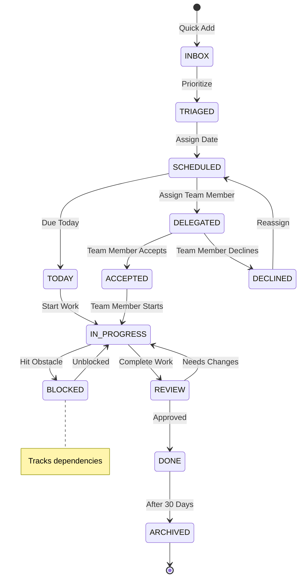
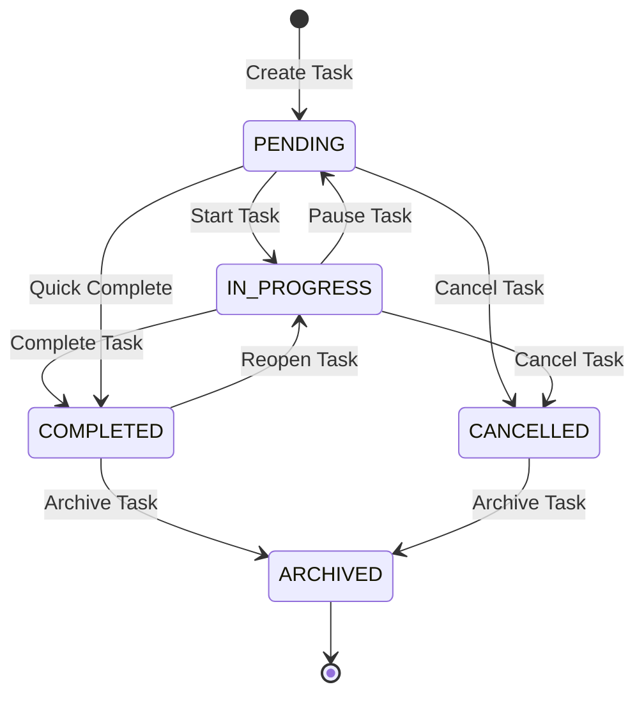
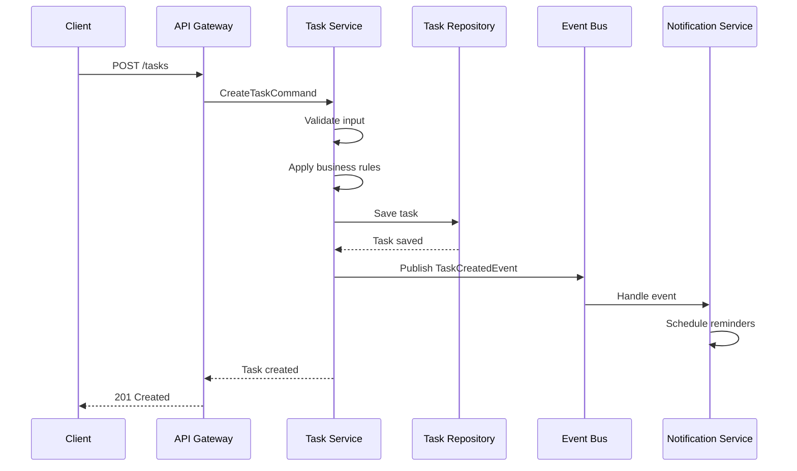
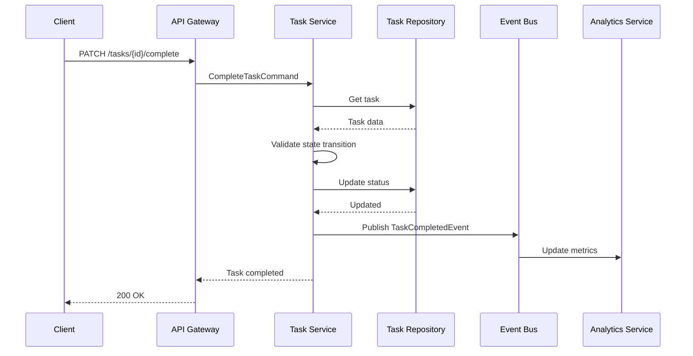

# Task Manager Service Backend Technical Specification

## Review Table

| Version | Date | Name | Role | Description |
| --- | --- | --- | --- | --- |
| 1.2 | 2025-11-13 | Team Lead | Reviewer | Added team collaboration and subtask management |
| 1.1 | 2025-11-10 | Senior Developer | Reviewer | Enhanced notification system and recurring tasks |
| 1.0 | 2025-11-07 | System Architect | Author | Initial Draft |

## Approval Table

| Approved By | Approved At | Note |
| --- | --- | --- |
| Technical Lead | Pending | Review team features |
| Product Owner | Pending | - |
| Project Manager | Pending | - |

---

## Background

Individuals and teams struggle with task overload, missed deadlines, and lack of visibility into work progress. Traditional task management relies on disparate tools, sticky notes, and mental tracking, leading to dropped commitments and inefficient prioritization.

## Context

The task management landscape ranges from simple todo lists to complex project management suites. Users need a solution that balances simplicity with powerful features like smart prioritization, deadline management, and team collaboration. The system must handle personal tasks, work assignments, and shared projects while maintaining performance and usability across devices.

## Objective

Implement a comprehensive task management service that:

1. **Streamlines task capture** - Quick add with natural language processing
2. **Enables smart prioritization** - Eisenhower matrix and deadline-based sorting
3. **Provides progress visibility** - Kanban boards, lists, and calendar views
4. **Supports collaboration** - Task sharing, comments, and team workspaces

## Paradigm

We adopt a **Clean Architecture with Repository Pattern**:

- **Domain Layer**: Task entities, business rules, and priority algorithms
- **Application Layer**: Use cases for task operations and workflow orchestration
- **Infrastructure Layer**: Database persistence, notification services, and external APIs
- **Repository Pattern**: Abstract data access for flexibility and testability
- **Real-time Updates**: WebSocket layer for collaborative features

---

## Database Design

### dbdiagram.io Schema

```dbml
Table tasks {
  id uuid [pk]
  user_id uuid [ref: > users.id]
  title varchar(255) [not null]
  description text
  priority TaskPriority [default: 'MEDIUM']
  status TaskStatus [default: 'PENDING']
  due_date timestamp
  completed_at timestamp
  created_at timestamp [default: `now()`]
  updated_at timestamp [default: `now()`]
  version int [default: 1, note: 'Optimistic locking']
  
  indexes {
    user_id
    (user_id, status)
    (user_id, due_date)
    (status, due_date)
  }
}

Table task_tags {
  id uuid [pk]
  task_id uuid [ref: > tasks.id]
  tag_name varchar(50) [not null]
  created_at timestamp [default: `now()`]
  
  indexes {
    task_id
    tag_name
    (task_id, tag_name) [unique]
  }
}

Table task_attachments {
  id uuid [pk]
  task_id uuid [ref: > tasks.id]
  file_name varchar(255)
  file_url varchar(500)
  file_size int
  mime_type varchar(100)
  uploaded_at timestamp [default: `now()`]
  
  indexes {
    task_id
  }
}

Table task_history {
  id uuid [pk]
  task_id uuid [ref: > tasks.id]
  user_id uuid [ref: > users.id]
  action TaskAction
  previous_value jsonb
  new_value jsonb
  created_at timestamp [default: `now()`]
  
  indexes {
    task_id
    (task_id, created_at)
  }
}

Table users {
  id uuid [pk]
  email varchar(255) [unique]
  name varchar(255)
  created_at timestamp
}

Enum TaskPriority {
  LOW
  MEDIUM
  HIGH
  URGENT
}

Enum TaskStatus {
  PENDING
  IN_PROGRESS
  COMPLETED
  CANCELLED
  ARCHIVED
}

Enum TaskAction {
  CREATED
  UPDATED
  STATUS_CHANGED
  PRIORITY_CHANGED
  COMPLETED
  REOPENED
  ARCHIVED
}
```

### SQL Implementation

```sql
CREATE TYPE task_priority AS ENUM ('LOW', 'MEDIUM', 'HIGH', 'URGENT');
CREATE TYPE task_status AS ENUM ('PENDING', 'IN_PROGRESS', 'COMPLETED', 'CANCELLED', 'ARCHIVED');
CREATE TYPE task_action AS ENUM ('CREATED', 'UPDATED', 'STATUS_CHANGED', 'PRIORITY_CHANGED', 'COMPLETED', 'REOPENED', 'ARCHIVED');

CREATE TABLE tasks (
    id UUID PRIMARY KEY DEFAULT gen_random_uuid(),
    user_id UUID NOT NULL REFERENCES users(id),
    title VARCHAR(255) NOT NULL,
    description TEXT,
    priority task_priority DEFAULT 'MEDIUM',
    status task_status DEFAULT 'PENDING',
    due_date TIMESTAMP,
    completed_at TIMESTAMP,
    created_at TIMESTAMP DEFAULT CURRENT_TIMESTAMP,
    updated_at TIMESTAMP DEFAULT CURRENT_TIMESTAMP,
    version INT DEFAULT 1
);

CREATE INDEX idx_tasks_user_id ON tasks(user_id);
CREATE INDEX idx_tasks_user_status ON tasks(user_id, status);
CREATE INDEX idx_tasks_user_due ON tasks(user_id, due_date);
CREATE INDEX idx_tasks_status_due ON tasks(status, due_date);
```

---

## Activity Lifecycle

### Task Management Lifecycle



---

## State Machines



### State Transition Matrix

| Current State | Event | Next State | Guards |
| --- | --- | --- | --- |
| PENDING | START_TASK | IN_PROGRESS | User owns task |
| IN_PROGRESS | PAUSE_TASK | PENDING | User owns task |
| IN_PROGRESS | COMPLETE_TASK | COMPLETED | User owns task |
| PENDING | COMPLETE_TASK | COMPLETED | User owns task |
| COMPLETED | REOPEN_TASK | IN_PROGRESS | User owns task, Not archived |
| PENDING/IN_PROGRESS | CANCEL_TASK | CANCELLED | User owns task |
| COMPLETED/CANCELLED | ARCHIVE_TASK | ARCHIVED | User owns task |

---

## Sequence Diagrams

### Create Task Flow



### Complete Task Flow



---

## API Endpoints

### Task Endpoints

#### POST /api/v1/tasks
**Create a new task**

Request:
```json
{
  "title": "Prepare presentation",
  "description": "Q4 review presentation",
  "priority": "HIGH",
  "due_date": "2025-11-20T10:00:00Z",
  "tags": ["work", "presentation"]
}
```

Response (201 Created):
```json
{
  "id": "task_abc123",
  "title": "Prepare presentation",
  "status": "PENDING",
  "created_at": "2025-11-13T08:00:00Z"
}
```

#### GET /api/v1/tasks
**List user tasks with filtering**

Query Parameters:
| Parameter | Type | Required | Description |
| --- | --- | --- | --- |
| status | string | No | Filter by status |
| priority | string | No | Filter by priority |
| due_before | timestamp | No | Tasks due before date |
| page | int | No | Page number (default: 1) |
| limit | int | No | Items per page (default: 20) |

Response (200 OK):
```json
{
  "tasks": [
    {
      "id": "task_abc123",
      "title": "Prepare presentation",
      "status": "PENDING",
      "priority": "HIGH",
      "due_date": "2025-11-20T10:00:00Z"
    }
  ],
  "pagination": {
    "page": 1,
    "limit": 20,
    "total": 45
  }
}
```

#### PATCH /api/v1/tasks/{id}
**Update task properties**

Request:
```json
{
  "title": "Updated title",
  "priority": "URGENT",
  "version": 1
}
```

Response (200 OK):
```json
{
  "id": "task_abc123",
  "title": "Updated title",
  "priority": "URGENT",
  "version": 2
}
```

## Architecture Components

### Service Layer

**Core Services**:
- Task Service - Manages task lifecycle and operations
- Priority Service - Smart prioritization algorithms
- Notification Service - Reminders and updates
- Collaboration Service - Team features and sharing
- Analytics Service - Productivity insights

**Data Layer**:
- PostgreSQL - Primary task storage
- Redis - Cache and session state
- ElasticSearch - Task search
- S3 - File attachments

**Communication Layer**:
- REST API - CRUD operations
- GraphQL - Complex queries
- WebSocket - Real-time updates
- Event Bus - Service messaging

---

## Security Considerations

### Authorization
- **Role-based access** - Owner, Assignee, Viewer
- **Workspace isolation** - Team data separation
- **API rate limiting** - 300 requests/minute
- **Session management** - JWT with refresh tokens

### Data Protection
- **Encryption at rest** - AES-256
- **TLS 1.3** for all connections
- **Audit logging** - All task modifications
- **Soft delete** - 30-day recovery window

### Privacy
- **Personal workspace** encryption
- **Anonymous task templates**
- **GDPR compliance** - Export and deletion
- **No third-party tracking**

---

## Testing Strategy

### Unit Tests
```typescript
describe('TaskPrioritization', () => {
  it('should prioritize by Eisenhower matrix', () => {
    const tasks = createTasksWithPriorities();
    const sorted = prioritizer.sort(tasks);
    expect(sorted[0].priority).toBe('URGENT_IMPORTANT');
  });

  it('should handle recurring task creation', () => {
    const task = createRecurringTask('Daily standup');
    const instances = scheduler.generateInstances(task, 7);
    expect(instances.length).toBe(7);
  });
});
```

### Integration Tests
- Task creation with notifications
- Subtask dependency management
- Team collaboration workflow
- Recurring task generation

### E2E Tests
- Complete task lifecycle
- Team task assignment flow
- Calendar integration
- Mobile app sync

### Performance Tests
- Handle 100k tasks per workspace
- Search response < 100ms
- Real-time sync < 50ms latency
- Support 10k concurrent users

---

## Acceptance Criteria

1. ✅ Tasks created in < 2 seconds
2. ✅ Natural language date parsing
3. ✅ Drag-drop between status columns
4. ✅ Subtask dependency tracking
5. ✅ Recurring tasks with patterns
6. ✅ Email and push notifications
7. ✅ Offline mode with sync
8. ✅ Calendar view integration
9. ✅ Bulk operations support
10. ✅ 99.95% uptime SLA

---

## Implementation Notes

### Idempotency
- Use task ID as idempotency key for create operations
- Implement version field for optimistic locking on updates

### Performance Considerations
- Index on (user_id, status) for filtered queries
- Implement Redis caching for frequently accessed tasks
- Batch notification processing for bulk operations

### Security
- Row-level security ensuring users access only their tasks
- Input validation on all fields
- Rate limiting: 100 requests per minute per user

### Monitoring
- Track task completion rates
- Monitor average time-to-completion by priority
- Alert on overdue high-priority tasks

### Future Enhancements
- Task templates for recurring activities
- Subtask support with parent-child relationships
- Team collaboration with task sharing
- AI-powered task prioritization suggestions