## Review Table

| Version | Date | Name | Role | Description |
| --- | --- | --- | --- | --- |
| 1.2 | 2025-11-10 | Technical Lead | Reviewer | Added some notes and comments |
| 1.2 | 2025-11-07 | Assistant | Editor | Added safeguards for banking and eaccount account management (add/update/delete) when redemption restrictions are enabled |
| 1.1 | 2025-11-04 | Assistant | Editor | Added eaccount whitelisting endpoints, updated redemption_restricted to banking_redemption_disabled, removed audit log references from sequence diagrams |
| 1.0 | 2025-10-30 | Engineer D | Author | Initial Draft |

## Approval Table

| Approved By | Approved At | Note |
| --- | --- | --- |
|  |  |  |

---

## Background

The Mobile App application's Payment Link allows merchants to accept digital payment payments through staff members or cashiers. Currently, these staff members have unrestricted access to critical account functions, creating significant financial risk. Staff can add personal bank accounts, redeem DigitalCurrency to their accounts, transfer funds via P2P, and potentially misappropriate company funds.

## Context

The current system lacks granular permission controls at the user level. Any user with access to a Payment Link account can:

- Add and use any bank account for redemption
- Transfer funds to e-accounts
- Initiate P2P transfers
- Make payments using company funds
- Export private keys (frontend concern, now addressed in this spec)

This creates a trust problem where business owners must rely entirely on staff honesty without technical safeguards.

## Objective

Implement a comprehensive restriction system that:

1. **Enforces banking and eaccount restrictions** - Control access to banking and eaccount redemptions separately
1. **Disables specific account features** - Granular control over e-account redemption, P2P transfers, payment capabilities, and private key export
1. **Ensures backward compatibility** - Existing unrestricted accounts continue functioning normally
1. **Provides restriction status visibility** - Users can check their restriction status via API

## Paradigm

We adopt a **DDD-lite approach with Hexagonal Architecture** principles:

- **Domain Layer**: User restrictions as first-class domain concepts
- **Application Layer**: Use cases for managing and enforcing restrictions
- **Infrastructure Layer**: Database persistence and API adapters
- **Separation of Concerns**: Restriction logic isolated from business operations

---

## Database Design

## Database Schema

```
Table userprofiles {
  id int [pk]
  user_uuid varchar [unique]
  account_id varchar [unique]
  // existing fields...

  indexes {
    user_uuid
    account_id
  }
}

Table user_restrictions {
  id int [pk, increment]
  user_uuid varchar [ref: > userprofiles.user_uuid, unique, note: "One restriction record per user"]
  banking_redemption_disabled boolean [default: false, note: "If true, banking redemptions are disabled"]
  eaccount_redemption_disabled boolean [default: false, note: "If true, eaccount redemptions are disabled"]
  p2p_transfer_disabled boolean [default: false]
  payment_disabled boolean [default: false]
  private_key_export_disabled boolean [default: false, note: "Prevents private key export"]
  updated_at timestamp
  updated_by varchar [ref: > profiles.admin_uuid, note: "Admin UUID who last updated restrictions"]

  indexes {
    user_uuid
  }
}

Table banking {
  id int [pk]
  account_id varchar [ref: > userprofiles.account_id]
  modified_by varchar [ref: > profiles.admin_uuid, note: "Admin UUID who modified"]

  indexes {
    account_id
    modified_by
  }
}

Table eaccounts {
  id int [pk]
  account_id varchar [ref: > userprofiles.account_id]
  modified_by varchar [ref: > profiles.admin_uuid, note: "Admin UUID who modified"]

  indexes {
    account_id
    modified_by
  }
}

Table profiles {
  admin_uuid varchar [pk]
}
```

---

## Activity Lifecycle

### User Restriction Activity Lifecycle

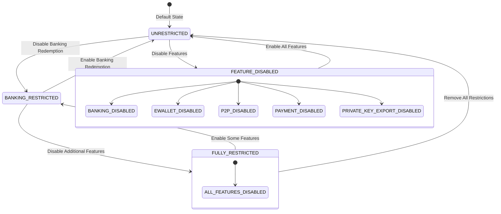

---

## API Endpoints

### Admin Management APIs

`POST /api/admin/users/{publicAddress}/restrictions`

Apply or update user restrictions.

**Request**

| Field | Type | Required | Description |
| --- | --- | --- | --- |
| banking_redemption_disabled | boolean | N | Disable bank redemption |
| eaccount_redemption_disabled | boolean | N | Disable e-account redemption |
| p2p_transfer_disabled | boolean | N | Disable P2P transfers |
| payment_disabled | boolean | N | Disable payment capability |
| private_key_export_disabled | boolean | N | Disable private key export |
| reason | string | Y | Reason for changes |

**Response (200 OK)**

```
{
  "user_uuid": "usr_123",
  "restrictions": {
    "banking_redemption_disabled": true,
    "eaccount_redemption_disabled": true,
    "p2p_transfer_disabled": true,
    "payment_disabled": false,
    "private_key_export_disabled": true
  },
  "updated_at": "2025-10-30T10:00:00Z",
  "updated_by": "admin_456"
}
```

**Sequence Diagram**

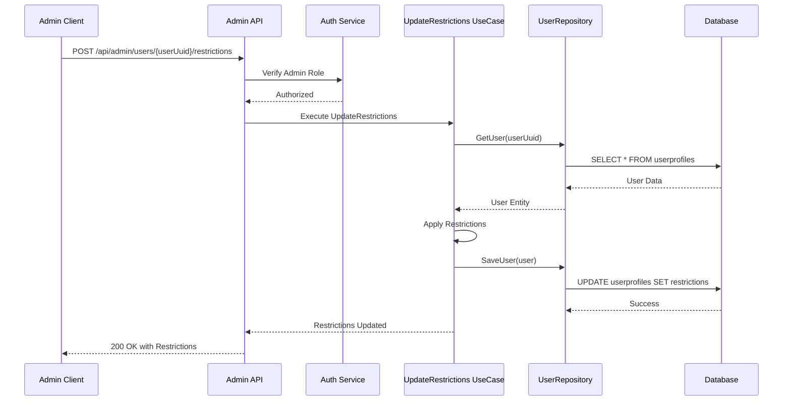

---

`POST /api/admin/banks/{publicAddress}`

Add a new bank account for a user.

**Request**

| Field | Type | Required | Description |
| --- | --- | --- | --- |
| asset | string | Y | Asset type (e.g., "idr") |
| account_nickname | string | N | Account nickname |
| bank_name | string | Y | Bank name |
| bank_account | string | Y | Bank account number |
| source | string | N | Bank account source (REDEMPTION or PAYMENT), defaults to REDEMPTION |

**Response (200 OK)**

```
{
  "bank_uuid": "bnk_789",
  "bank_name": "BCA",
  "bank_account": "1234567890",
  "bank_account_name": "John Doe",
  "account_nickname": "Personal BCA",
  "asset": "idr",
  "status": "VALIDATED",
  "modified_by": "admin_456"
}
```

**Sequence Diagram**

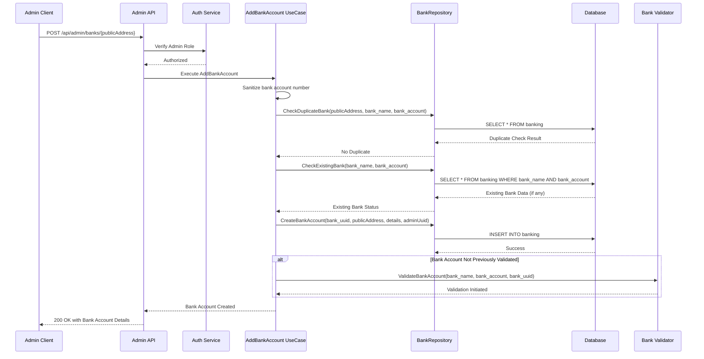

---

`DELETE /api/admin/banks/{bankUuid}`

Soft-delete a bank account.

**Response (200 OK)**

```
{
  "message": "Bank account deleted successfully",
  "bank_uuid": "bnk_789"
}
```

**Sequence Diagram**

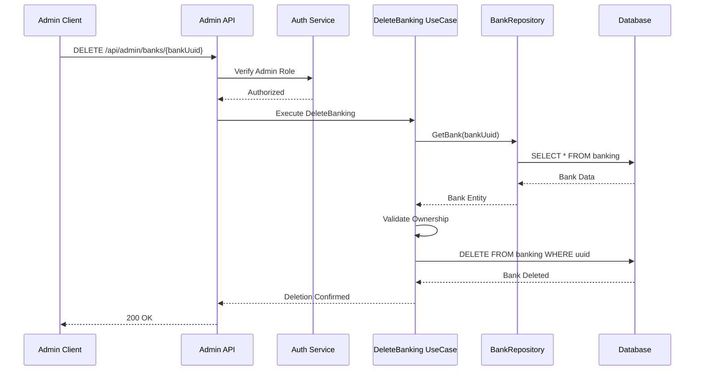

---

`POST /api/admin/eaccounts/{publicAddress}`

Add a new e-account account for a user.

**Request**

| Field | Type | Required | Description |
| --- | --- | --- | --- |
| provider | string | Y | E-account provider (OVO, GOPAY, SHOPEEPAY, DANA, LINKAJA) |
| phone_number | string | Y | Phone number (must start with 0) |
| label | string | Y | Account label/name |

**Response (200 OK)**

```
{
  "uuid": "ew_789",
  "provider": "OVO",
  "phone_number": "081234567890",
  "label": "Personal OVO",
  "status": "VALIDATED",
  "modified_by": "admin_456"
}
```

**Sequence Diagram**

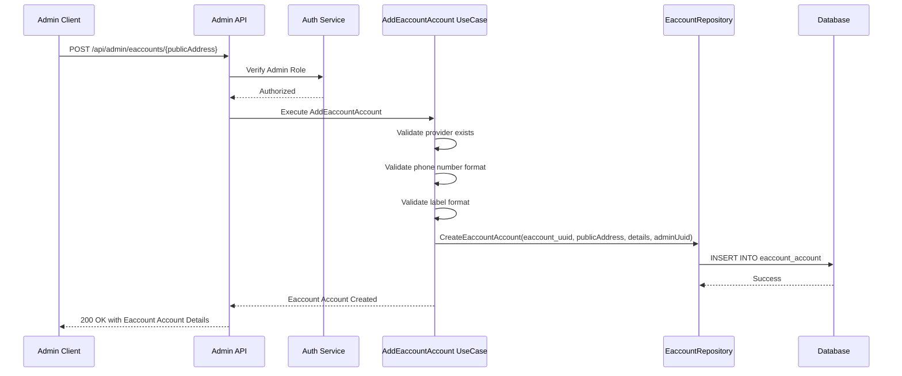

---

`DELETE /api/admin/eaccounts/{eaccountUuid}`

Soft-delete an e-account account.

**Response (200 OK)**

```
{
  "message": "E-account account deleted successfully",
  "uuid": "ew_789"
}
```

**Sequence Diagram**

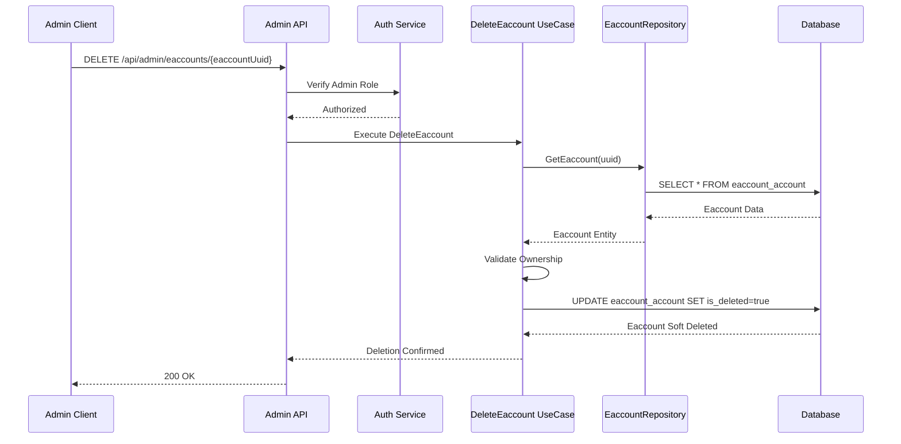

---

`GET /api/admin/users/{userUuid}/restrictions`

Get the current restriction status for a user.

**Response (200 OK)**

```
{
  "user_uuid": "usr_123",
  "restrictions": {
    "banking_redemption_disabled": false,
    "eaccount_redemption_disabled": true,
    "p2p_transfer_disabled": true,
    "payment_disabled": false,
    "private_key_export_disabled": true
  },
  "updated_at": "2025-10-30T10:00:00Z",
  "updated_by": "admin_456"
}
```

**Response (404 Not Found)**

```
{
  "error": "USER_NOT_FOUND",
  "message": "User not found"
}
```

**Sequence Diagram**

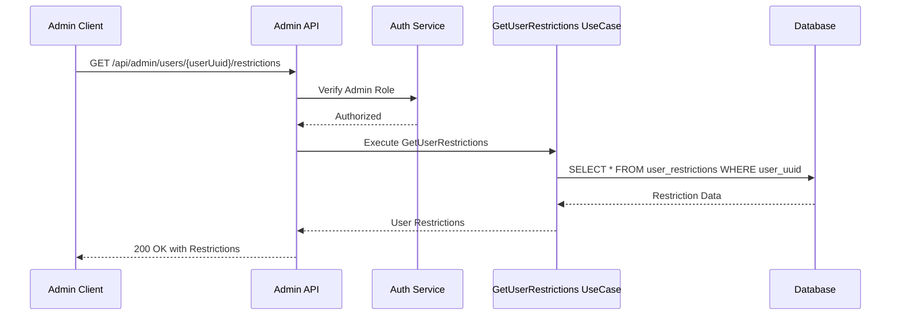

---

### Account Operation APIs (Modified)

`GET /api/account/v2/restrictions`

Get the current user's restriction status and whitelisted accounts.

**Response (200 OK)**

```
// Account with restriction
{
  "user_uuid": "usr_123",
  "restrictions": {
    "banking_redemption_disabled": true,
    "eaccount_redemption_disabled": true,
    "p2p_transfer_disabled": false,
    "payment_disabled": false,
    "private_key_export_disabled": true
  }
}

// Account without restriction
{
  "user_uuid": "usr_123",
  "restrictions": {}
}
```

**Sequence Diagram**

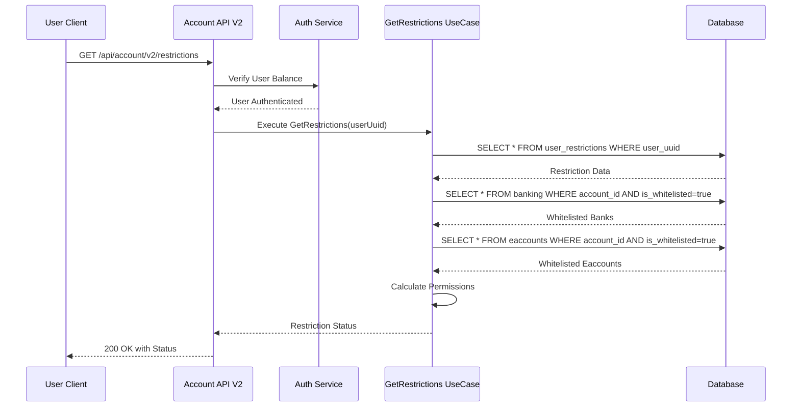

---

`POST /api/account/v2/redeem/initiate`

**Unified redeem endpoint** - Replaces deprecated `/redeem-to-bank/initiate` and `/redeem-to-eaccount/initiate`. Modified to enforce redemption restrictions.

**Request**

| Field | Type | Required | Description |
| --- | --- | --- | --- |
| destination | string | Y | Destination type: "bank", "pay-bank", or "e-account" |
| destination_uuid | string | Y | Bank UUID or E-account UUID |
| ui_amount | string/number | Y | Redemption amount in UI units |
| memo | string | N | Optional memo/note |

**Response (200 OK)**

```
{
  "serializedTransaction": "base64_encoded_transaction",
  "redeemRequestUuid": "redeem_request_uuid_123",
  "seqNo": 42
}
```

**Response (403 Forbidden)**

```
{
  "error": "REDEMPTION_RESTRICTED",
  "message": "Bank account not whitelisted for redemption"
}
```

OR

```
{
  "error": "EWALLET_REDEMPTION_DISABLED",
  "message": "E-account redemption is disabled for this account"
}
```

---

`POST /api/account/v2/redeem-to-bank/initiate` (DEPRECATED)

**Deprecated** -**_DELETE THIS ENDPOINT AS SOON AS POSSIBLE_**

---

`POST /api/account/v2/redeem-to-eaccount/initiate` (DEPRECATED)

**Deprecated** -**_DELETE THIS ENDPOINT AS SOON AS POSSIBLE_**

---

**Banking Account Management APIs (Modified)**

`POST /api/account/v2/banking`

Add a new bank account with restriction enforcement.

**Request**

| Field | Type | Required | Description |
| --- | --- | --- | --- |
| asset | string | Y | Asset type (e.g., "DigitalCurrency") |
| bank_name | string | Y | Bank name |
| bank_account | string | Y | Bank account number |
| account_holder | string | Y | Account holder name |

**Response (200 OK)**

```
{
  "uuid": "bnk_789",
  "bank_name": "BCA",
  "account_number": "1234567890",
  "account_holder": "John Doe"
}
```

**Response (403 Forbidden)**

```
{
  "error": "BANKING_MANAGEMENT_DISABLED",
  "message": "Banking account management is disabled due to redemption restrictions"
}
```

**Sequence Diagram**

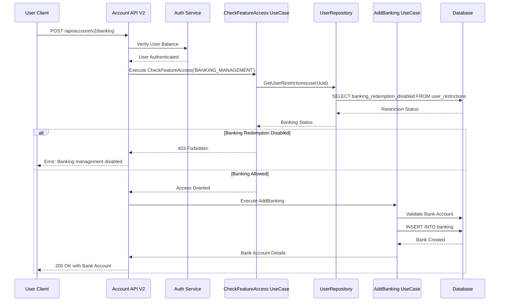

---

`POST /api/account/v2/banking/:bank_uuid/update`

Update an existing bank account with restriction enforcement.

**Request**

| Field | Type | Required | Description |
| --- | --- | --- | --- |
| asset | string | Y | Asset type (e.g., "DigitalCurrency") |
| bank_name | string | Y | Bank name |
| bank_account | string | Y | Bank account number |
| account_holder | string | Y | Account holder name |

**Response (200 OK)**

```
{
  "uuid": "bnk_789",
  "bank_name": "BCA",
  "account_number": "1234567890",
  "account_holder": "John Doe",
  "is_whitelisted": false
}
```

**Response (403 Forbidden)**

```
{
  "error": "BANKING_MANAGEMENT_DISABLED",
  "message": "Banking account management is disabled due to redemption restrictions"
}
```

**Sequence Diagram**

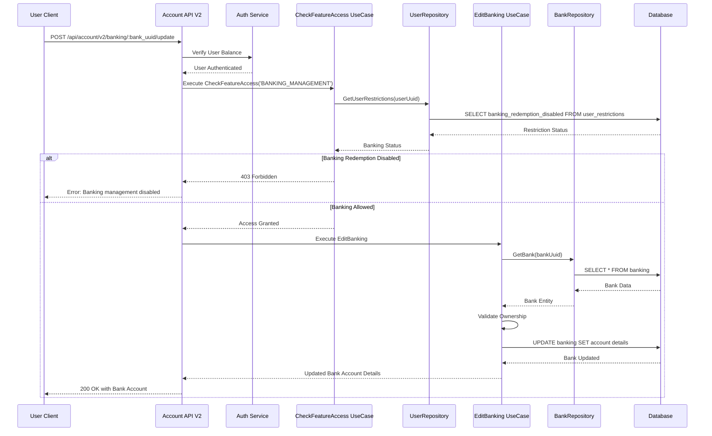

---

`DELETE /api/account/v2/banking/:bank_uuid`

Delete a bank account with restriction enforcement.

**Response (200 OK)**

```
{
  "message": "Bank account deleted successfully",
  "uuid": "bnk_789"
}
```

**Response (403 Forbidden)**

```
{
  "error": "BANKING_MANAGEMENT_DISABLED",
  "message": "Banking account management is disabled due to redemption restrictions"
}
```

**Sequence Diagram**

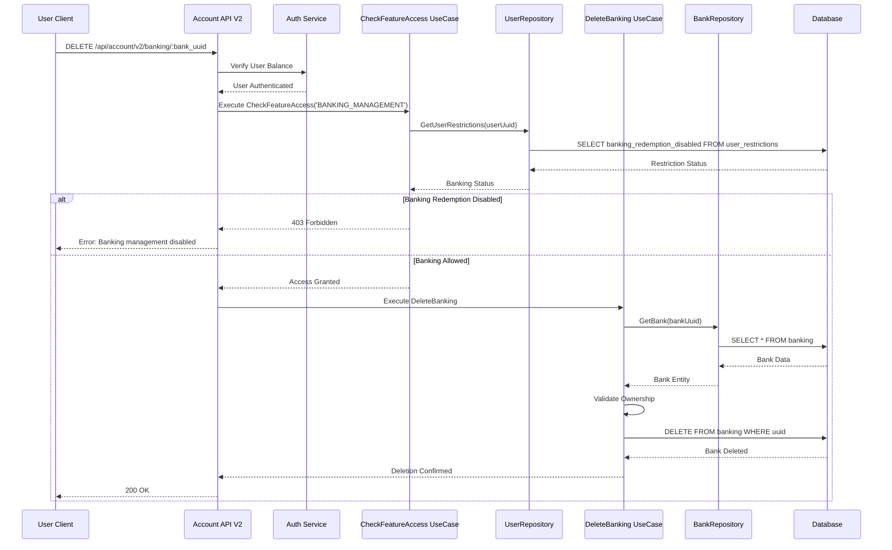

---

**E-Account Account Management APIs (Modified)**

`POST /api/account/v2/eaccount-account`

Add a new e-account account with restriction enforcement.

**Request**

| Field | Type | Required | Description |
| --- | --- | --- | --- |
| provider | string | Y | E-account provider (e.g., "OVO", "GOPAY", "DANA") |
| phone_number | string | Y | Phone number (must start with 0) |
| label | string | Y | Account label/name |

**Response (200 OK)**

```
{
  "uuid": "ew_789",
  "provider": "OVO",
  "phone_number": "081234567890",
  "label": "Personal OVO",
  "is_whitelisted": false
}
```

**Response (403 Forbidden)**

```
{
  "error": "EWALLET_MANAGEMENT_DISABLED",
  "message": "E-account account management is disabled due to redemption restrictions"
}
```

**Sequence Diagram**

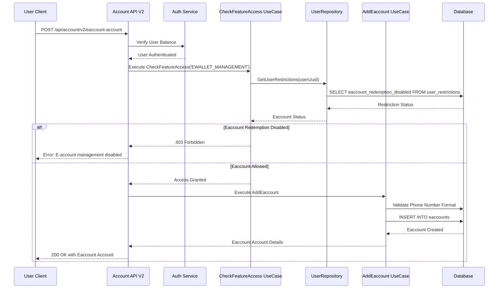

---

`POST /api/account/v2/eaccount-account/:uuid/update`

Update an existing e-account account with restriction enforcement.

**Request**

| Field | Type | Required | Description |
| --- | --- | --- | --- |
| provider | string | Y | E-account provider (e.g., "OVO", "GOPAY", "DANA") |
| phone_number | string | Y | Phone number (must start with 0) |
| label | string | Y | Account label/name |

**Response (200 OK)**

```
{
  "uuid": "ew_789",
  "provider": "OVO",
  "phone_number": "081234567890",
  "label": "Personal OVO",
  "is_whitelisted": false
}
```

**Response (403 Forbidden)**

```
{
  "error": "EWALLET_MANAGEMENT_DISABLED",
  "message": "E-account account management is disabled due to redemption restrictions"
}
```

**Sequence Diagram**

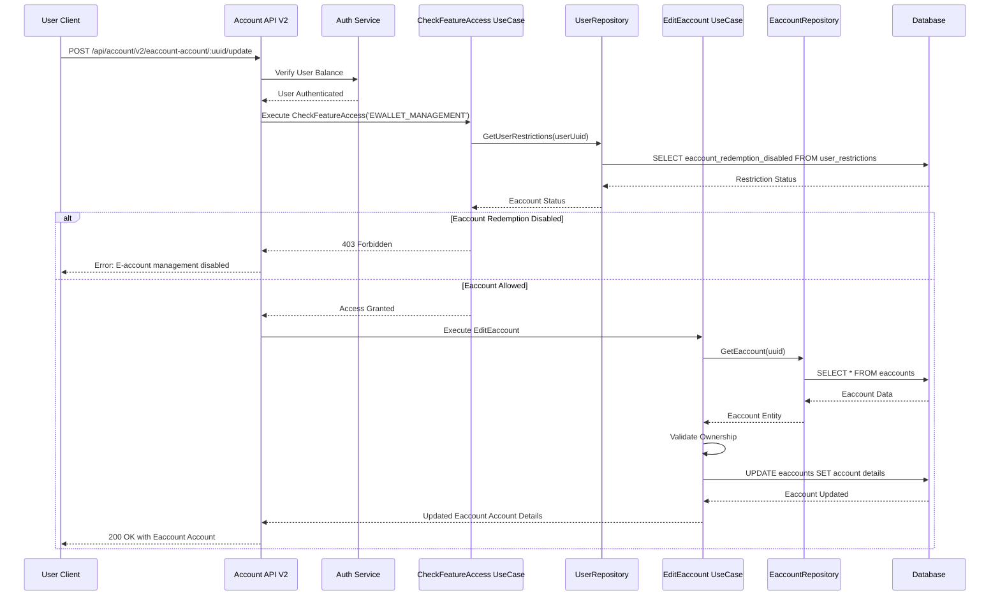

---

`DELETE /api/account/v2/eaccount-account/:uuid`

Delete an e-account account with restriction enforcement.

**Response (200 OK)**

```
{
  "message": "E-account account deleted successfully",
  "uuid": "ew_789"
}
```

**Response (403 Forbidden)**

```
{
  "error": "EWALLET_MANAGEMENT_DISABLED",
  "message": "E-account account management is disabled due to redemption restrictions"
}
```

**Sequence Diagram**

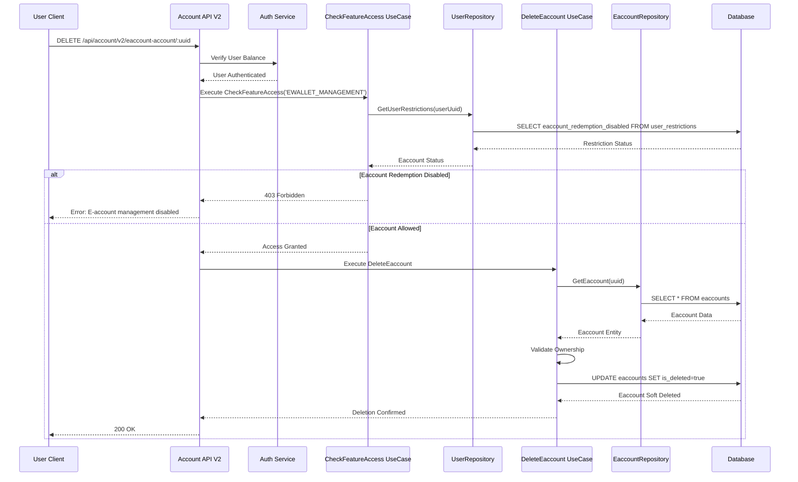

---

`POST /api/account/v2/transfer/initiate`

P2P transfer initiation with restriction enforcement.

**Request**

| Field | Type | Required | Description |
| --- | --- | --- | --- |
| destination_address | string | Y | Recipient's account identifier (Bank Network A or Bank Network B) |
| ui_amount | string/number | Y | Transfer amount in UI units |

**Response (200 OK)**

```
{
  "serializedTransaction": "base64_encoded_transaction",
  "uuid": "transfer_p2p_uuid_123",
  "seqNo": 42
}
```

**Response (403 Forbidden)**

```
{
  "error": "P2P_TRANSFER_DISABLED",
  "message": "P2P transfers are disabled for this account"
}
```

`POST /api/account/v2/transfer/send`

Execute P2P transfer after initiation.

**Request**

| Field | Type | Required | Description |
| --- | --- | --- | --- |
| uuid | string | Y | Transfer UUID from initiate response |
| data | string | Y | Signed transaction data |
| save_destination | boolean | N | Save destination address for future use |
| address_name | string | N | Name for saved destination (required if save_destination=true) |

**Response (200 OK)**

```
{
  "signature": "tx_hash_123",
  "amount": "1000000",
  "message": "Transfering 1000000 DigitalCurrency to 0xabc... is IN_PROGRESS",
  "uuid": "activity_uuid_123",
  "activity": {
    "uuid": "activity_uuid_123"
  },
  "activity_uuid": "activity_uuid_123"
}
```

**Response (403 Forbidden)**

```
{
  "error": "P2P_TRANSFER_DISABLED",
  "message": "P2P transfers are disabled for this account"
}
```

**Sequence Diagram (Initiate)**

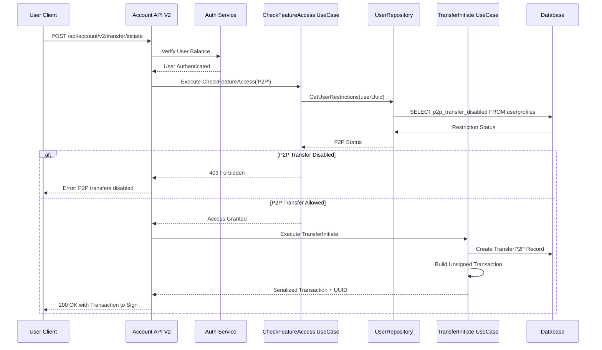

---

`POST /api/account/v2/pay/bank_transfer/initiate`

Payment via bank transfer with restrictions in place.

**Request**

| Field | Type | Required | Description |
| --- | --- | --- | --- |
| bank_uuid | string | Y | Bank account UUID for payment |
| memo | string | N | Payment memo/note |

**Response (200 OK)**

```
{
  "uuid": "redeem_request_uuid_123",
  "status": "INITIATED",
  "activity": {
    "uuid": "activity_uuid_123",
    "owner": "user_account_id",
    "date_created": "2025-10-30T10:00:00Z",
    "source": "PaymentBankTransfer"
  },
  "temp_account": {
    "uuid": "temp_account_uuid_123",
    "account_id": "temp_account_address",
    "DigitalCurrency_balance_address": "temp_account_funds_address",
    "state": "PROVISIONED",
    "failure_operation": null,
    "error_description": null,
    "tx_hash_close": null
  },
  "bank": {
    "account_holder": "John Doe",
    "account_number": "1234567890",
    "bank_name": "BCA"
  }
}
```

**Response (403 Forbidden)**

```
{
  "error": "PAYMENT_DISABLED",
  "message": "Payments are disabled for this account"
}
```

`POST /api/account/v2/pay/bank_transfer/send`

Execute payment after initiation.

**Request**

| Field | Type | Required | Description |
| --- | --- | --- | --- |
| uuid | string | Y | Redeem request UUID from initiate |
| data | string | Y | Signed transaction data |

**Response (200 OK)**

```
{
  "uuid": "redeem_request_uuid_123",
  "status": "VALIDATED",
  "activity": {
    "uuid": "activity_uuid_123"
  }
}
```

**Response (403 Forbidden)**

```
{
  "error": "PAYMENT_DISABLED",
  "message": "Payments are disabled for this account"
}
```

**Sequence Diagram (Initiate)**

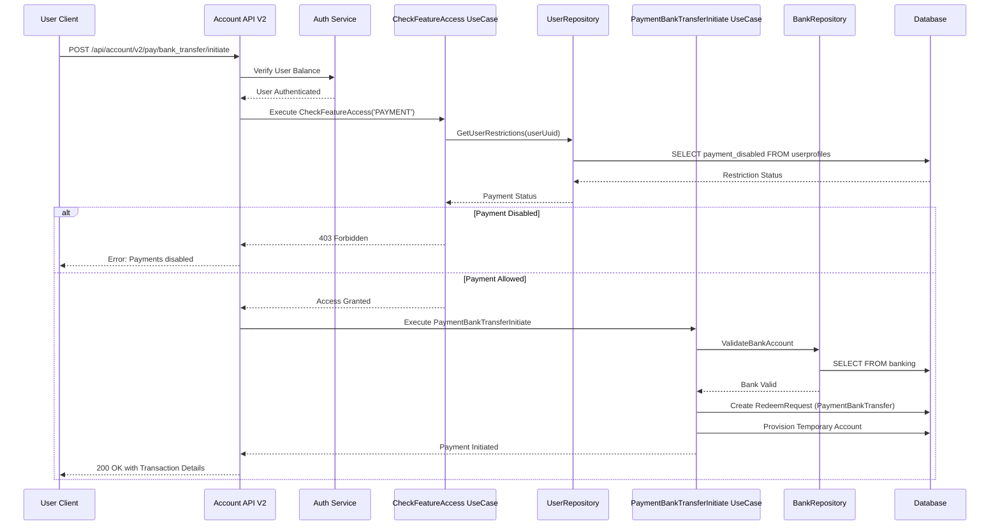

---

## Security Considerations

### Authorization

- Only the ADMIN role can modify restrictions
- All changes require a reason
- No self-modification allowed
- Private key export requires password + 2FA even when not restricted

### Defense in Depth

- Database constraints enforce restrictions
- Application layer validates before operations
- API layer checks permissions
- Frontend hides disabled features
- Critical operations require additional authentication

---

## Testing Strategy

### Unit Tests

```typescript
describe('UserRestriction', () => {
  it('should prevent banking redemption when disabled', () => {
    const restriction = new UserRestriction({ 
      bankingRedemptionDisabled: true 
    });
    
    expect(restriction.canPerformBankingRedemption()).toBe(false);
  });

  it('should prevent eaccount redemption when disabled', () => {
    const restriction = new UserRestriction({ 
      eaccountRedemptionDisabled: true 
    });
    
    expect(restriction.canPerformEaccountRedemption()).toBe(false);
  });
  
  it('should prevent P2P transfers when disabled', () => {
    const restriction = new UserRestriction({ 
      p2pTransferDisabled: true 
    });
    
    expect(restriction.canPerformP2PTransfer()).toBe(false);
  });
  
  it('should prevent private key export when disabled', () => {
    const restriction = new UserRestriction({
      privateKeyExportDisabled: true
    });

    expect(restriction.canExportPrivateKey()).toBe(false);
  });

  it('should prevent banking account management when banking redemption disabled', () => {
    const restriction = new UserRestriction({
      bankingRedemptionDisabled: true
    });

    expect(restriction.canManageBankingAccounts()).toBe(false);
  });

  it('should prevent eaccount account management when eaccount redemption disabled', () => {
    const restriction = new UserRestriction({
      eaccountRedemptionDisabled: true
    });

    expect(restriction.canManageEaccountAccounts()).toBe(false);
  });
});
```

### Integration Tests

- Test restriction enforcement in the redemption flows (banking and eaccount)
- Test banking account management blocking (add/update/delete)
- Test eaccount account management blocking (add/update/delete)
- Test P2P transfer blocking
- Test payment blocking
- Test private key export blocking

### E2E Tests

- Complete banking redemption flow with restrictions
- Complete eaccount redemption flow with restrictions
- Banking account add/update/delete with restrictions
- Eaccount account add/update/delete with restrictions
- Admin restriction management flow
- P2P transfer with restrictions
- Payment with restrictions
- Private key export with restrictions
- Restriction status API

---

## Acceptance Criteria

1. ✅ Admin can enable/disable banking redemption restrictions for any user
1. ✅ Admin can enable/disable eaccount redemption restrictions for any user
1. ✅ Admin can enable/disable P2P transfer restrictions
1. ✅ Admin can enable/disable payment restrictions
1. ✅ Admin can enable/disable private key export restrictions
1. ✅ Banking redemptions can be disabled per user
1. ✅ E-account redemptions can be disabled per user
1. ✅ P2P transfers can be disabled per user
1. ✅ Payment capability can be disabled per user
1. ✅ Private key export can be disabled per user
1. ✅ Banking account management (add/update/delete) is blocked when banking_redemption_disabled is true
1. ✅ E-account account management (add/update/delete) is blocked when eaccount_redemption_disabled is true
1. ✅ Users can view their restriction status via API
1. ✅ System maintains backward compatibility
1. ✅ All sequences properly enforce restrictions
