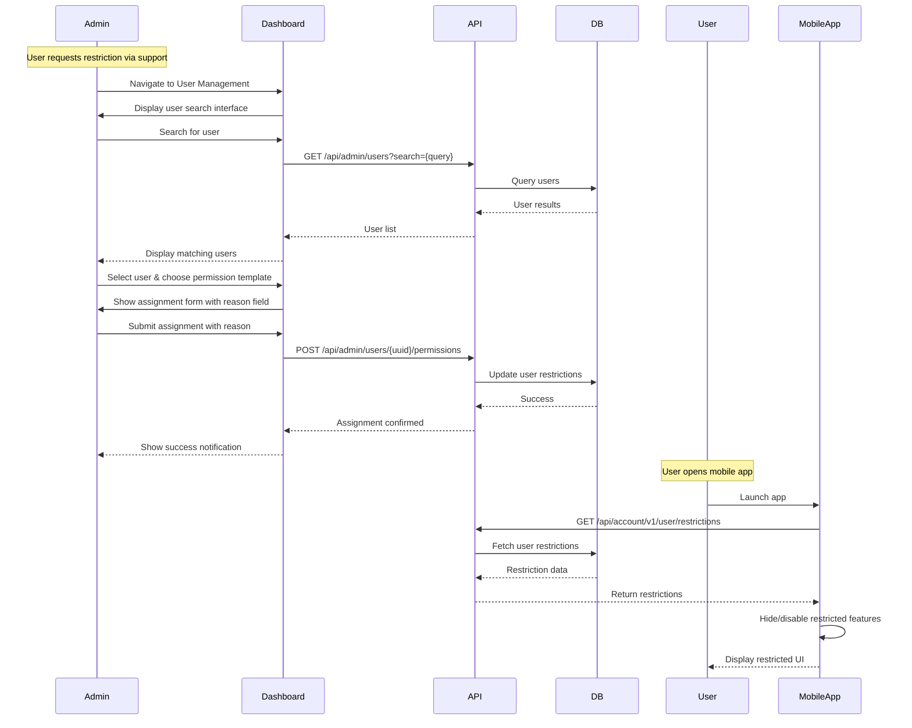
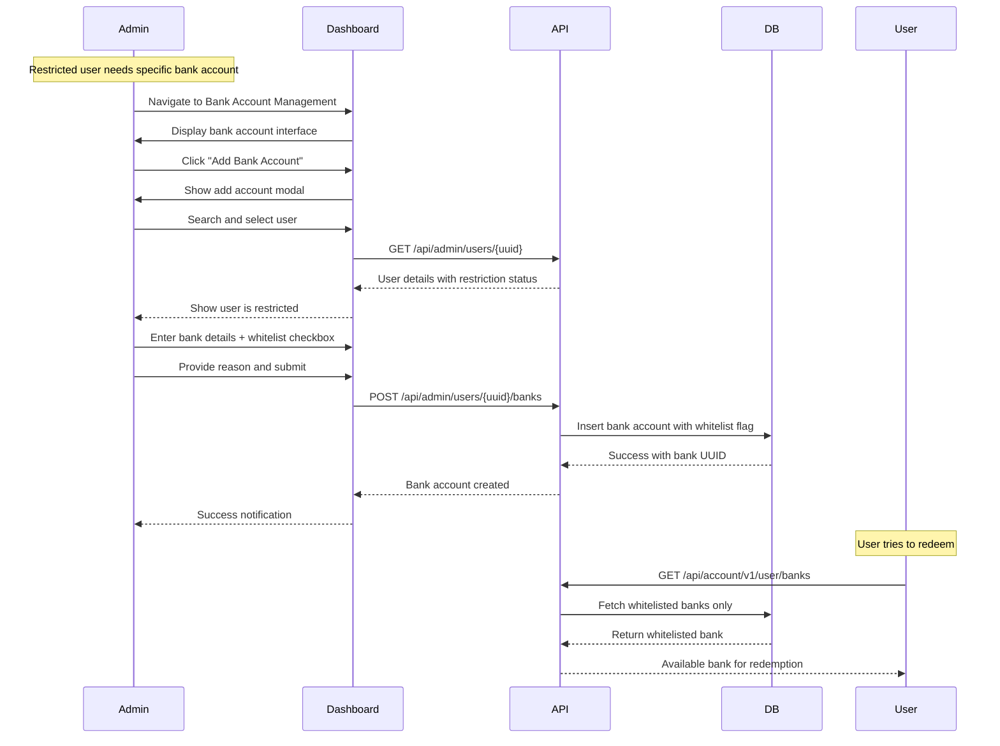
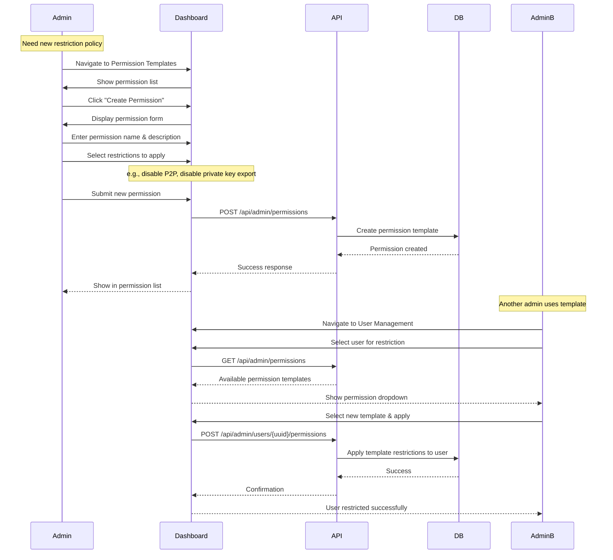
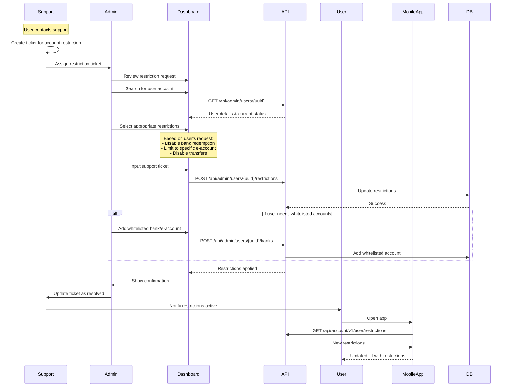
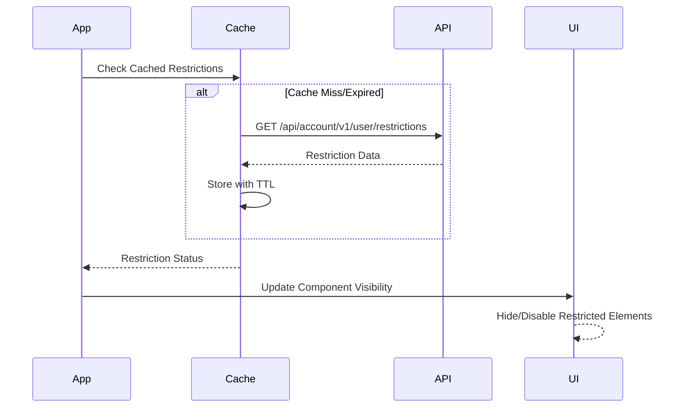

# User Withdrawal Restriction Feature - Frontend Design Specification

## Review Table

| Version | Date | Name | Role | Description |
| --- | --- | --- | --- | --- |
| 1.0 | 2025-11-05 | Engineer D | Author | Initial Draft - Mobile App/Telegram Mini App & Admin Dashboard |

## Approval Table

| Approved By | Approved At | Note |
| --- | --- | --- |
| Engineer B | 2025-11-10 | Approved |

---

## Background

Following the implementation of backend restriction controls for Mobile App Payment Link users, the frontend systems must be updated to enforce these restrictions at the UI level. The mobile applications and admin dashboard currently provide unrestricted access to all account functions, creating security gaps when backend restrictions are applied.

## Context

Current frontend limitations:

- Mobile app shows all features regardless of user restrictions
- No admin interface exists for managing user restrictions
- Banking/eaccount management lacks administrative controls
- UI elements remain clickable even when the backend would reject actions
- No visual indicators of restricted account status

## Objective

Implement comprehensive frontend restriction enforcement:

1. **Mobile App/Telegram Mini App** - Dynamically hide/disable features based on user restrictions
1. **Admin Dashboard** - Provide a complete restriction management interface
1. **Visual Feedback** - Clear indicators of restriction status
1. **Graceful Degradation** - Maintain usability for restricted accounts

## User Stories & Workflows

### Admin User Stories

#### Permission Management

- **As an admin**, I want to create permission templates with specific restrictions so that I can apply consistent restriction policies to multiple users
- **As an admin**, I want to edit existing permission templates so that I can adjust restriction policies as business needs change
- **As an admin**, I want to assign permission templates to users so that I can quickly apply restrictions without manual configuration

#### User Restriction Management

- **As an admin**, I want to view all users with restrictions so that I can monitor and manage restricted accounts effectively
- **As an admin**, I want to modify individual user restrictions so that I can handle special cases outside of standard templates
- **As an admin**, I want to see the history of restriction changes so that I can audit who made changes and why

#### Banking & E-account Management

- **As an admin**, I want to add/whitelist specific bank accounts for restricted users so that they can still redeem to approved accounts
- **As an admin**, I want to add/whitelist specific e-accounts for restricted users so that they can use approved payment mwire_transferods
- **As an admin**, I want to remove bank accounts or e-accounts from users so that I can prevent redemption to unauthorized accounts

### Key Admin Workflows

#### Workflow 1: Applying Restrictions to a User

#### Workflow 2: Whitelisting Bank Account for Restricted User

#### Workflow 3: Creating and Applying Permission Template

#### Workflow 4: Handling Support-Requested Restrictions

### User (Account Owner) Experience

#### As a restricted account owner:

- **As a account owner**, I want to see which features are restricted so that I understand my account limitations
- **As a account owner**, I want restricted butbank_network_bs to be clearly disabled so that I don't attempt unavailable actions
- **As a account owner**, I want to see only my whitelisted bank accounts and e-accounts so that I can still perform allowed redemptions
- **As a account owner**, I want to contact support to request changes to my restrictions when my needs change

## Paradigm

Adopting **DDD-lite with Hexagonal Architecture** for frontend:

- **Presentation Layer**: React components with restriction-aware rendering
- **Application Layer**: Use cases for fetching and caching restrictions
- **Domain Layer**: Restriction models and business logic
- **Infrastructure Layer**: API adapters and local storage

---

## Mobile App/Telegram Mini App Implementation

### Restriction Detection Flow

### Feature Restriction Mapping

| Feature | Restriction Field | UI Action |
| --- | --- | --- |
| Bank Account Management | `banking_redemption_disabled` | Remove from Settings menu |
| E-account Management | `eaccount_redemption_disabled` | Remove from Settings menu |
| Recovery Phrase | `private_key_export_disabled` | Remove from Settings |
| Transfer Butbank_network_b | `p2p_transfer_disabled` | Hide/disable butbank_network_b |
| Pay Butbank_network_b | `payment_disabled` | Hide/disable butbank_network_b |

### Component Implementation

The mobile app will implement Higher-Order Components (HOCs) for restriction-aware rendering. These components will:

- Check user restrictions from the cached state
- Conditionally render child components based on restriction status
- Provide fallback UI for restricted features
- Ensure butbank_network_bs are completely unclickable when restricted

### Settings Page Updates

The Settings page will dynamically filter available options based on user restrictions:

- Bank account options are removed when banking redemption is disabled
- E-account options are removed when e-account redemption is disabled
- Recovery phrase option removed when private key export is disabled
- All removed options are completely hidden from the UI

### Main Account Screen Updates

The main account screen will enforce restrictions on primary actions:

- The transfer butbank_network_b is hidden or disabled with a clear visual indication when P2P transfers are disabled
- Pay butbank_network_b hidden or disabled, with a clear visual indication when payments are disabled
- Disabled butbank_network_bs show "Restricted" label for user clarity

---

## Admin Dashboard Implementation

### Permission Management System

#### Permission List Page

The permission list page will display all available permission templates with:

- Permission name and description
- Active restriction flags for each permission
- Creation date and last modified by information
- Actions for editing and deleting permissions
- Search and filter capabilities

#### Create/Edit Permission Page

The permission form page will allow admins to:

- Define the permission template name and description
- Select which restrictions to apply (checkboxes for each restriction type)
- Save templates for reuse across multiple users
- Validate that at least one restriction is selected
- Provide clear descriptions of what each restriction does

### User Permission Assignment

#### Assignment Page

The user permission assignment page will provide:

- User search functionality by name, ID, or email
- Dropdown selection of available permission templates
- Required reason field for audit trail
- Current assignments table showing active restrictions
- Ability to modify or remove existing assignments

### Banking/E-account Management

#### Bank Account Management Page

The bank account management interface will include:

- Comprehensive list of all user bank accounts
- Filters by user ID, bank name, and whitelist status
- Add/edit/delete functionality for bank accounts
- Whitelist checkbox for restricted user accounts
- Required reason field for all modifications

#### Add/Edit Bank Account Modal

The bank account modal will provide:

- User selection (disabled in edit mode)
- Bank selection from supported banks list
- Account number and holder name inputs
- Whitelist option for restricted users
- Mandatory reason field for audit trail

---

## API Integration

### Mobile App API Calls

The restriction service will:

- Fetch user restrictions on app launch
- Implement 5-minute cache TTL for performance
- Fall back to cached data on API failure
- Clear cache on user logout
- Refresh cache when returning from background

### Admin Dashboard API Calls

The admin API service will handle:

- CRUD operations for permission templates
- User restriction assignment and removal
- Bank account management including whitelisting
- E-account management including whitelisting
- Audit log retrieval for compliance

---

## Error Handling

### Mobile App Error States

Error handling will include:

- Graceful degradation when API is unavailable
- Clear messaging for restricted features
- Toast notifications for restriction-related errors
- Default to restricted state on uncertainty
- Retry logic for failed API calls

### Admin Dashboard Error Handling

Admin error handling will provide:

- Specific error messages for different HTTP status codes
- Permission denied notifications for unauthorized actions
- Conflict warnings for duplicate entries
- Success confirmations for all modifications
- Detailed error logging for debugging

---

## Acceptance Criteria

### Mobile App/Telegram Mini App

1. ✅ GET /api/account/v1/user/restrictions API is consumed on app launch
1. ✅ Bank account options removed from Settings when `banking_redemption_disabled = true`
1. ✅ E-account options removed from Settings when `eaccount_redemption_disabled = true`
1. ✅ Recovery phrase removed from Settings when `private_key_export_disabled = true`
1. ✅ Transfer butbank_network_b disabled/hidden when `p2p_transfer_disabled = true`
1. ✅ Pay butbank_network_b disabled/hidden when `payment_disabled = true`
1. ✅ Butbank_network_bs are unclickable (not just visually disabled) when restricted
1. ✅ Restriction status cached with 5-minute TTL
1. ✅ Cache cleared on logout
1. ✅ Graceful fallback when API is unavailable

### Admin Dashboard

1. ✅ Permission list page displays all permission templates
1. ✅ Create permission page allows defining restriction combinations
1. ✅ Edit permission page updates existing templates
1. ✅ Delete permission with confirmation dialog
1. ✅ User-permission assignment page with user search
1. ✅ Assignment table shows user-permission relationships
1. ✅ Bank account management page with search and filters
1. ✅ Add/edit/delete bank accounts for users
1. ✅ E-account management page with search and filters
1. ✅ Add/edit/delete e-account accounts for users
1. ✅ All admin actions require reason input
1. ✅ Audit log for all administrative changes
1. ✅ Role-based access control implemented

### Performance & Security

1. ✅ Page load time < 2 seconds
1. ✅ API response caching implemented
1. ✅ No sensitive data in local storage
1. ✅ CSRF protection on all forms
1. ✅ Input validation and sanitization
