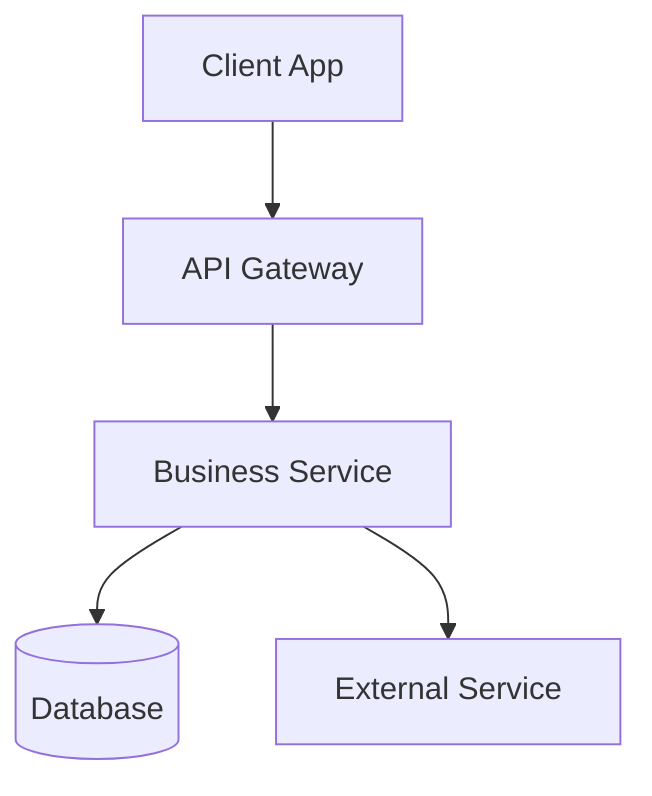
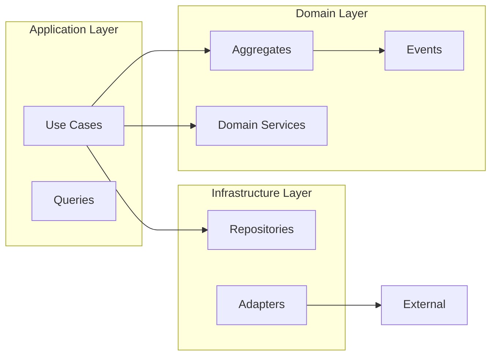
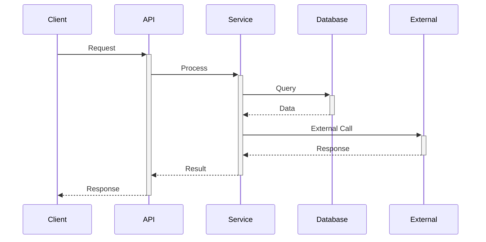
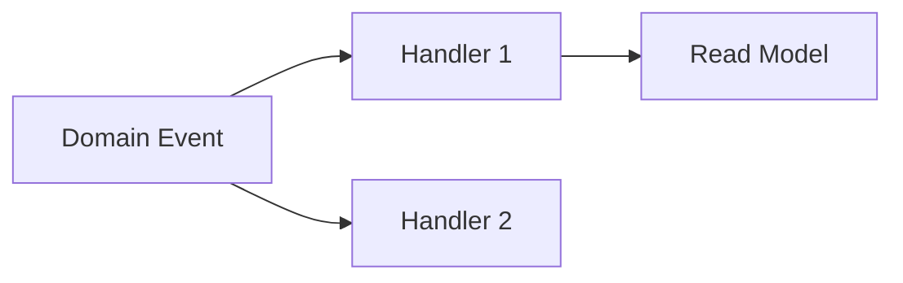

# Common Spec Sections and Patterns

## Essential Spec Sections

### 1. Executive Summary Pattern

Start with a concise overview that includes:
- What is being built
- Why it's needed  
- Key approach/philosophy
- Dependencies and constraints

Example:
```markdown
This specification defines [what] to [solve what problem] using [approach]. 
The design focuses on [key principles]. Dependencies include [list].
```

### 2. Problem Statement

Clearly articulate:
- Current state and its limitations
- Pain points and inefficiencies
- Business impact of the problem
- Success criteria for the solution

### 3. Solution Approach

Document the chosen approach with:
- High-level architecture
- Key design decisions and trade-offs
- Alternative approaches considered
- Rationale for chosen approach

Example format:
```markdown
## Approach Selection

Approach 1: [Name]
- Pros: [list]
- Cons: [list]  
- Fit: [when to use]

**Selected: Approach X** - [reasoning]
```

### 4. Technical Architecture

Include these diagrams and descriptions:

#### System Architecture


#### Component Diagram


### 5. Data Flow Patterns

#### Request Flow


#### Event Flow


### 6. Database Design Patterns

#### Audit Fields
Every table should include:
```sql
created_at TIMESTAMP DEFAULT CURRENT_TIMESTAMP
updated_at TIMESTAMP DEFAULT CURRENT_TIMESTAMP ON UPDATE CURRENT_TIMESTAMP
created_by VARCHAR(36) -- user_uuid
updated_by VARCHAR(36) -- user_uuid
```

#### Soft Delete Pattern
```sql
is_deleted BOOLEAN DEFAULT FALSE
deleted_at TIMESTAMP NULL
deleted_by VARCHAR(36) NULL
```

#### Versioning Pattern
```sql
version INT DEFAULT 1
is_current BOOLEAN DEFAULT TRUE
effective_from TIMESTAMP
effective_to TIMESTAMP
```

### 7. API Design Standards

#### RESTful Conventions

```markdown
### GET /resource
List resources with pagination and filtering

### GET /resource/:id
Get single resource  

### POST /resource
Create new resource

### PUT /resource/:id
Update entire resource

### PATCH /resource/:id
Partial update

### DELETE /resource/:id
Delete resource
```

#### Standard Response Format

Success:
```json
{
  "data": { ... },
  "meta": {
    "timestamp": "2025-01-01T10:00:00Z",
    "request_id": "req_123"
  }
}
```

Error:
```json
{
  "error": {
    "code": "VALIDATION_ERROR",
    "message": "User-friendly message",
    "field": "email",
    "details": { ... }
  },
  "meta": { ... }
}
```

Pagination:
```json
{
  "data": [ ... ],
  "pagination": {
    "total": 100,
    "page": 1,
    "per_page": 20,
    "total_pages": 5
  },
  "meta": { ... }
}
```

### 8. State Machine Documentation

#### State Transition Table
```markdown
| From State | To State | Trigger | Guards | Side Effects |
| --- | --- | --- | --- | --- |
| INITIATED | PROCESSING | start() | hasRequiredData | notify() |
| PROCESSING | COMPLETED | complete() | isValid | updateMetrics() |
| PROCESSING | FAILED | fail() | - | sendAlert() |
```

#### State Descriptions
```markdown
- **INITIATED**: Initial state when entity is created
- **PROCESSING**: Active processing in progress
- **COMPLETED**: Successfully finished
- **FAILED**: Terminal failure state
```

### 9. Error Handling Strategy

Document error categories and handling:

```markdown
## Error Categories

### Business Errors
- Invalid state transitions
- Business rule violations
- Insufficient permissions

### Technical Errors  
- Network failures
- Database errors
- External service errors

### Validation Errors
- Missing required fields
- Invalid format
- Range violations

## Recovery Strategies

| Error Type | Strategy | Max Retries | Backoff |
| --- | --- | --- | --- |
| Network | Exponential backoff | 3 | 2^n seconds |
| Database | Immediate retry | 1 | None |
| Business | No retry | 0 | N/A |
```

### 10. Migration Strategy

```markdown
## Migration Plan

### Phase 1: Preparation
- [ ] Create new tables
- [ ] Deploy new code (feature flagged)
- [ ] Start dual writes

### Phase 2: Migration  
- [ ] Backfill historical data
- [ ] Verify data integrity
- [ ] Enable reads from new system

### Phase 3: Cutover
- [ ] Switch primary writes
- [ ] Monitor for issues
- [ ] Stop dual writes

### Rollback Plan
1. Revert feature flag
2. Restore from backup if needed
3. Re-sync data
```

### 11. Operational Considerations

```markdown
## Monitoring & Alerts

### Key Metrics
- Transaction success rate > 99%
- p95 latency < 200ms
- Error rate < 1%

### Alerts
- Critical: Service down, > 5% error rate
- Warning: > 1% error rate, p95 > 500ms
- Info: Unusual patterns, high volume

### Logging
- All state transitions
- External API calls
- Error conditions
- Performance metrics
```

### 12. Security Considerations

```markdown
## Security Requirements

### Authentication
- JWT tokens with 1hr expiry
- Refresh token rotation

### Authorization  
- Role-based access control (RBAC)
- Resource-level permissions

### Data Protection
- Encrypt PII at rest
- TLS 1.3 for transit
- PCI compliance for payment data

### Audit Trail
- Log all write operations
- Immutable audit log
- Regular audit reviews
```

## Writing Best Practices

### 1. Use Present Tense
Write specs in present tense for current behavior:
- ✅ "The system validates the input"
- ❌ "The system will validate the input"

### 2. Be Specific
Avoid ambiguous terms:
- ✅ "Response time must be < 200ms for 95% of requests"
- ❌ "Response should be fast"

### 3. Include Examples
Every complex concept needs an example:
```markdown
**Example**: When a user submits an order with 3 items,
the system creates 1 Order aggregate with 3 OrderItem entities.
```

### 4. Define Success Criteria
Make acceptance criteria measurable:
- ✅ "Error rate < 1% over 30 days"
- ❌ "System should be reliable"

### 5. Document Decisions
Include ADRs (Architecture Decision Records):
```markdown
## Decision: Use Event Sourcing
**Status**: Accepted
**Context**: Need audit trail and time-travel queries
**Decision**: Implement event sourcing for Order aggregate
**Consequences**: Higher complexity, eventual consistency
```

### 6. Version Everything
Track changes systematically:
```markdown
| Version | Date | Author | Changes |
| --- | --- | --- | --- |
| 1.0 | 2025-01-01 | John | Initial draft |
| 1.1 | 2025-01-15 | Jane | Added error handling |
```

## Common Anti-patterns to Avoid

1. **Over-engineering**: Don't add complexity that isn't needed yet
2. **Under-specifying**: Vague requirements lead to rework
3. **Missing edge cases**: Document error scenarios explicitly
4. **Ignoring operations**: Consider monitoring, debugging, maintenance
5. **Skipping examples**: Abstract descriptions need concrete examples
6. **Forgetting rollback**: Every change needs a reversal plan
7. **Assuming knowledge**: Define all terms and acronyms
8. **Mixed concerns**: Keep business logic separate from infrastructure
