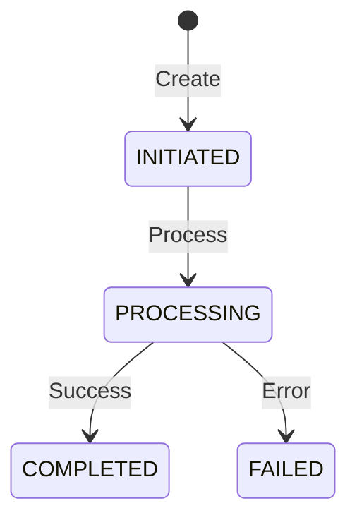
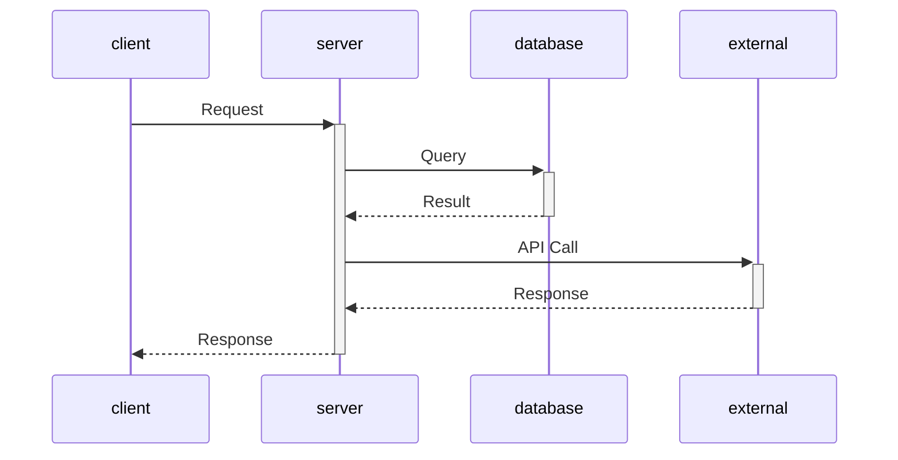

# Design Spec Templates

## Standard Spec Structure

### 1. Header Metadata

```markdown
---

## Review Table

| Version | Date | Name | Role | Description |
| --- | --- | --- | --- | --- |
| 1.0 | [Date] | [Author] | Author | Initial Draft |

## Approval Table

| Approved By | Approved At | Note |
| --- | --- | --- |
```

### 2. Opening Sections

#### Background / Context / Objective / Paradigm
- **Background**: Historical context and current state
- **Context**: Current system limitations and needs
- **Objective**: Clear goals and success criteria
- **Paradigm**: Design philosophy and approach

#### Terms Definition
Define all domain-specific terms, acronyms, and concepts used throughout the spec.

### 3. Database Design

#### Using dbdiagram.io syntax:
```
Table table_name {
  id int [pk, increment]
  field_name varchar(255) [unique, not null]
  enum_field EnumType
  reference_id int [ref: > other_table.id]
  created_at timestamp [default: `CURRENT_TIMESTAMP`]
  
  indexes {
    (field1, field2) [unique]
    field3
  }
  
  Note: 'Table description'
}

Enum EnumType {
  VALUE1
  VALUE2
}
```

#### SQL Schema:
```sql
CREATE TABLE table_name (
  id BIGINT AUTO_INCREMENT PRIMARY KEY,
  field VARCHAR(255) NOT NULL,
  UNIQUE KEY uk_name (field1, field2),
  INDEX idx_name (field)
);
```

### 4. State Machines



### 5. Sequence Diagrams



### 6. API Endpoints

#### REST API Format:
```markdown
### METHOD /endpoint/path

**Request**

| Field | Type | Required | Description |
| --- | --- | --- | --- |
| param | string | Y | Description |

**Response (200 OK)**

\`\`\`json
{
  "field": "value"
}
\`\`\`
```

### 7. Implementation Notes

- Technical considerations
- Performance implications
- Security considerations
- Migration strategy
- Rollback plan

## DDD + Hexagonal Architecture Templates

### 1. Bounded Contexts

```markdown
## Bounded Contexts

- **[Context Name]**
  - _Owns_: Aggregates, entities, value objects
  - _Emits_: Domain events
  - _Depends on_: Other contexts (if any)
```

### 2. Aggregates & Entities

```markdown
### Aggregates

| Aggregate Root | Context | Why it's a Root |
| --- | --- | --- |
| Entity | Context | Authoritative source for... |
```

### 3. Domain Events

```typescript
// Domain Events
export type DomainEvent = 
  | { type: 'entity.created'; id: string; data: CreateData }
  | { type: 'entity.updated'; id: string; data: UpdateData }
  | { type: 'entity.deleted'; id: string };
```

### 4. Ports & Adapters

```typescript
// Inbound Port (Use Case Interface)
export interface CreateEntityUseCase {
  execute(input: CreateInput): Promise<CreateOutput>;
}

// Outbound Port (Repository/External Service)
export interface EntityRepository {
  save(entity: Entity): Promise<void>;
  findById(id: string): Promise<Entity | null>;
}
```

### 5. Use Cases

```markdown
### Use Case: [Name]

**Happy Path:**
1. Step 1
2. Step 2
3. Step 3

**Error Cases:**
- Condition → Response
- Condition → Response
```

## Common Patterns

### Idempotency
- Use unique `ref_id` for operations
- Check existing state before mutations
- Return same response for duplicate requests

### Event Sourcing
- Store events, not state
- Rebuild state from events
- Use event timestamps for ordering

### CQRS
- Separate read and write models
- Optimize reads with projections
- Keep write model normalized

### State Transitions
- Define clear state machine
- Validate transitions
- Handle edge cases explicitly

### Error Handling
```typescript
// Standard error format
{
  "error": {
    "code": "ERROR_CODE",
    "message": "User-friendly message",
    "details": {}
  }
}
```
